# 🧮 Project Euler 998 Days Challenge — Progressive CS + Math Curriculum

[](https://projecteuler.net/)
[-brightgreen?style=flat-square)](#-998-günlük-müfredat-haritası)
[](https://python.org)
[](mufredat_haritasi_visualizer.html)
[](#-özel-lisans)

> **"Project Euler arşivini gelişigüzel bir problem koleksiyonu olarak değil; 998 gün boyunca her gün bir kavram inşa eden, bilgi grafiğiyle (Knowledge Graph) birbirine bağlı bir bilgisayar bilimleri & matematik okuluna dönüştürüyoruz."**

---

## 🎯 Projenin Temel Felsefesi

Bu repo, Project Euler problemlerini rastgele seçip çözmek yerine, **1 Günlük = 1 Project Euler Problemi** kuralıyla sıralı ve pedagojik olarak inşa edilen **998 Günlük İlerlemeli Bilgisayar Bilimleri & Matematik Müfredatıdır**.

```text
Project Euler (998 Problem)
         ↓
      998 Gün
         ↓
  1 Problem / Gün
         ↓
  1 Notebook / Gün
         ↓
Progressive CS + Math Curriculum
```

### ⚖️ Değişmez Kurallar (Invariants)
1. **Birebir Eşleşme:** $\text{Day } N \equiv \text{Project Euler Problem } N$. Sıra asla değiştirilmez.
2. **Tek Odak:** Her gün yalnızca ve yalnızca o güne ait tek problem çözülür ve incelenir.
3. **Bilgi Grafiği (Knowledge Graph):** Her problem, önceki günlerde öğrenilmiş teoremlere ve algoritmalara köprü kurar (`Day 003` Çarpanlar $\rightarrow$ `Day 010` Asal Eleği gibi).
4. **Türkçe Standart:** Değişken adları, formülasyonlar, docstring'ler ve kavram açıklamaları eksiksiz Türkçe yazılır.
5. **Tam Bağımsızlık (Self-contained):** Harici veri gerektiren problemler için (`p054_poker.txt`, `p096_sudoku.txt`, `p102_triangles.txt`, `p107_network.txt` vb.) veri dosyaları ilgili günün hem `src/` klasörüne hem de çalışma dizinine kopyalanarak notebook'ların harici bağımlılık olmadan bağımsız çalışması sağlanmıştır.

---

## 🗺️ Pedagojik Öğrenme Akışı (Curriculum User Flow)

Her bir günün notebook'u, bir öğrencinin veya algoritma araştırmacısının bir problemi ilk okuduğu andan nihai karmaşıklık analizine kadar takip edeceği 20 adımlık standart bir zihinsel akışa göre tasarlanmıştır:

```mermaid
graph TD
    START(("Başlangıç: Gün N Problemi")) --> MOTIVATION["1. Günün Problemi & Motivasyon"]
    MOTIVATION --> STATEMENT["2. Problem Metni (TR + EN)"]
    STATEMENT --> TOPICS["3. Öğrenilecek Konular & Teknikler"]
    TOPICS --> PREREQ["4. Ön Bilgiler & Bilgi Grafiği"]
    PREREQ --> UNDERSTAND["5. Problemi Anlama & Örnek Senaryo"]
    
    UNDERSTAND --> MODEL["6. Matematiksel Model (LaTeX Formülleri)"]
    MODEL --> NAIVE["7. İlk / Naif Yaklaşım (Brute Force)"]
    NAIVE --> BOTTLENECK{"Darboğaz Analizi: Süre O(N^2+) Kabul Edilebilir mi?"}
    
    BOTTLENECK -- "Kabul Edilemez (Zaman Aşımı)" --> AHA["8 & 9. Anahtar Gözlem (Aha! Anı & Analitik İndirgeme)"]
    BOTTLENECK -- "Yeterli" --> ALGO["10. Algoritma & Sözde Kod (Pseudo-code)"]
    AHA --> ALGO
    
    ALGO --> PLAN["11. Adım Adım Çözüm Planı"]
    PLAN --> HELPERS["12. Kütüphaneler & Bağımsız Yardımcılar"]
    HELPERS --> IMPL["13. Python İmplementasyonu (coz_XXXX)"]
    IMPL --> TESTS["14. Testler & Süre Ölçümlü Doğrulama"]
    
    TESTS --> VERIFY{"Assertion Doğrulandı mı?"}

    VERIFY -- "Hata / Yanlış Cevap" --> DEBUG["Hata Ayıklama & Sınır Durum Kontrolü"]
    DEBUG --> IMPL
    VERIFY -- "Başarılı" --> COMPLEXITY["15. Karmaşıklık Analizi (Zaman & Alan: Naif vs Opt)"]
    
    COMPLEXITY --> ALT["16. Alternatif Çözüm Yolları"]
    ALT --> ADVANCED["17. Optimizasyon & İleri Seviye Notlar"]
    ADVANCED --> TAKEAWAYS["18. Bugün Öğrenilenler (Key Takeaways)"]
    TAKEAWAYS --> SIMILAR["19. Benzer Problem Tipleri (Euler / LeetCode / ACM)"]
    SIMILAR --> EXERCISES["20. Alıştırmalar & Düşünme Soruları"]
    EXERCISES --> END(("Nihai Kart: Doğrulanmış Çözüm & Süre"))

    style START fill:#0052cc,stroke:#003380,color:#fff
    style AHA fill:#f59e0b,stroke:#b45309,color:#fff
    style IMPL fill:#10b981,stroke:#047857,color:#fff
    style TESTS fill:#8b5cf6,stroke:#6d28d9,color:#fff
    style VERIFY fill:#06b6d4,stroke:#0e7490,color:#fff
    style DEBUG fill:#ef4444,stroke:#b91c1c,color:#fff
    style END fill:#10b981,stroke:#047857,color:#fff
```



---

## 📘 20 Bölümlük Pedagojik Notebook Mimarisi

Her günün notebook'u sıradan bir kod bloğu değil, kendi içinde eksiksiz bir eğitim ünitesidir:

| # | Bölüm Adı | Açıklama |
|---|---|---|
| **1** | **Günün Problemi ve Motivasyon** | Problemin genel bağlamı ve bize kazandıracağı sezgi |
| **2** | **Problem Metni** | Orijinal metin, akıcı Türkçe çeviri, girdi/çıktı kısıtları |
| **3** | **Öğrenilecek Konular** | Primary/Secondary Topics, temel kavramlar ve teknikler |
| **4** | **Ön Bilgiler & Bilgi Grafiği** | Önceki günlerden gelen kavram bağıntıları (Prerequisites) |
| **5** | **Problemi Anlama & Örnek Senaryo** | Küçük sayılarla adım adım senaryo ve edge-case analizi |
| **6** | **Matematiksel Model** | Teoremler, denklemler ve LaTeX formülasyonları |
| **7** | **İlk / Naif Yaklaşım (Brute Force)** | Akla ilk gelen kaba kuvvet mantığı ve darboğazı |
| **8** | **Daha İyi Yaklaşım** | Analitik sadeleştirme veya arama uzayı budaması |
| **9** | **Anahtar Gözlem (Aha! Anı)** | Problemi anında kolaylaştıran kritik matematiksel özellik |
| **10**| **Kullanılan Algoritma / Yöntem** | Veri yapıları, algoritma mantığı ve sözde kod |
| **11**| **Adım Adım Çözüm Planı** | Kodlama öncesi işlem basamakları rehberi |
| **12**| **Kütüphaneler ve Yardımcılar** | Bağımsız çalışmayı sağlayan paylaşılan matematik araçları |
| **13**| **Python İmplementasyonu** | Temiz, tip ipuçlu ve Türkçe değişkenli `coz_XXXX()` kodu |
| **14**| **Testler ve Doğrulama** | Süre ölçümlü, doğrulanmış çalıştırılabilir test hücresi |
| **15**| **Karmaşıklık Analizi** | Zaman ve Alan karmaşıklığı: Naif vs Optimize karşılaştırması |
| **16**| **Alternatif Çözüm Yolları** | Fonksiyonel tek satırlıklar, dinamik programlama vb. |
| **17**| **Optimizasyon ve İpuçları** | Bellek tasarrufu, ön hesaplama, bit düzeyinde hızlandırma |
| **18**| **Bugün Öğrenilenler** | Algoritma cephaneliğimize eklenen anahtar ilkeler |
| **19**| **Benzer Problem Tipleri** | Euler, LeetCode ve ACM yarışmalarındaki kardeş sorular |
| **20**| **Alıştırmalar & Düşünme Soruları**| Ölçeklenebilirlik, genelleştirme ve zihin açıcı sorular |

---

## 📂 Dizin Yapısı

```text
project-euler-998-days/
│
├── README.md                      # Ana müfredat vitrini ve 998 günlük ilerleme tablosu
├── mufredat_haritasi.json         # 998 günün tam Knowledge Graph veritabanı
├── mufredat_haritasi_visualizer.html # İnteraktif HTML5 Canvas bilgi grafiği görselleştirici
├── AGENTS.md                      # 998 Günlük AI Agent çalışma protokolü
├── cozumler.py                    # Doğrulanmış Türkçe çözümler kütüphanesi (P1 - P200)
├── sorular.json                   # 998 sorunun metin veritabanı
│
├── day_001/
│   ├── day_001_problem_001_multiples_of_3_or_5.ipynb
│   └── src/
├── day_054/
│   ├── day_054_problem_054_poker_hands.ipynb
│   ├── p054_poker.txt
│   └── src/
│       └── p054_poker.txt         # Günün harici verisi yerel olarak src/ içinde
├── day_102/
│   ├── day_102_problem_102_triangle_containment.ipynb
│   ├── p102_triangles.txt
│   └── src/
│       └── p102_triangles.txt
...
└── day_998/
    ├── day_998_problem_998_squaring_the_triangle.ipynb
    └── src/
```

---

## 🗺️ 998 Günlük Müfredat Haritası

### 🔹 Blok 1: Temel Matematik, Sayılar Teorisi ve Algoritma Temelleri (Gün 001 – Gün 100)

| Gün | Euler # | Problem Başlığı | Ana Konu | Zorluk | Zaman (Opt) | Durum |
| :---: | :---: | :--- | :--- | :---: | :---: | :---: |
| **001** | #1 | [day_001](day_001/day_001_problem_001_multiples_of_3_or_5.ipynb) | Sayılar Teorisi (Number Theory) | Başlangıç | `O(1)` | ✅ Çözüldü |
| **002** | #2 | [day_002](day_002/day_002_problem_002_even_fibonacci_numbers.ipynb) | Diziler ve Yinelemeler (Sequences & Recurrences) | Başlangıç | `O(log N)` | ✅ Çözüldü |
| **003** | #3 | [day_003](day_003/day_003_problem_003_largest_prime_factor.ipynb) | Sayılar Teorisi (Number Theory) | Başlangıç | `O(√N)` | ✅ Çözüldü |
| **004** | #4 | [day_004](day_004/day_004_problem_004_largest_palindrome_product.ipynb) | Arama ve Sayı Temsili (Search & Number Representation) | Başlangıç | `O(N²/11)` | ✅ Çözüldü |
| **005** | #5 | [day_005](day_005/day_005_problem_005_smallest_multiple.ipynb) | Sayılar Teorisi (Number Theory) | Başlangıç | `O(N log(max))` | ✅ Çözüldü |
| **006** | #6 | [day_006](day_006/day_006_problem_006_sum_square_difference.ipynb) | Cebir ve Kapalı Formüller (Algebra) | Başlangıç | `O(1)` | ✅ Çözüldü |
| **007** | #7 | [day_007](day_007/day_007_problem_007_10_001st_prime.ipynb) | Asal Sayılar (Prime Numbers) | Başlangıç-Orta | `O(N log log N)` | ✅ Çözüldü |
| **008** | #8 | [day_008](day_008/day_008_problem_008_largest_product_in_a_series.ipynb) | Dizi İşleme (Array Processing) | Başlangıç | `O(N)` | ✅ Çözüldü |
| **009** | #9 | [day_009](day_009/day_009_problem_009_special_pythagorean_triplet.ipynb) | Diofant Denklemleri (Diophantine Equations) | Başlangıç-Orta | `O(N)` | ✅ Çözüldü |
| **010** | #10 | [day_010](day_010/day_010_problem_010_summation_of_primes.ipynb) | Asal Sayılar (Prime Numbers) | Başlangıç-Orta | `O(N log log N)` | ✅ Çözüldü |
| **011** | #11 | [day_011](day_011/day_011_problem_011_largest_product_in_a_grid.ipynb) | Izgara Arama (Grid Search) | Başlangıç-Orta | `O(R · C)` | ✅ Çözüldü |
| **012** | #12 | [day_012](day_012/day_012_problem_012_highly_divisible_triangular_number.ipynb) | Sayılar Teorisi (Number Theory) | Orta | `O(N · (log N) / ln ln N)` | ✅ Çözüldü |
| **013** | #13 | [day_013](day_013/day_013_problem_013_large_sum.ipynb) | Büyük Sayı Aritmetiği (Arbitrary Precision Arithmetic) | Başlangıç | `O(N · D)` | ✅ Çözüldü |
| **014** | #14 | [day_014](day_014/day_014_problem_014_longest_collatz_sequence.ipynb) | Dinamik Programlama (Dynamic Programming) | Orta | `O(N)` | ✅ Çözüldü |
| **015** | #15 | [day_015](day_015/day_015_problem_015_lattice_paths.ipynb) | Kombinatorik (Combinatorics) | Başlangıç-Orta | `O(N)` | ✅ Çözüldü |
| **016** | #16 | [day_016](day_016/day_016_problem_016_power_digit_sum.ipynb) | Büyük Sayı Aritmetiği (Big Integer Arithmetic) | Başlangıç | `O(log N)` | ✅ Çözüldü |
| **017** | #17 | [day_017](day_017/day_017_problem_017_number_letter_counts.ipynb) | Dize İşleme ve Ayrıştırma (String Parsing) | Başlangıç-Orta | `O(N)` | ✅ Çözüldü |
| **018** | #18 | [day_018](day_018/day_018_problem_018_maximum_path_sum_i.ipynb) | Dinamik Programlama (Dynamic Programming) | Orta | `O(H²)` | ✅ Çözüldü |
| **019** | #19 | [day_019](day_019/day_019_problem_019_counting_sundays.ipynb) | Takvim Algoritmaları (Calendar Algorithms) | Başlangıç-Orta | `O(Y)` | ✅ Çözüldü |
| **020** | #20 | [day_020](day_020/day_020_problem_020_factorial_digit_sum.ipynb) | Büyük Sayı Aritmetiği (Big Integer Factorial) | Başlangıç | `O(N log² N)` | ✅ Çözüldü |
| **021** | #21 | [day_021](day_021/day_021_problem_021_amicable_numbers.ipynb) | Sayılar Teorisi ve Kombinatorik | Başlangıç | `O(N log N)` | ✅ Çözüldü |
| **022** | #22 | [day_022](day_022/day_022_problem_022_names_scores.ipynb) | Sayılar Teorisi ve Kombinatorik | Başlangıç | `O(N log N)` | ✅ Çözüldü |
| **023** | #23 | [day_023](day_023/day_023_problem_023_non_abundant_sums.ipynb) | Sayılar Teorisi ve Kombinatorik | Başlangıç | `O(N log N)` | ✅ Çözüldü |
| **024** | #24 | [day_024](day_024/day_024_problem_024_lexicographic_permutations.ipynb) | Kombinatorik ve Olasılık | Başlangıç | `O(N log N)` | ✅ Çözüldü |
| **025** | #25 | [day_025](day_025/day_025_problem_025_1000_digit_fibonacci_number.ipynb) | Diziler ve Yinelemeler (Sequences & Recurrences) | Başlangıç | `O(N log N)` | ✅ Çözüldü |
| **026** | #26 | [day_026](day_026/day_026_problem_026_reciprocal_cycles.ipynb) | Sayılar Teorisi ve Kombinatorik | Başlangıç | `O(N log N)` | ✅ Çözüldü |
| **027** | #27 | [day_027](day_027/day_027_problem_027_quadratic_primes.ipynb) | Asal Sayılar ve Elekler | Başlangıç | `O(N log N)` | ✅ Çözüldü |
| **028** | #28 | [day_028](day_028/day_028_problem_028_number_spiral_diagonals.ipynb) | Sayılar Teorisi ve Kombinatorik | Başlangıç | `O(N log N)` | ✅ Çözüldü |
| **029** | #29 | [day_029](day_029/day_029_problem_029_distinct_powers.ipynb) | Sayılar Teorisi ve Kombinatorik | Başlangıç | `O(N log N)` | ✅ Çözüldü |
| **030** | #30 | [day_030](day_030/day_030_problem_030_digit_fifth_powers.ipynb) | Basamak Analizi ve Sayı Temsili | Başlangıç | `O(N log N)` | ✅ Çözüldü |
| **031** | #31 | [day_031](day_031/day_031_problem_031_coin_sums.ipynb) | Sayılar Teorisi ve Kombinatorik | Başlangıç | `O(N log N)` | ✅ Çözüldü |
| **032** | #32 | [day_032](day_032/day_032_problem_032_pandigital_products.ipynb) | Basamak Analizi ve Sayı Temsili | Başlangıç-Orta | `O(N log N)` | ✅ Çözüldü |
| **033** | #33 | [day_033](day_033/day_033_problem_033_digit_cancelling_fractions.ipynb) | Basamak Analizi ve Sayı Temsili | Başlangıç-Orta | `O(N log N)` | ✅ Çözüldü |
| **034** | #34 | [day_034](day_034/day_034_problem_034_digit_factorials.ipynb) | Basamak Analizi ve Sayı Temsili | Başlangıç | `O(N log N)` | ✅ Çözüldü |
| **035** | #35 | [day_035](day_035/day_035_problem_035_circular_primes.ipynb) | Asal Sayılar ve Elekler | Başlangıç | `O(N log N)` | ✅ Çözüldü |
| **036** | #36 | [day_036](day_036/day_036_problem_036_double_base_palindromes.ipynb) | Basamak Analizi ve Sayı Temsili | Başlangıç | `O(N log N)` | ✅ Çözüldü |
| **037** | #37 | [day_037](day_037/day_037_problem_037_truncatable_primes.ipynb) | Asal Sayılar ve Elekler | Başlangıç-Orta | `O(N log N)` | ✅ Çözüldü |
| **038** | #38 | [day_038](day_038/day_038_problem_038_pandigital_multiples.ipynb) | Basamak Analizi ve Sayı Temsili | Başlangıç-Orta | `O(N log N)` | ✅ Çözüldü |
| **039** | #39 | [day_039](day_039/day_039_problem_039_integer_right_triangles.ipynb) | Hesaplamalı Geometri (Computational Geometry) | Başlangıç-Orta | `O(N log N)` | ✅ Çözüldü |
| **040** | #40 | [day_040](day_040/day_040_problem_040_champernowne_s_constant.ipynb) | Sayılar Teorisi ve Kombinatorik | Başlangıç-Orta | `O(N log N)` | ✅ Çözüldü |
| **041** | #41 | [day_041](day_041/day_041_problem_041_pandigital_prime.ipynb) | Asal Sayılar ve Elekler | Başlangıç-Orta | `O(N log N)` | ✅ Çözüldü |
| **042** | #42 | [day_042](day_042/day_042_problem_042_coded_triangle_numbers.ipynb) | Hesaplamalı Geometri (Computational Geometry) | Başlangıç-Orta | `O(N log N)` | ✅ Çözüldü |
| **043** | #43 | [day_043](day_043/day_043_problem_043_sub_string_divisibility.ipynb) | Sayılar Teorisi ve Kombinatorik | Başlangıç-Orta | `O(N log N)` | ✅ Çözüldü |
| **044** | #44 | [day_044](day_044/day_044_problem_044_pentagon_numbers.ipynb) | Sayılar Teorisi ve Kombinatorik | Başlangıç-Orta | `O(N log N)` | ✅ Çözüldü |
| **045** | #45 | [day_045](day_045/day_045_problem_045_triangular_pentagonal_and_hexagonal.ipynb) | Sayılar Teorisi ve Kombinatorik | Başlangıç-Orta | `O(N log N)` | ✅ Çözüldü |
| **046** | #46 | [day_046](day_046/day_046_problem_046_goldbach_s_other_conjecture.ipynb) | Sayılar Teorisi ve Kombinatorik | Başlangıç-Orta | `O(N log N)` | ✅ Çözüldü |
| **047** | #47 | [day_047](day_047/day_047_problem_047_distinct_primes_factors.ipynb) | Asal Sayılar ve Elekler | Başlangıç-Orta | `O(N log N)` | ✅ Çözüldü |
| **048** | #48 | [day_048](day_048/day_048_problem_048_self_powers.ipynb) | Sayılar Teorisi ve Kombinatorik | Başlangıç | `O(N log N)` | ✅ Çözüldü |
| **049** | #49 | [day_049](day_049/day_049_problem_049_prime_permutations.ipynb) | Asal Sayılar ve Elekler | Başlangıç-Orta | `O(N log N)` | ✅ Çözüldü |
| **050** | #50 | [day_050](day_050/day_050_problem_050_consecutive_prime_sum.ipynb) | Asal Sayılar ve Elekler | Başlangıç-Orta | `O(N log N)` | ✅ Çözüldü |
| **051** | #51 | [day_051](day_051/day_051_problem_051_prime_digit_replacements.ipynb) | Asal Sayılar ve Elekler | Başlangıç-Orta | `O(N log N)` | ✅ Çözüldü |
| **052** | #52 | [day_052](day_052/day_052_problem_052_permuted_multiples.ipynb) | Sayılar Teorisi ve Kombinatorik | Başlangıç-Orta | `O(N log N)` | ✅ Çözüldü |
| **053** | #53 | [day_053](day_053/day_053_problem_053_combinatoric_selections.ipynb) | Sayılar Teorisi ve Kombinatorik | Başlangıç-Orta | `O(N log N)` | ✅ Çözüldü |
| **054** | #54 | [day_054](day_054/day_054_problem_054_poker_hands.ipynb) | Sayılar Teorisi ve Kombinatorik | Başlangıç-Orta | `O(N log N)` | ✅ Çözüldü |
| **055** | #55 | [day_055](day_055/day_055_problem_055_lychrel_numbers.ipynb) | Sayılar Teorisi ve Kombinatorik | Başlangıç-Orta | `O(N log N)` | ✅ Çözüldü |
| **056** | #56 | [day_056](day_056/day_056_problem_056_powerful_digit_sum.ipynb) | Basamak Analizi ve Sayı Temsili | Başlangıç-Orta | `O(N log N)` | ✅ Çözüldü |
| **057** | #57 | [day_057](day_057/day_057_problem_057_square_root_convergents.ipynb) | Sayılar Teorisi ve Kombinatorik | Başlangıç-Orta | `O(N log N)` | ✅ Çözüldü |
| **058** | #58 | [day_058](day_058/day_058_problem_058_spiral_primes.ipynb) | Asal Sayılar ve Elekler | Başlangıç-Orta | `O(N log N)` | ✅ Çözüldü |
| **059** | #59 | [day_059](day_059/day_059_problem_059_xor_decryption.ipynb) | Sayılar Teorisi ve Kombinatorik | Başlangıç-Orta | `O(N log N)` | ✅ Çözüldü |
| **060** | #60 | [day_060](day_060/day_060_problem_060_prime_pair_sets.ipynb) | Asal Sayılar ve Elekler | Başlangıç-Orta | `O(N log N)` | ✅ Çözüldü |
| **061** | #61 | [day_061](day_061/day_061_problem_061_cyclical_figurate_numbers.ipynb) | Sayılar Teorisi ve Kombinatorik | Başlangıç-Orta | `O(N log N)` | ✅ Çözüldü |
| **062** | #62 | [day_062](day_062/day_062_problem_062_cubic_permutations.ipynb) | Kombinatorik ve Olasılık | Başlangıç-Orta | `O(N log N)` | ✅ Çözüldü |
| **063** | #63 | [day_063](day_063/day_063_problem_063_powerful_digit_counts.ipynb) | Basamak Analizi ve Sayı Temsili | Başlangıç-Orta | `O(N log N)` | ✅ Çözüldü |
| **064** | #64 | [day_064](day_064/day_064_problem_064_odd_period_square_roots.ipynb) | Sayılar Teorisi ve Kombinatorik | Başlangıç-Orta | `O(N log N)` | ✅ Çözüldü |
| **065** | #65 | [day_065](day_065/day_065_problem_065_convergents_of_e.ipynb) | Sayılar Teorisi ve Kombinatorik | Başlangıç-Orta | `O(N log N)` | ✅ Çözüldü |
| **066** | #66 | [day_066](day_066/day_066_problem_066_diophantine_equation.ipynb) | Sayılar Teorisi ve Kombinatorik | Başlangıç-Orta | `O(N log N)` | ✅ Çözüldü |
| **067** | #67 | [day_067](day_067/day_067_problem_067_maximum_path_sum_ii.ipynb) | Graf Teorisi ve Ağ Yolları | Başlangıç | `O(N log N)` | ✅ Çözüldü |
| **068** | #68 | [day_068](day_068/day_068_problem_068_magic_5_gon_ring.ipynb) | Sayılar Teorisi ve Kombinatorik | Başlangıç-Orta | `O(N log N)` | ✅ Çözüldü |
| **069** | #69 | [day_069](day_069/day_069_problem_069_totient_maximum.ipynb) | Sayılar Teorisi ve Kombinatorik | Başlangıç-Orta | `O(N log N)` | ✅ Çözüldü |
| **070** | #70 | [day_070](day_070/day_070_problem_070_totient_permutation.ipynb) | Kombinatorik ve Olasılık | Başlangıç-Orta | `O(N log N)` | ✅ Çözüldü |
| **071** | #71 | [day_071](day_071/day_071_problem_071_ordered_fractions.ipynb) | Sayılar Teorisi ve Kombinatorik | Başlangıç-Orta | `O(N log N)` | ✅ Çözüldü |
| **072** | #72 | [day_072](day_072/day_072_problem_072_counting_fractions.ipynb) | Sayılar Teorisi ve Kombinatorik | Başlangıç-Orta | `O(N log N)` | ✅ Çözüldü |
| **073** | #73 | [day_073](day_073/day_073_problem_073_counting_fractions_in_a_range.ipynb) | Sayılar Teorisi ve Kombinatorik | Başlangıç-Orta | `O(N log N)` | ✅ Çözüldü |
| **074** | #74 | [day_074](day_074/day_074_problem_074_digit_factorial_chains.ipynb) | Basamak Analizi ve Sayı Temsili | Başlangıç-Orta | `O(N log N)` | ✅ Çözüldü |
| **075** | #75 | [day_075](day_075/day_075_problem_075_singular_integer_right_triangles.ipynb) | Hesaplamalı Geometri (Computational Geometry) | Orta | `O(N log N)` | ✅ Çözüldü |
| **076** | #76 | [day_076](day_076/day_076_problem_076_counting_summations.ipynb) | Sayılar Teorisi ve Kombinatorik | Başlangıç-Orta | `O(N log N)` | ✅ Çözüldü |
| **077** | #77 | [day_077](day_077/day_077_problem_077_prime_summations.ipynb) | Asal Sayılar ve Elekler | Orta | `O(N log N)` | ✅ Çözüldü |
| **078** | #78 | [day_078](day_078/day_078_problem_078_coin_partitions.ipynb) | Kombinatorik ve Olasılık | Orta | `O(N log N)` | ✅ Çözüldü |
| **079** | #79 | [day_079](day_079/day_079_problem_079_passcode_derivation.ipynb) | Sayılar Teorisi ve Kombinatorik | Başlangıç-Orta | `O(N log N)` | ✅ Çözüldü |
| **080** | #80 | [day_080](day_080/day_080_problem_080_square_root_digital_expansion.ipynb) | Basamak Analizi ve Sayı Temsili | Orta | `O(N log N)` | ✅ Çözüldü |
| **081** | #81 | [day_081](day_081/day_081_problem_081_path_sum_two_ways.ipynb) | Graf Teorisi ve Ağ Yolları | Başlangıç-Orta | `O(N log N)` | ✅ Çözüldü |
| **082** | #82 | [day_082](day_082/day_082_problem_082_path_sum_three_ways.ipynb) | Graf Teorisi ve Ağ Yolları | Başlangıç-Orta | `O(N log N)` | ✅ Çözüldü |
| **083** | #83 | [day_083](day_083/day_083_problem_083_path_sum_four_ways.ipynb) | Graf Teorisi ve Ağ Yolları | Orta | `O(N log N)` | ✅ Çözüldü |
| **084** | #84 | [day_084](day_084/day_084_problem_084_monopoly_odds.ipynb) | Sayılar Teorisi ve Kombinatorik | Orta | `O(N log N)` | ✅ Çözüldü |
| **085** | #85 | [day_085](day_085/day_085_problem_085_counting_rectangles.ipynb) | Sayılar Teorisi ve Kombinatorik | Başlangıç-Orta | `O(N log N)` | ✅ Çözüldü |
| **086** | #86 | [day_086](day_086/day_086_problem_086_cuboid_route.ipynb) | Sayılar Teorisi ve Kombinatorik | Orta | `O(N log N)` | ✅ Çözüldü |
| **087** | #87 | [day_087](day_087/day_087_problem_087_prime_power_triples.ipynb) | Asal Sayılar ve Elekler | Başlangıç-Orta | `O(N log N)` | ✅ Çözüldü |
| **088** | #88 | [day_088](day_088/day_088_problem_088_product_sum_numbers.ipynb) | Sayılar Teorisi ve Kombinatorik | Orta | `O(N log N)` | ✅ Çözüldü |
| **089** | #89 | [day_089](day_089/day_089_problem_089_roman_numerals.ipynb) | Basamak Analizi ve Sayı Temsili | Başlangıç-Orta | `O(N log N)` | ✅ Çözüldü |
| **090** | #90 | [day_090](day_090/day_090_problem_090_cube_digit_pairs.ipynb) | Basamak Analizi ve Sayı Temsili | Orta | `O(N log N)` | ✅ Çözüldü |
| **091** | #91 | [day_091](day_091/day_091_problem_091_right_triangles_with_integer_coordinates.ipynb) | Hesaplamalı Geometri (Computational Geometry) | Orta | `O(N log N)` | ✅ Çözüldü |
| **092** | #92 | [day_092](day_092/day_092_problem_092_square_digit_chains.ipynb) | Basamak Analizi ve Sayı Temsili | Başlangıç-Orta | `O(N log N)` | ✅ Çözüldü |
| **093** | #93 | [day_093](day_093/day_093_problem_093_arithmetic_expressions.ipynb) | Sayılar Teorisi ve Kombinatorik | Orta | `O(N log N)` | ✅ Çözüldü |
| **094** | #94 | [day_094](day_094/day_094_problem_094_almost_equilateral_triangles.ipynb) | Hesaplamalı Geometri (Computational Geometry) | Orta | `O(N log N)` | ✅ Çözüldü |
| **095** | #95 | [day_095](day_095/day_095_problem_095_amicable_chains.ipynb) | Sayılar Teorisi ve Kombinatorik | Orta | `O(N log N)` | ✅ Çözüldü |
| **096** | #96 | [day_096](day_096/day_096_problem_096_su_doku.ipynb) | Sayılar Teorisi ve Kombinatorik | Orta | `O(N log N)` | ✅ Çözüldü |
| **097** | #97 | [day_097](day_097/day_097_problem_097_large_non_mersenne_prime.ipynb) | Asal Sayılar ve Elekler | Başlangıç-Orta | `O(N log N)` | ✅ Çözüldü |
| **098** | #98 | [day_098](day_098/day_098_problem_098_anagramic_squares.ipynb) | Sayılar Teorisi ve Kombinatorik | Orta | `O(N log N)` | ✅ Çözüldü |
| **099** | #99 | [day_099](day_099/day_099_problem_099_largest_exponential.ipynb) | Sayılar Teorisi ve Kombinatorik | Başlangıç-Orta | `O(N log N)` | ✅ Çözüldü |
| **100** | #100 | [day_100](day_100/day_100_problem_100_arranged_probability.ipynb) | Kombinatorik ve Olasılık | Orta | `O(N log N)` | ✅ Çözüldü |

### 🔹 Blok 2: İleri Sayılar Teorisi, Markov Zincirleri, Graf Teorisi ve Dinamik Programlama (Gün 101 – Gün 200)

| Gün | Euler # | Problem Başlığı | Ana Konu | Zorluk | Zaman (Opt) | Durum |
| :---: | :---: | :--- | :--- | :---: | :---: | :---: |
| **101** | #101 | [day_101](day_101/day_101_problem_101_optimum_polynomial.ipynb) | Sayılar Teorisi ve Kombinatorik | Orta | `O(N log N)` | ✅ Çözüldü |
| **102** | #102 | [day_102](day_102/day_102_problem_102_triangle_containment.ipynb) | Hesaplamalı Geometri (Computational Geometry) | Başlangıç-Orta | `O(N log N)` | ✅ Çözüldü |
| **103** | #103 | [day_103](day_103/day_103_problem_103_special_subset_sums_optimum.ipynb) | Sayılar Teorisi ve Kombinatorik | Orta | `O(N log N)` | ✅ Çözüldü |
| **104** | #104 | [day_104](day_104/day_104_problem_104_pandigital_fibonacci_ends.ipynb) | Diziler ve Yinelemeler (Sequences & Recurrences) | Orta | `O(N log N)` | ✅ Çözüldü |
| **105** | #105 | [day_105](day_105/day_105_problem_105_special_subset_sums_testing.ipynb) | Sayılar Teorisi ve Kombinatorik | Orta | `O(N log N)` | ✅ Çözüldü |
| **106** | #106 | [day_106](day_106/day_106_problem_106_special_subset_sums_meta_testing.ipynb) | Sayılar Teorisi ve Kombinatorik | Orta | `O(N log N)` | ✅ Çözüldü |
| **107** | #107 | [day_107](day_107/day_107_problem_107_minimal_network.ipynb) | Graf Teorisi ve Ağ Yolları | Orta | `O(N log N)` | ✅ Çözüldü |
| **108** | #108 | [day_108](day_108/day_108_problem_108_diophantine_reciprocals_i.ipynb) | Sayılar Teorisi ve Kombinatorik | Orta | `O(N log N)` | ✅ Çözüldü |
| **109** | #109 | [day_109](day_109/day_109_problem_109_darts.ipynb) | Sayılar Teorisi ve Kombinatorik | Orta | `O(N log N)` | ✅ Çözüldü |
| **110** | #110 | [day_110](day_110/day_110_problem_110_diophantine_reciprocals_ii.ipynb) | Sayılar Teorisi ve Kombinatorik | Orta | `O(N log N)` | ✅ Çözüldü |
| **111** | #111 | [day_111](day_111/day_111_problem_111_primes_with_runs.ipynb) | Asal Sayılar ve Elekler | Orta | `O(N log N)` | ✅ Çözüldü |
| **112** | #112 | [day_112](day_112/day_112_problem_112_bouncy_numbers.ipynb) | Sayılar Teorisi ve Kombinatorik | Başlangıç-Orta | `O(N log N)` | ✅ Çözüldü |
| **113** | #113 | [day_113](day_113/day_113_problem_113_non_bouncy_numbers.ipynb) | Sayılar Teorisi ve Kombinatorik | Orta | `O(N log N)` | ✅ Çözüldü |
| **114** | #114 | [day_114](day_114/day_114_problem_114_counting_block_combinations_i.ipynb) | Kombinatorik ve Olasılık | Orta | `O(N log N)` | ✅ Çözüldü |
| **115** | #115 | [day_115](day_115/day_115_problem_115_counting_block_combinations_ii.ipynb) | Kombinatorik ve Olasılık | Orta | `O(N log N)` | ✅ Çözüldü |
| **116** | #116 | [day_116](day_116/day_116_problem_116_red_green_or_blue_tiles.ipynb) | Sayılar Teorisi ve Kombinatorik | Orta | `O(N log N)` | ✅ Çözüldü |
| **117** | #117 | [day_117](day_117/day_117_problem_117_red_green_and_blue_tiles.ipynb) | Sayılar Teorisi ve Kombinatorik | Orta | `O(N log N)` | ✅ Çözüldü |
| **118** | #118 | [day_118](day_118/day_118_problem_118_pandigital_prime_sets.ipynb) | Asal Sayılar ve Elekler | Orta | `O(N log N)` | ✅ Çözüldü |
| **119** | #119 | [day_119](day_119/day_119_problem_119_digit_power_sum.ipynb) | Basamak Analizi ve Sayı Temsili | Orta | `O(N log N)` | ✅ Çözüldü |
| **120** | #120 | [day_120](day_120/day_120_problem_120_square_remainders.ipynb) | Sayılar Teorisi ve Kombinatorik | Orta | `O(N log N)` | ✅ Çözüldü |
| **121** | #121 | [day_121](day_121/day_121_problem_121_disc_game_prize_fund.ipynb) | Sayılar Teorisi ve Kombinatorik | Orta | `O(N log N)` | ✅ Çözüldü |
| **122** | #122 | [day_122](day_122/day_122_problem_122_efficient_exponentiation.ipynb) | Sayılar Teorisi ve Kombinatorik | Orta | `O(N log N)` | ✅ Çözüldü |
| **123** | #123 | [day_123](day_123/day_123_problem_123_prime_square_remainders.ipynb) | Asal Sayılar ve Elekler | Orta | `O(N log N)` | ✅ Çözüldü |
| **124** | #124 | [day_124](day_124/day_124_problem_124_ordered_radicals.ipynb) | Sayılar Teorisi ve Kombinatorik | Orta | `O(N log N)` | ✅ Çözüldü |
| **125** | #125 | [day_125](day_125/day_125_problem_125_palindromic_sums.ipynb) | Sayılar Teorisi ve Kombinatorik | Orta | `O(N log N)` | ✅ Çözüldü |
| **126** | #126 | [day_126](day_126/day_126_problem_126_cuboid_layers.ipynb) | Sayılar Teorisi ve Kombinatorik | Orta | `O(N log N)` | ✅ Çözüldü |
| **127** | #127 | [day_127](day_127/day_127_problem_127_abc_hits.ipynb) | Sayılar Teorisi ve Kombinatorik | Orta | `O(N log N)` | ✅ Çözüldü |
| **128** | #128 | [day_128](day_128/day_128_problem_128_hexagonal_tile_differences.ipynb) | Sayılar Teorisi ve Kombinatorik | Orta | `O(N log N)` | ✅ Çözüldü |
| **129** | #129 | [day_129](day_129/day_129_problem_129_repunit_divisibility.ipynb) | Sayılar Teorisi ve Kombinatorik | Orta | `O(N log N)` | ✅ Çözüldü |
| **130** | #130 | [day_130](day_130/day_130_problem_130_composites_with_prime_repunit_property.ipynb) | Asal Sayılar ve Elekler | Orta | `O(N log N)` | ✅ Çözüldü |
| **131** | #131 | [day_131](day_131/day_131_problem_131_prime_cube_partnership.ipynb) | Asal Sayılar ve Elekler | Orta | `O(N log N)` | ✅ Çözüldü |
| **132** | #132 | [day_132](day_132/day_132_problem_132_large_repunit_factors.ipynb) | Sayılar Teorisi ve Kombinatorik | Orta | `O(N log N)` | ✅ Çözüldü |
| **133** | #133 | [day_133](day_133/day_133_problem_133_repunit_nonfactors.ipynb) | Sayılar Teorisi ve Kombinatorik | Orta | `O(N log N)` | ✅ Çözüldü |
| **134** | #134 | [day_134](day_134/day_134_problem_134_prime_pair_connection.ipynb) | Asal Sayılar ve Elekler | Orta | `O(N log N)` | ✅ Çözüldü |
| **135** | #135 | [day_135](day_135/day_135_problem_135_same_differences.ipynb) | Sayılar Teorisi ve Kombinatorik | Orta | `O(N log N)` | ✅ Çözüldü |
| **136** | #136 | [day_136](day_136/day_136_problem_136_singleton_difference.ipynb) | Sayılar Teorisi ve Kombinatorik | Orta | `O(N log N)` | ✅ Çözüldü |
| **137** | #137 | [day_137](day_137/day_137_problem_137_fibonacci_golden_nuggets.ipynb) | Diziler ve Yinelemeler (Sequences & Recurrences) | Orta | `O(N log N)` | ✅ Çözüldü |
| **138** | #138 | [day_138](day_138/day_138_problem_138_special_isosceles_triangles.ipynb) | Hesaplamalı Geometri (Computational Geometry) | Orta | `O(N log N)` | ✅ Çözüldü |
| **139** | #139 | [day_139](day_139/day_139_problem_139_pythagorean_tiles.ipynb) | Sayılar Teorisi ve Kombinatorik | Orta | `O(N log N)` | ✅ Çözüldü |
| **140** | #140 | [day_140](day_140/day_140_problem_140_modified_fibonacci_golden_nuggets.ipynb) | Diziler ve Yinelemeler (Sequences & Recurrences) | Orta | `O(N log N)` | ✅ Çözüldü |
| **141** | #141 | [day_141](day_141/day_141_problem_141_square_progressive_numbers.ipynb) | Sayılar Teorisi ve Kombinatorik | Orta | `O(N log N)` | ✅ Çözüldü |
| **142** | #142 | [day_142](day_142/day_142_problem_142_perfect_square_collection.ipynb) | Sayılar Teorisi ve Kombinatorik | Orta | `O(N log N)` | ✅ Çözüldü |
| **143** | #143 | [day_143](day_143/day_143_problem_143_torricelli_triangles.ipynb) | Hesaplamalı Geometri (Computational Geometry) | İleri | `O(N log N)` | ✅ Çözüldü |
| **144** | #144 | [day_144](day_144/day_144_problem_144_laser_beam_reflections.ipynb) | Sayılar Teorisi ve Kombinatorik | Orta | `O(N log N)` | ✅ Çözüldü |
| **145** | #145 | [day_145](day_145/day_145_problem_145_reversible_numbers.ipynb) | Sayılar Teorisi ve Kombinatorik | Orta | `O(N log N)` | ✅ Çözüldü |
| **146** | #146 | [day_146](day_146/day_146_problem_146_investigating_a_prime_pattern.ipynb) | Asal Sayılar ve Elekler | Orta | `O(N log N)` | ✅ Çözüldü |
| **147** | #147 | [day_147](day_147/day_147_problem_147_rectangles_in_cross_hatched_grids.ipynb) | Graf Teorisi ve Ağ Yolları | İleri | `O(N log N)` | ✅ Çözüldü |
| **148** | #148 | [day_148](day_148/day_148_problem_148_exploring_pascal_s_triangle.ipynb) | Hesaplamalı Geometri (Computational Geometry) | Orta | `O(N log N)` | ✅ Çözüldü |
| **149** | #149 | [day_149](day_149/day_149_problem_149_maximum_sum_subsequence.ipynb) | Diziler ve Yinelemeler (Sequences & Recurrences) | Orta | `O(N log N)` | ✅ Çözüldü |
| **150** | #150 | [day_150](day_150/day_150_problem_150_sub_triangle_sums.ipynb) | Hesaplamalı Geometri (Computational Geometry) | Orta | `O(N log N)` | ✅ Çözüldü |
| **151** | #151 | [day_151](day_151/day_151_problem_151_a_preference_for_a5.ipynb) | Sayılar Teorisi ve Kombinatorik | Orta | `O(N log N)` | ✅ Çözüldü |
| **152** | #152 | [day_152](day_152/day_152_problem_152_sums_of_square_reciprocals.ipynb) | Sayılar Teorisi ve Kombinatorik | İleri | `O(N log N)` | ✅ Çözüldü |
| **153** | #153 | [day_153](day_153/day_153_problem_153_investigating_gaussian_integers.ipynb) | Sayılar Teorisi ve Kombinatorik | İleri | `O(N log N)` | ✅ Çözüldü |
| **154** | #154 | [day_154](day_154/day_154_problem_154_exploring_pascal_s_pyramid.ipynb) | Sayılar Teorisi ve Kombinatorik | İleri | `O(N log N)` | ✅ Çözüldü |
| **155** | #155 | [day_155](day_155/day_155_problem_155_counting_capacitor_circuits.ipynb) | Sayılar Teorisi ve Kombinatorik | İleri | `O(N log N)` | ✅ Çözüldü |
| **156** | #156 | [day_156](day_156/day_156_problem_156_counting_digits.ipynb) | Basamak Analizi ve Sayı Temsili | İleri | `O(N log N)` | ✅ Çözüldü |
| **157** | #157 | [day_157](day_157/day_157_problem_157_base_10_diophantine_reciprocal.ipynb) | Sayılar Teorisi ve Kombinatorik | İleri | `O(N log N)` | ✅ Çözüldü |
| **158** | #158 | [day_158](day_158/day_158_problem_158_lexicographical_neighbours.ipynb) | Graf Teorisi ve Ağ Yolları | İleri | `O(N log N)` | ✅ Çözüldü |
| **159** | #159 | [day_159](day_159/day_159_problem_159_digital_root_sums_of_factorisations.ipynb) | Basamak Analizi ve Sayı Temsili | İleri | `O(N log N)` | ✅ Çözüldü |
| **160** | #160 | [day_160](day_160/day_160_problem_160_factorial_trailing_digits.ipynb) | Basamak Analizi ve Sayı Temsili | İleri | `O(N log N)` | ✅ Çözüldü |
| **161** | #161 | [day_161](day_161/day_161_problem_161_triominoes.ipynb) | Sayılar Teorisi ve Kombinatorik | İleri | `O(N log N)` | ✅ Çözüldü |
| **162** | #162 | [day_162](day_162/day_162_problem_162_hexadecimal_numbers.ipynb) | Sayılar Teorisi ve Kombinatorik | Orta | `O(N log N)` | ✅ Çözüldü |
| **163** | #163 | [day_163](day_163/day_163_problem_163_cross_hatched_triangles.ipynb) | Hesaplamalı Geometri (Computational Geometry) | İleri | `O(N log N)` | ✅ Çözüldü |
| **164** | #164 | [day_164](day_164/day_164_problem_164_three_consecutive_digital_sum_limit.ipynb) | Basamak Analizi ve Sayı Temsili | Orta | `O(N log N)` | ✅ Çözüldü |
| **165** | #165 | [day_165](day_165/day_165_problem_165_intersections.ipynb) | Sayılar Teorisi ve Kombinatorik | İleri | `O(N log N)` | ✅ Çözüldü |
| **166** | #166 | [day_166](day_166/day_166_problem_166_criss_cross.ipynb) | Sayılar Teorisi ve Kombinatorik | Orta | `O(N log N)` | ✅ Çözüldü |
| **167** | #167 | [day_167](day_167/day_167_problem_167_investigating_ulam_sequences.ipynb) | Diziler ve Yinelemeler (Sequences & Recurrences) | İleri | `O(N log N)` | ✅ Çözüldü |
| **168** | #168 | [day_168](day_168/day_168_problem_168_number_rotations.ipynb) | Sayılar Teorisi ve Kombinatorik | İleri | `O(N log N)` | ✅ Çözüldü |
| **169** | #169 | [day_169](day_169/day_169_problem_169_sums_of_powers_of_two.ipynb) | Sayılar Teorisi ve Kombinatorik | Orta | `O(N log N)` | ✅ Çözüldü |
| **170** | #170 | [day_170](day_170/day_170_problem_170_pandigital_concatenating_products.ipynb) | Basamak Analizi ve Sayı Temsili | İleri | `O(N log N)` | ✅ Çözüldü |
| **171** | #171 | [day_171](day_171/day_171_problem_171_square_sum_of_the_digital_squares.ipynb) | Basamak Analizi ve Sayı Temsili | İleri | `O(N log N)` | ✅ Çözüldü |
| **172** | #172 | [day_172](day_172/day_172_problem_172_few_repeated_digits.ipynb) | Basamak Analizi ve Sayı Temsili | İleri | `O(N log N)` | ✅ Çözüldü |
| **173** | #173 | [day_173](day_173/day_173_problem_173_hollow_square_laminae_i.ipynb) | Sayılar Teorisi ve Kombinatorik | Orta | `O(N log N)` | ✅ Çözüldü |
| **174** | #174 | [day_174](day_174/day_174_problem_174_hollow_square_laminae_ii.ipynb) | Sayılar Teorisi ve Kombinatorik | Orta | `O(N log N)` | ✅ Çözüldü |
| **175** | #175 | [day_175](day_175/day_175_problem_175_fractions_and_sum_of_powers_of_two.ipynb) | Sayılar Teorisi ve Kombinatorik | İleri | `O(N log N)` | ✅ Çözüldü |
| **176** | #176 | [day_176](day_176/day_176_problem_176_common_cathetus_right_angled_triangles.ipynb) | Hesaplamalı Geometri (Computational Geometry) | İleri | `O(N log N)` | ✅ Çözüldü |
| **177** | #177 | [day_177](day_177/day_177_problem_177_integer_angled_quadrilaterals.ipynb) | Sayılar Teorisi ve Kombinatorik | İleri | `O(N log N)` | ✅ Çözüldü |
| **178** | #178 | [day_178](day_178/day_178_problem_178_step_numbers.ipynb) | Sayılar Teorisi ve Kombinatorik | İleri | `O(N log N)` | ✅ Çözüldü |
| **179** | #179 | [day_179](day_179/day_179_problem_179_consecutive_positive_divisors.ipynb) | Sayılar Teorisi ve Kombinatorik | Orta | `O(N log N)` | ✅ Çözüldü |
| **180** | #180 | [day_180](day_180/day_180_problem_180_golden_triplets.ipynb) | Sayılar Teorisi ve Kombinatorik | İleri | `O(N log N)` | ✅ Çözüldü |
| **181** | #181 | [day_181](day_181/day_181_problem_181_grouping_two_different_coloured_objects.ipynb) | Sayılar Teorisi ve Kombinatorik | İleri | `O(N log N)` | ✅ Çözüldü |
| **182** | #182 | [day_182](day_182/day_182_problem_182_rsa_encryption.ipynb) | Sayılar Teorisi ve Kombinatorik | İleri | `O(N log N)` | ✅ Çözüldü |
| **183** | #183 | [day_183](day_183/day_183_problem_183_maximum_product_of_parts.ipynb) | Sayılar Teorisi ve Kombinatorik | Orta | `O(N log N)` | ✅ Çözüldü |
| **184** | #184 | [day_184](day_184/day_184_problem_184_triangles_containing_the_origin.ipynb) | Hesaplamalı Geometri (Computational Geometry) | İleri | `O(N log N)` | ✅ Çözüldü |
| **185** | #185 | [day_185](day_185/day_185_problem_185_number_mind.ipynb) | Sayılar Teorisi ve Kombinatorik | İleri | `O(N log N)` | ✅ Çözüldü |
| **186** | #186 | [day_186](day_186/day_186_problem_186_connectedness_of_a_network.ipynb) | Graf Teorisi ve Ağ Yolları | İleri | `O(N log N)` | ✅ Çözüldü |
| **187** | #187 | [day_187](day_187/day_187_problem_187_semiprimes.ipynb) | Asal Sayılar ve Elekler | Orta | `O(N log N)` | ✅ Çözüldü |
| **188** | #188 | [day_188](day_188/day_188_problem_188_hyperexponentiation.ipynb) | Sayılar Teorisi ve Kombinatorik | Orta | `O(N log N)` | ✅ Çözüldü |
| **189** | #189 | [day_189](day_189/day_189_problem_189_tri_colouring_a_triangular_grid.ipynb) | Graf Teorisi ve Ağ Yolları | İleri | `O(N log N)` | ✅ Çözüldü |
| **190** | #190 | [day_190](day_190/day_190_problem_190_maximising_a_weighted_product.ipynb) | Sayılar Teorisi ve Kombinatorik | Orta | `O(N log N)` | ✅ Çözüldü |
| **191** | #191 | [day_191](day_191/day_191_problem_191_prize_strings.ipynb) | Sayılar Teorisi ve Kombinatorik | Orta | `O(N log N)` | ✅ Çözüldü |
| **192** | #192 | [day_192](day_192/day_192_problem_192_best_approximations.ipynb) | Sayılar Teorisi ve Kombinatorik | İleri | `O(N log N)` | ✅ Çözüldü |
| **193** | #193 | [day_193](day_193/day_193_problem_193_squarefree_numbers.ipynb) | Sayılar Teorisi ve Kombinatorik | İleri | `O(N log N)` | ✅ Çözüldü |
| **194** | #194 | [day_194](day_194/day_194_problem_194_coloured_configurations.ipynb) | Sayılar Teorisi ve Kombinatorik | İleri | `O(N log N)` | ✅ Çözüldü |
| **195** | #195 | [day_195](day_195/day_195_problem_195_60_degree_triangle_inscribed_circles.ipynb) | Hesaplamalı Geometri (Computational Geometry) | İleri | `O(N log N)` | ✅ Çözüldü |
| **196** | #196 | [day_196](day_196/day_196_problem_196_prime_triplets.ipynb) | Asal Sayılar ve Elekler | İleri | `O(N log N)` | ✅ Çözüldü |
| **197** | #197 | [day_197](day_197/day_197_problem_197_a_recursively_defined_sequence.ipynb) | Diziler ve Yinelemeler (Sequences & Recurrences) | Orta | `O(N log N)` | ✅ Çözüldü |
| **198** | #198 | [day_198](day_198/day_198_problem_198_ambiguous_numbers.ipynb) | Sayılar Teorisi ve Kombinatorik | İleri | `O(N log N)` | ✅ Çözüldü |
| **199** | #199 | [day_199](day_199/day_199_problem_199_iterative_circle_packing.ipynb) | Hesaplamalı Geometri (Computational Geometry) | İleri | `O(N log N)` | ✅ Çözüldü |
| **200** | #200 | [day_200](day_200/day_200_problem_200_prime_proof_squbes.ipynb) | Asal Sayılar ve Elekler | İleri | `O(N log N)` | ✅ Çözüldü |

---

### 🔹 Blok 3: İleri Kombinatorik, Modüler Dinamik Sistemler ve Geometrik Optimizasyon (Gün 201 – Gün 300)

| Gün | Euler # | Problem Başlığı | Ana Konu | Zorluk | Zaman (Opt) | Durum |
| :---: | :---: | :--- | :--- | :---: | :---: | :---: |
| **201** | #201 | [day_201](day_201/day_201_problem_201_subsets_with_a_unique_sum.ipynb) | Sayılar Teorisi ve Kombinatorik | İleri | `O(N log N)` | ✅ Çözüldü |
| **202** | #202 | [day_202](day_202/day_202_problem_202_laserbeam.ipynb) | Sayılar Teorisi ve Kombinatorik | İleri | `O(N log N)` | ✅ Çözüldü |
| **203** | #203 | [day_203](day_203/day_203_problem_203_squarefree_binomial_coefficients.ipynb) | Sayılar Teorisi ve Kombinatorik | Orta | `O(N log N)` | ✅ Çözüldü |
| **204** | #204 | [day_204](day_204/day_204_problem_204_generalised_hamming_numbers.ipynb) | Sayılar Teorisi ve Kombinatorik | Orta | `O(N log N)` | ✅ Çözüldü |
| **205** | #205 | [day_205](day_205/day_205_problem_205_dice_game.ipynb) | Kombinatorik ve Olasılık | Orta | `O(N log N)` | ✅ Çözüldü |
| **206** | #206 | [day_206](day_206/day_206_problem_206_concealed_square.ipynb) | Sayılar Teorisi ve Kombinatorik | Başlangıç-Orta | `O(N log N)` | ✅ Çözüldü |
| **207** | #207 | [day_207](day_207/day_207_problem_207_integer_partition_equations.ipynb) | Kombinatorik ve Olasılık | Orta | `O(N log N)` | ✅ Çözüldü |
| **208** | #208 | [day_208](day_208/day_208_problem_208_robot_walks.ipynb) | Sayılar Teorisi ve Kombinatorik | İleri | `O(N log N)` | ✅ Çözüldü |
| **209** | #209 | [day_209](day_209/day_209_problem_209_circular_logic.ipynb) | Sayılar Teorisi ve Kombinatorik | İleri | `O(N log N)` | ✅ Çözüldü |
| **210** | #210 | [day_210](day_210/day_210_problem_210_obtuse_angled_triangles.ipynb) | Hesaplamalı Geometri (Computational Geometry) | İleri | `O(N log N)` | ✅ Çözüldü |
| **211** | #211 | [day_211](day_211/day_211_problem_211_divisor_square_sum.ipynb) | Sayılar Teorisi ve Kombinatorik | Orta | `O(N log N)` | ✅ Çözüldü |
| **212** | #212 | [day_212](day_212/day_212_problem_212_combined_volume_of_cuboids.ipynb) | Sayılar Teorisi ve Kombinatorik | İleri | `O(N log N)` | ✅ Çözüldü |
| **213** | #213 | [day_213](day_213/day_213_problem_213_flea_circus.ipynb) | Sayılar Teorisi ve Kombinatorik | İleri | `O(N log N)` | ✅ Çözüldü |
| **214** | #214 | [day_214](day_214/day_214_problem_214_totient_chains.ipynb) | Sayılar Teorisi ve Kombinatorik | Orta | `O(N log N)` | ✅ Çözüldü |
| **215** | #215 | [day_215](day_215/day_215_problem_215_crack_free_walls.ipynb) | Sayılar Teorisi ve Kombinatorik | İleri | `O(N log N)` | ✅ Çözüldü |
| **216** | #216 | [day_216](day_216/day_216_problem_216_the_primality_of_2n_2_1.ipynb) | Sayılar Teorisi ve Kombinatorik | Orta | `O(N log N)` | ✅ Çözüldü |
| **217** | #217 | [day_217](day_217/day_217_problem_217_balanced_numbers.ipynb) | Sayılar Teorisi ve Kombinatorik | İleri | `O(N log N)` | ✅ Çözüldü |
| **218** | #218 | [day_218](day_218/day_218_problem_218_perfect_right_angled_triangles.ipynb) | Hesaplamalı Geometri (Computational Geometry) | İleri | `O(N log N)` | ✅ Çözüldü |
| **219** | #219 | [day_219](day_219/day_219_problem_219_skew_cost_coding.ipynb) | Sayılar Teorisi ve Kombinatorik | İleri | `O(N log N)` | ✅ Çözüldü |
| **220** | #220 | [day_220](day_220/day_220_problem_220_heighway_dragon.ipynb) | Sayılar Teorisi ve Kombinatorik | İleri | `O(N log N)` | ✅ Çözüldü |
| **221** | #221 | [day_221](day_221/day_221_problem_221_alexandrian_integers.ipynb) | Sayılar Teorisi ve Kombinatorik | İleri | `O(N log N)` | ✅ Çözüldü |
| **222** | #222 | [day_222](day_222/day_222_problem_222_sphere_packing.ipynb) | Sayılar Teorisi ve Kombinatorik | İleri | `O(N log N)` | ✅ Çözüldü |
| **223** | #223 | [day_223](day_223/day_223_problem_223_almost_right_angled_triangles_i.ipynb) | Hesaplamalı Geometri (Computational Geometry) | İleri | `O(N log N)` | ✅ Çözüldü |
| **224** | #224 | [day_224](day_224/day_224_problem_224_almost_right_angled_triangles_ii.ipynb) | Hesaplamalı Geometri (Computational Geometry) | İleri | `O(N log N)` | ✅ Çözüldü |
| **225** | #225 | [day_225](day_225/day_225_problem_225_tribonacci_non_divisors.ipynb) | Sayılar Teorisi ve Kombinatorik | Orta | `O(N log N)` | ✅ Çözüldü |
| **226** | #226 | [day_226](day_226/day_226_problem_226_a_scoop_of_blancmange.ipynb) | Sayılar Teorisi ve Kombinatorik | İleri | `O(N log N)` | ✅ Çözüldü |
| **227** | #227 | [day_227](day_227/day_227_problem_227_the_chase.ipynb) | Sayılar Teorisi ve Kombinatorik | İleri | `O(N log N)` | ✅ Çözüldü |
| **228** | #228 | [day_228](day_228/day_228_problem_228_minkowski_sums.ipynb) | Sayılar Teorisi ve Kombinatorik | İleri | `O(N log N)` | ✅ Çözüldü |
| **229** | #229 | [day_229](day_229/day_229_problem_229_four_representations_using_squares.ipynb) | Sayılar Teorisi ve Kombinatorik | İleri | `O(N log N)` | ✅ Çözüldü |
| **230** | #230 | [day_230](day_230/day_230_problem_230_fibonacci_words.ipynb) | Diziler ve Yinelemeler (Sequences & Recurrences) | İleri | `O(N log N)` | ✅ Çözüldü |
| **231** | #231 | [day_231](day_231/day_231_problem_231_prime_factorisation_of_binomial_coefficients.ipynb) | Asal Sayılar ve Elekler | Orta | `O(N log N)` | ✅ Çözüldü |
| **232** | #232 | [day_232](day_232/day_232_problem_232_the_race.ipynb) | Sayılar Teorisi ve Kombinatorik | İleri | `O(N log N)` | ✅ Çözüldü |
| **233** | #233 | [day_233](day_233/day_233_problem_233_lattice_points_on_a_circle.ipynb) | Hesaplamalı Geometri (Computational Geometry) | İleri | `O(N log N)` | ✅ Çözüldü |
| **234** | #234 | [day_234](day_234/day_234_problem_234_semidivisible_numbers.ipynb) | Sayılar Teorisi ve Kombinatorik | İleri | `O(N log N)` | ✅ Çözüldü |
| **235** | #235 | [day_235](day_235/day_235_problem_235_an_arithmetic_geometric_sequence.ipynb) | Diziler ve Yinelemeler (Sequences & Recurrences) | Orta | `O(N log N)` | ✅ Çözüldü |
| **236** | #236 | [day_236](day_236/day_236_problem_236_luxury_hampers.ipynb) | Sayılar Teorisi ve Kombinatorik | Uzman | `O(N log N)` | ✅ Çözüldü |
| **237** | #237 | [day_237](day_237/day_237_problem_237_tours_on_a_4_times_n_playing_board.ipynb) | Sayılar Teorisi ve Kombinatorik | İleri | `O(N log N)` | ✅ Çözüldü |
| **238** | #238 | [day_238](day_238/day_238_problem_238_infinite_string_tour.ipynb) | Sayılar Teorisi ve Kombinatorik | Uzman | `O(N log N)` | ✅ Çözüldü |
| **239** | #239 | [day_239](day_239/day_239_problem_239_twenty_two_foolish_primes.ipynb) | Asal Sayılar ve Elekler | İleri | `O(N log N)` | ✅ Çözüldü |
| **240** | #240 | [day_240](day_240/day_240_problem_240_top_dice.ipynb) | Kombinatorik ve Olasılık | İleri | `O(N log N)` | ✅ Çözüldü |
| **241** | #241 | [day_241](day_241/day_241_problem_241_perfection_quotients.ipynb) | Sayılar Teorisi ve Kombinatorik | Uzman | `O(N log N)` | ✅ Çözüldü |
| **242** | #242 | [day_242](day_242/day_242_problem_242_odd_triplets.ipynb) | Sayılar Teorisi ve Kombinatorik | İleri | `O(N log N)` | ✅ Çözüldü |
| **243** | #243 | [day_243](day_243/day_243_problem_243_resilience.ipynb) | Sayılar Teorisi ve Kombinatorik | Orta | `O(N log N)` | ✅ Çözüldü |
| **244** | #244 | [day_244](day_244/day_244_problem_244_sliders.ipynb) | Sayılar Teorisi ve Kombinatorik | İleri | `O(N log N)` | ✅ Çözüldü |
| **245** | #245 | [day_245](day_245/day_245_problem_245_coresilience.ipynb) | Sayılar Teorisi ve Kombinatorik | Uzman | `O(N log N)` | ✅ Çözüldü |
| **246** | #246 | [day_246](day_246/day_246_problem_246_tangents_to_an_ellipse.ipynb) | Sayılar Teorisi ve Kombinatorik | Uzman | `O(N log N)` | ✅ Çözüldü |
| **247** | #247 | [day_247](day_247/day_247_problem_247_squares_under_a_hyperbola.ipynb) | Sayılar Teorisi ve Kombinatorik | İleri | `O(N log N)` | ✅ Çözüldü |
| **248** | #248 | [day_248](day_248/day_248_problem_248_euler_s_totient_function_equals_13.ipynb) | Sayılar Teorisi ve Kombinatorik | İleri | `O(N log N)` | ✅ Çözüldü |
| **249** | #249 | [day_249](day_249/day_249_problem_249_prime_subset_sums.ipynb) | Asal Sayılar ve Elekler | İleri | `O(N log N)` | ✅ Çözüldü |
| **250** | #250 | [day_250](day_250/day_250_problem_250_250250.ipynb) | Sayılar Teorisi ve Kombinatorik | İleri | `O(N log N)` | ✅ Çözüldü |
| **251** | #251 | [day_251](day_251/day_251_problem_251_cardano_triplets.ipynb) | Sayılar Teorisi ve Kombinatorik | İleri | `O(N log N)` | ✅ Çözüldü |
| **252** | #252 | [day_252](day_252/day_252_problem_252_convex_holes.ipynb) | Sayılar Teorisi ve Kombinatorik | Uzman | `O(N log N)` | ✅ Çözüldü |
| **253** | #253 | [day_253](day_253/day_253_problem_253_tidying_up_a.ipynb) | Sayılar Teorisi ve Kombinatorik | Uzman | `O(N log N)` | ✅ Çözüldü |
| **254** | #254 | [day_254](day_254/day_254_problem_254_sums_of_digit_factorials.ipynb) | Basamak Analizi ve Sayı Temsili | Uzman | `O(N log N)` | ✅ Çözüldü |
| **255** | #255 | [day_255](day_255/day_255_problem_255_rounded_square_roots.ipynb) | Sayılar Teorisi ve Kombinatorik | Uzman | `O(N log N)` | ✅ Çözüldü |
| **256** | #256 | [day_256](day_256/day_256_problem_256_tatami_free_rooms.ipynb) | Sayılar Teorisi ve Kombinatorik | Uzman | `O(N log N)` | ✅ Çözüldü |
| **257** | #257 | [day_257](day_257/day_257_problem_257_angular_bisectors.ipynb) | Sayılar Teorisi ve Kombinatorik | Uzman | `O(N log N)` | ✅ Çözüldü |
| **258** | #258 | [day_258](day_258/day_258_problem_258_a_lagged_fibonacci_sequence.ipynb) | Diziler ve Yinelemeler (Sequences & Recurrences) | İleri | `O(N log N)` | ✅ Çözüldü |
| **259** | #259 | [day_259](day_259/day_259_problem_259_reachable_numbers.ipynb) | Sayılar Teorisi ve Kombinatorik | İleri | `O(N log N)` | ✅ Çözüldü |
| **260** | #260 | [day_260](day_260/day_260_problem_260_stone_game.ipynb) | Sayılar Teorisi ve Kombinatorik | İleri | `O(N log N)` | ✅ Çözüldü |
| **261** | #261 | [day_261](day_261/day_261_problem_261_pivotal_square_sums.ipynb) | Sayılar Teorisi ve Kombinatorik | Uzman | `O(N log N)` | ✅ Çözüldü |
| **262** | #262 | [day_262](day_262/day_262_problem_262_mountain_range.ipynb) | Sayılar Teorisi ve Kombinatorik | Uzman | `O(N log N)` | ✅ Çözüldü |
| **263** | #263 | [day_263](day_263/day_263_problem_263_an_engineers_dream_come_true.ipynb) | Sayılar Teorisi ve Kombinatorik | Uzman | `O(N log N)` | ✅ Çözüldü |
| **264** | #264 | [day_264](day_264/day_264_problem_264_triangle_centres.ipynb) | Hesaplamalı Geometri (Computational Geometry) | Uzman | `O(N log N)` | ✅ Çözüldü |
| **265** | #265 | [day_265](day_265/day_265_problem_265_binary_circles.ipynb) | Hesaplamalı Geometri (Computational Geometry) | Orta | `O(N log N)` | ✅ Çözüldü |
| **266** | #266 | [day_266](day_266/day_266_problem_266_pseudo_square_root.ipynb) | Sayılar Teorisi ve Kombinatorik | İleri | `O(N log N)` | ✅ Çözüldü |
| **267** | #267 | [day_267](day_267/day_267_problem_267_billionaire.ipynb) | Sayılar Teorisi ve Kombinatorik | İleri | `O(N log N)` | ✅ Çözüldü |
| **268** | #268 | [day_268](day_268/day_268_problem_268_at_least_four_distinct_prime_factors_less_than_100.ipynb) | Asal Sayılar ve Elekler | İleri | `O(N log N)` | ✅ Çözüldü |
| **269** | #269 | [day_269](day_269/day_269_problem_269_polynomials_with_at_least_one_integer_root.ipynb) | Sayılar Teorisi ve Kombinatorik | Uzman | `O(N log N)` | ✅ Çözüldü |
| **270** | #270 | [day_270](day_270/day_270_problem_270_cutting_squares.ipynb) | Sayılar Teorisi ve Kombinatorik | Uzman | `O(N log N)` | ✅ Çözüldü |
| **271** | #271 | [day_271](day_271/day_271_problem_271_modular_cubes_part_1.ipynb) | Sayılar Teorisi ve Kombinatorik | İleri | `O(N log N)` | ✅ Çözüldü |
| **272** | #272 | [day_272](day_272/day_272_problem_272_modular_cubes_part_2.ipynb) | Sayılar Teorisi ve Kombinatorik | Uzman | `O(N log N)` | ✅ Çözüldü |
| **273** | #273 | [day_273](day_273/day_273_problem_273_sum_of_squares.ipynb) | Sayılar Teorisi ve Kombinatorik | İleri | `O(N log N)` | ✅ Çözüldü |
| **274** | #274 | [day_274](day_274/day_274_problem_274_divisibility_multipliers.ipynb) | Sayılar Teorisi ve Kombinatorik | İleri | `O(N log N)` | ✅ Çözüldü |
| **275** | #275 | [day_275](day_275/day_275_problem_275_balanced_sculptures.ipynb) | Sayılar Teorisi ve Kombinatorik | Uzman | `O(N log N)` | ✅ Çözüldü |
| **276** | #276 | [day_276](day_276/day_276_problem_276_primitive_triangles.ipynb) | Hesaplamalı Geometri (Computational Geometry) | İleri | `O(N log N)` | ✅ Çözüldü |
| **277** | #277 | [day_277](day_277/day_277_problem_277_a_modified_collatz_sequence.ipynb) | Diziler ve Yinelemeler (Sequences & Recurrences) | İleri | `O(N log N)` | ✅ Çözüldü |
| **278** | #278 | [day_278](day_278/day_278_problem_278_linear_combinations_of_semiprimes.ipynb) | Asal Sayılar ve Elekler | Uzman | `O(N log N)` | ✅ Çözüldü |
| **279** | #279 | [day_279](day_279/day_279_problem_279_triangles_with_integral_sides_and_an_integral_angle.ipynb) | Hesaplamalı Geometri (Computational Geometry) | Uzman | `O(N log N)` | ✅ Çözüldü |
| **280** | #280 | [day_280](day_280/day_280_problem_280_ant_and_seeds.ipynb) | Sayılar Teorisi ve Kombinatorik | Uzman | `O(N log N)` | ✅ Çözüldü |
| **281** | #281 | [day_281](day_281/day_281_problem_281_pizza_toppings.ipynb) | Sayılar Teorisi ve Kombinatorik | Uzman | `O(N log N)` | ✅ Çözüldü |
| **282** | #282 | [day_282](day_282/day_282_problem_282_the_ackermann_function.ipynb) | Sayılar Teorisi ve Kombinatorik | Uzman | `O(N log N)` | ✅ Çözüldü |
| **283** | #283 | [day_283](day_283/day_283_problem_283_integer_sided_triangles_with_integral_area_perimeter_ratio.ipynb) | Hesaplamalı Geometri (Computational Geometry) | Uzman | `O(N log N)` | ✅ Çözüldü |
| **284** | #284 | [day_284](day_284/day_284_problem_284_steady_squares.ipynb) | Sayılar Teorisi ve Kombinatorik | İleri | `O(N log N)` | ✅ Çözüldü |
| **285** | #285 | [day_285](day_285/day_285_problem_285_pythagorean_odds.ipynb) | Sayılar Teorisi ve Kombinatorik | İleri | `O(N log N)` | ✅ Çözüldü |
| **286** | #286 | [day_286](day_286/day_286_problem_286_scoring_probabilities.ipynb) | Sayılar Teorisi ve Kombinatorik | İleri | `O(N log N)` | ✅ Çözüldü |
| **287** | #287 | [day_287](day_287/day_287_problem_287_quadtree_encoding_a_simple_compression_algorithm.ipynb) | Sayılar Teorisi ve Kombinatorik | İleri | `O(N log N)` | ✅ Çözüldü |
| **288** | #288 | [day_288](day_288/day_288_problem_288_an_enormous_factorial.ipynb) | Sayılar Teorisi ve Kombinatorik | İleri | `O(N log N)` | ✅ Çözüldü |
| **289** | #289 | [day_289](day_289/day_289_problem_289_eulerian_cycles.ipynb) | Sayılar Teorisi ve Kombinatorik | Uzman | `O(N log N)` | ✅ Çözüldü |
| **290** | #290 | [day_290](day_290/day_290_problem_290_digital_signature.ipynb) | Basamak Analizi ve Sayı Temsili | Uzman | `O(N log N)` | ✅ Çözüldü |
| **291** | #291 | [day_291](day_291/day_291_problem_291_panaitopol_primes.ipynb) | Asal Sayılar ve Elekler | İleri | `O(N log N)` | ✅ Çözüldü |
| **292** | #292 | [day_292](day_292/day_292_problem_292_pythagorean_polygons.ipynb) | Hesaplamalı Geometri (Computational Geometry) | Uzman | `O(N log N)` | ✅ Çözüldü |
| **293** | #293 | [day_293](day_293/day_293_problem_293_pseudo_fortunate_numbers.ipynb) | Sayılar Teorisi ve Kombinatorik | İleri | `O(N log N)` | ✅ Çözüldü |
| **294** | #294 | [day_294](day_294/day_294_problem_294_sum_of_digits_experience_23.ipynb) | Basamak Analizi ve Sayı Temsili | Uzman | `O(N log N)` | ✅ Çözüldü |
| **295** | #295 | [day_295](day_295/day_295_problem_295_lenticular_holes.ipynb) | Sayılar Teorisi ve Kombinatorik | Uzman | `O(N log N)` | ✅ Çözüldü |
| **296** | #296 | [day_296](day_296/day_296_problem_296_angular_bisector_and_tangent.ipynb) | Sayılar Teorisi ve Kombinatorik | Uzman | `O(N log N)` | ✅ Çözüldü |
| **297** | #297 | [day_297](day_297/day_297_problem_297_zeckendorf_representation.ipynb) | Sayılar Teorisi ve Kombinatorik | İleri | `O(N log N)` | ✅ Çözüldü |
| **298** | #298 | [day_298](day_298/day_298_problem_298_selective_amnesia.ipynb) | Sayılar Teorisi ve Kombinatorik | Uzman | `O(N log N)` | ✅ Çözüldü |
| **299** | #299 | [day_299](day_299/day_299_problem_299_three_similar_triangles.ipynb) | Hesaplamalı Geometri (Computational Geometry) | Uzman | `O(N log N)` | ✅ Çözüldü |
| **300** | #300 | [day_300](day_300/day_300_problem_300_protein_folding.ipynb) | Sayılar Teorisi ve Kombinatorik | İleri | `O(N log N)` | ✅ Çözüldü |

---

### 🔹 Blok 4: Büyük Kombinatorik, Fraktallar, Matris Üs Alma ve Graf Ağaçları (Gün 301 – Gün 400)

| Gün | Euler # | Problem Başlığı | Ana Konu | Zorluk | Zaman (Opt) | Durum |
| :---: | :---: | :--- | :--- | :---: | :---: | :---: |
| **301** | #301 | [day_301](day_301/day_301_problem_301_nim.ipynb) | Sayılar Teorisi ve Kombinatorik | Orta | `O(N log N)` | ✅ Çözüldü |
| **302** | #302 | [day_302](day_302/day_302_problem_302_strong_achilles_numbers.ipynb) | Sayılar Teorisi ve Kombinatorik | Uzman | `O(N log N)` | ✅ Çözüldü |
| **303** | #303 | [day_303](day_303/day_303_problem_303_multiples_with_small_digits.ipynb) | Basamak Analizi ve Sayı Temsili | İleri | `O(N log N)` | ✅ Çözüldü |
| **304** | #304 | [day_304](day_304/day_304_problem_304_primonacci.ipynb) | Sayılar Teorisi ve Kombinatorik | İleri | `O(N log N)` | ✅ Çözüldü |
| **305** | #305 | [day_305](day_305/day_305_problem_305_reflexive_position.ipynb) | Sayılar Teorisi ve Kombinatorik | Uzman | `O(N log N)` | ✅ Çözüldü |
| **306** | #306 | [day_306](day_306/day_306_problem_306_paper_strip_game.ipynb) | Sayılar Teorisi ve Kombinatorik | İleri | `O(N log N)` | ✅ Çözüldü |
| **307** | #307 | [day_307](day_307/day_307_problem_307_chip_defects.ipynb) | Sayılar Teorisi ve Kombinatorik | İleri | `O(N log N)` | ✅ Çözüldü |
| **308** | #308 | [day_308](day_308/day_308_problem_308_an_amazing_prime_generating_automaton.ipynb) | Asal Sayılar ve Elekler | Uzman | `O(N log N)` | ✅ Çözüldü |
| **309** | #309 | [day_309](day_309/day_309_problem_309_integer_ladders.ipynb) | Sayılar Teorisi ve Kombinatorik | Uzman | `O(N log N)` | ✅ Çözüldü |
| **310** | #310 | [day_310](day_310/day_310_problem_310_nim_square.ipynb) | Sayılar Teorisi ve Kombinatorik | İleri | `O(N log N)` | ✅ Çözüldü |
| **311** | #311 | [day_311](day_311/day_311_problem_311_biclinic_integral_quadrilaterals.ipynb) | Sayılar Teorisi ve Kombinatorik | Uzman | `O(N log N)` | ✅ Çözüldü |
| **312** | #312 | [day_312](day_312/day_312_problem_312_cyclic_paths_on_sierpiński_graphs.ipynb) | Graf Teorisi ve Ağ Yolları | Uzman | `O(N log N)` | ✅ Çözüldü |
| **313** | #313 | [day_313](day_313/day_313_problem_313_sliding_game.ipynb) | Sayılar Teorisi ve Kombinatorik | İleri | `O(N log N)` | ✅ Çözüldü |
| **314** | #314 | [day_314](day_314/day_314_problem_314_the_mouse_on_the_moon.ipynb) | Sayılar Teorisi ve Kombinatorik | Uzman | `O(N log N)` | ✅ Çözüldü |
| **315** | #315 | [day_315](day_315/day_315_problem_315_digital_root_clocks.ipynb) | Basamak Analizi ve Sayı Temsili | İleri | `O(N log N)` | ✅ Çözüldü |
| **316** | #316 | [day_316](day_316/day_316_problem_316_numbers_in_decimal_expansions.ipynb) | Sayılar Teorisi ve Kombinatorik | Uzman | `O(N log N)` | ✅ Çözüldü |
| **317** | #317 | [day_317](day_317/day_317_problem_317_firecracker.ipynb) | Sayılar Teorisi ve Kombinatorik | İleri | `O(N log N)` | ✅ Çözüldü |
| **318** | #318 | [day_318](day_318/day_318_problem_318_2011_nines.ipynb) | Sayılar Teorisi ve Kombinatorik | Uzman | `O(N log N)` | ✅ Çözüldü |
| **319** | #319 | [day_319](day_319/day_319_problem_319_bounded_sequences.ipynb) | Diziler ve Yinelemeler (Sequences & Recurrences) | Uzman | `O(N log N)` | ✅ Çözüldü |
| **320** | #320 | [day_320](day_320/day_320_problem_320_factorials_divisible_by_a_huge_integer.ipynb) | Sayılar Teorisi ve Kombinatorik | Uzman | `O(N log N)` | ✅ Çözüldü |
| **321** | #321 | [day_321](day_321/day_321_problem_321_swapping_counters.ipynb) | Sayılar Teorisi ve Kombinatorik | İleri | `O(N log N)` | ✅ Çözüldü |
| **322** | #322 | [day_322](day_322/day_322_problem_322_binomial_coefficients_divisible_by_10.ipynb) | Sayılar Teorisi ve Kombinatorik | Uzman | `O(N log N)` | ✅ Çözüldü |
| **323** | #323 | [day_323](day_323/day_323_problem_323_bitwise_or_operations_on_random_integers.ipynb) | Sayılar Teorisi ve Kombinatorik | İleri | `O(N log N)` | ✅ Çözüldü |
| **324** | #324 | [day_324](day_324/day_324_problem_324_building_a_tower.ipynb) | Sayılar Teorisi ve Kombinatorik | Uzman | `O(N log N)` | ✅ Çözüldü |
| **325** | #325 | [day_325](day_325/day_325_problem_325_stone_game_ii.ipynb) | Sayılar Teorisi ve Kombinatorik | Uzman | `O(N log N)` | ✅ Çözüldü |
| **326** | #326 | [day_326](day_326/day_326_problem_326_modulo_summations.ipynb) | Sayılar Teorisi ve Kombinatorik | Uzman | `O(N log N)` | ✅ Çözüldü |
| **327** | #327 | [day_327](day_327/day_327_problem_327_rooms_of_doom.ipynb) | Sayılar Teorisi ve Kombinatorik | İleri | `O(N log N)` | ✅ Çözüldü |
| **328** | #328 | [day_328](day_328/day_328_problem_328_lowest_cost_search.ipynb) | Sayılar Teorisi ve Kombinatorik | Uzman | `O(N log N)` | ✅ Çözüldü |
| **329** | #329 | [day_329](day_329/day_329_problem_329_prime_frog.ipynb) | Asal Sayılar ve Elekler | İleri | `O(N log N)` | ✅ Çözüldü |
| **330** | #330 | [day_330](day_330/day_330_problem_330_euler_s_number.ipynb) | Sayılar Teorisi ve Kombinatorik | Uzman | `O(N log N)` | ✅ Çözüldü |
| **331** | #331 | [day_331](day_331/day_331_problem_331_cross_flips.ipynb) | Sayılar Teorisi ve Kombinatorik | Uzman | `O(N log N)` | ✅ Çözüldü |
| **332** | #332 | [day_332](day_332/day_332_problem_332_spherical_triangles.ipynb) | Hesaplamalı Geometri (Computational Geometry) | Uzman | `O(N log N)` | ✅ Çözüldü |
| **333** | #333 | [day_333](day_333/day_333_problem_333_special_partitions.ipynb) | Kombinatorik ve Olasılık | İleri | `O(N log N)` | ✅ Çözüldü |
| **334** | #334 | [day_334](day_334/day_334_problem_334_spilling_the_beans.ipynb) | Sayılar Teorisi ve Kombinatorik | Uzman | `O(N log N)` | ✅ Çözüldü |
| **335** | #335 | [day_335](day_335/day_335_problem_335_gathering_the_beans.ipynb) | Sayılar Teorisi ve Kombinatorik | Uzman | `O(N log N)` | ✅ Çözüldü |
| **336** | #336 | [day_336](day_336/day_336_problem_336_maximix_arrangements.ipynb) | Sayılar Teorisi ve Kombinatorik | İleri | `O(N log N)` | ✅ Çözüldü |
| **337** | #337 | [day_337](day_337/day_337_problem_337_totient_stairstep_sequences.ipynb) | Diziler ve Yinelemeler (Sequences & Recurrences) | Uzman | `O(N log N)` | ✅ Çözüldü |
| **338** | #338 | [day_338](day_338/day_338_problem_338_cutting_rectangular_grid_paper.ipynb) | Graf Teorisi ve Ağ Yolları | Uzman | `O(N log N)` | ✅ Çözüldü |
| **339** | #339 | [day_339](day_339/day_339_problem_339_peredur_fab_efrawg.ipynb) | Sayılar Teorisi ve Kombinatorik | Uzman | `O(N log N)` | ✅ Çözüldü |
| **340** | #340 | [day_340](day_340/day_340_problem_340_crazy_function.ipynb) | Sayılar Teorisi ve Kombinatorik | İleri | `O(N log N)` | ✅ Çözüldü |
| **341** | #341 | [day_341](day_341/day_341_problem_341_golomb_s_self_describing_sequence.ipynb) | Diziler ve Yinelemeler (Sequences & Recurrences) | Uzman | `O(N log N)` | ✅ Çözüldü |
| **342** | #342 | [day_342](day_342/day_342_problem_342_the_totient_of_a_square_is_a_cube.ipynb) | Sayılar Teorisi ve Kombinatorik | Uzman | `O(N log N)` | ✅ Çözüldü |
| **343** | #343 | [day_343](day_343/day_343_problem_343_fractional_sequences.ipynb) | Diziler ve Yinelemeler (Sequences & Recurrences) | İleri | `O(N log N)` | ✅ Çözüldü |
| **344** | #344 | [day_344](day_344/day_344_problem_344_silver_dollar_game.ipynb) | Sayılar Teorisi ve Kombinatorik | Uzman | `O(N log N)` | ✅ Çözüldü |
| **345** | #345 | [day_345](day_345/day_345_problem_345_matrix_sum.ipynb) | Graf Teorisi ve Ağ Yolları | Orta | `O(N log N)` | ✅ Çözüldü |
| **346** | #346 | [day_346](day_346/day_346_problem_346_strong_repunits.ipynb) | Sayılar Teorisi ve Kombinatorik | Orta | `O(N log N)` | ✅ Çözüldü |
| **347** | #347 | [day_347](day_347/day_347_problem_347_largest_integer_divisible_by_two_primes.ipynb) | Asal Sayılar ve Elekler | Orta | `O(N log N)` | ✅ Çözüldü |
| **348** | #348 | [day_348](day_348/day_348_problem_348_sum_of_a_square_and_a_cube.ipynb) | Sayılar Teorisi ve Kombinatorik | İleri | `O(N log N)` | ✅ Çözüldü |
| **349** | #349 | [day_349](day_349/day_349_problem_349_langton_s_ant.ipynb) | Sayılar Teorisi ve Kombinatorik | İleri | `O(N log N)` | ✅ Çözüldü |
| **350** | #350 | [day_350](day_350/day_350_problem_350_constraining_the_least_greatest_and_the_greatest_least.ipynb) | Sayılar Teorisi ve Kombinatorik | Uzman | `O(N log N)` | ✅ Çözüldü |
| **351** | #351 | [day_351](day_351/day_351_problem_351_hexagonal_orchards.ipynb) | Sayılar Teorisi ve Kombinatorik | İleri | `O(N log N)` | ✅ Çözüldü |
| **352** | #352 | [day_352](day_352/day_352_problem_352_blood_tests.ipynb) | Sayılar Teorisi ve Kombinatorik | Uzman | `O(N log N)` | ✅ Çözüldü |
| **353** | #353 | [day_353](day_353/day_353_problem_353_risky_moon.ipynb) | Sayılar Teorisi ve Kombinatorik | Uzman | `O(N log N)` | ✅ Çözüldü |
| **354** | #354 | [day_354](day_354/day_354_problem_354_distances_in_a_bee_s_honeycomb.ipynb) | Sayılar Teorisi ve Kombinatorik | Uzman | `O(N log N)` | ✅ Çözüldü |
| **355** | #355 | [day_355](day_355/day_355_problem_355_maximal_coprime_subset.ipynb) | Asal Sayılar ve Elekler | Uzman | `O(N log N)` | ✅ Çözüldü |
| **356** | #356 | [day_356](day_356/day_356_problem_356_largest_roots_of_cubic_polynomials.ipynb) | Sayılar Teorisi ve Kombinatorik | Uzman | `O(N log N)` | ✅ Çözüldü |
| **357** | #357 | [day_357](day_357/day_357_problem_357_prime_generating_integers.ipynb) | Asal Sayılar ve Elekler | Orta | `O(N log N)` | ✅ Çözüldü |
| **358** | #358 | [day_358](day_358/day_358_problem_358_cyclic_numbers.ipynb) | Sayılar Teorisi ve Kombinatorik | İleri | `O(N log N)` | ✅ Çözüldü |
| **359** | #359 | [day_359](day_359/day_359_problem_359_hilbert_s_new_hotel.ipynb) | Sayılar Teorisi ve Kombinatorik | İleri | `O(N log N)` | ✅ Çözüldü |
| **360** | #360 | [day_360](day_360/day_360_problem_360_scary_sphere.ipynb) | Sayılar Teorisi ve Kombinatorik | Uzman | `O(N log N)` | ✅ Çözüldü |
| **361** | #361 | [day_361](day_361/day_361_problem_361_subsequence_of_thue_morse_sequence.ipynb) | Diziler ve Yinelemeler (Sequences & Recurrences) | Uzman | `O(N log N)` | ✅ Çözüldü |
| **362** | #362 | [day_362](day_362/day_362_problem_362_squarefree_factors.ipynb) | Sayılar Teorisi ve Kombinatorik | Uzman | `O(N log N)` | ✅ Çözüldü |
| **363** | #363 | [day_363](day_363/day_363_problem_363_bézier_curves.ipynb) | Sayılar Teorisi ve Kombinatorik | İleri | `O(N log N)` | ✅ Çözüldü |
| **364** | #364 | [day_364](day_364/day_364_problem_364_comfortable_distance.ipynb) | Sayılar Teorisi ve Kombinatorik | Uzman | `O(N log N)` | ✅ Çözüldü |
| **365** | #365 | [day_365](day_365/day_365_problem_365_a_huge_binomial_coefficient.ipynb) | Sayılar Teorisi ve Kombinatorik | İleri | `O(N log N)` | ✅ Çözüldü |
| **366** | #366 | [day_366](day_366/day_366_problem_366_stone_game_iii.ipynb) | Sayılar Teorisi ve Kombinatorik | Uzman | `O(N log N)` | ✅ Çözüldü |
| **367** | #367 | [day_367](day_367/day_367_problem_367_bozo_sort.ipynb) | Sayılar Teorisi ve Kombinatorik | Uzman | `O(N log N)` | ✅ Çözüldü |
| **368** | #368 | [day_368](day_368/day_368_problem_368_a_kempner_like_series.ipynb) | Diziler ve Yinelemeler (Sequences & Recurrences) | Uzman | `O(N log N)` | ✅ Çözüldü |
| **369** | #369 | [day_369](day_369/day_369_problem_369_badugi.ipynb) | Sayılar Teorisi ve Kombinatorik | Uzman | `O(N log N)` | ✅ Çözüldü |
| **370** | #370 | [day_370](day_370/day_370_problem_370_geometric_triangles.ipynb) | Hesaplamalı Geometri (Computational Geometry) | Uzman | `O(N log N)` | ✅ Çözüldü |
| **371** | #371 | [day_371](day_371/day_371_problem_371_licence_plates.ipynb) | Sayılar Teorisi ve Kombinatorik | İleri | `O(N log N)` | ✅ Çözüldü |
| **372** | #372 | [day_372](day_372/day_372_problem_372_pencils_of_rays.ipynb) | Sayılar Teorisi ve Kombinatorik | Uzman | `O(N log N)` | ✅ Çözüldü |
| **373** | #373 | [day_373](day_373/day_373_problem_373_circumscribed_circles.ipynb) | Hesaplamalı Geometri (Computational Geometry) | Uzman | `O(N log N)` | ✅ Çözüldü |
| **374** | #374 | [day_374](day_374/day_374_problem_374_maximum_integer_partition_product.ipynb) | Kombinatorik ve Olasılık | Uzman | `O(N log N)` | ✅ Çözüldü |
| **375** | #375 | [day_375](day_375/day_375_problem_375_minimum_of_subsequences.ipynb) | Diziler ve Yinelemeler (Sequences & Recurrences) | Uzman | `O(N log N)` | ✅ Çözüldü |
| **376** | #376 | [day_376](day_376/day_376_problem_376_nontransitive_sets_of_dice.ipynb) | Kombinatorik ve Olasılık | Uzman | `O(N log N)` | ✅ Çözüldü |
| **377** | #377 | [day_377](day_377/day_377_problem_377_sum_of_digits_experience_13.ipynb) | Basamak Analizi ve Sayı Temsili | Uzman | `O(N log N)` | ✅ Çözüldü |
| **378** | #378 | [day_378](day_378/day_378_problem_378_triangle_triples.ipynb) | Hesaplamalı Geometri (Computational Geometry) | Uzman | `O(N log N)` | ✅ Çözüldü |
| **379** | #379 | [day_379](day_379/day_379_problem_379_least_common_multiple_count.ipynb) | Sayılar Teorisi ve Kombinatorik | Uzman | `O(N log N)` | ✅ Çözüldü |
| **380** | #380 | [day_380](day_380/day_380_problem_380_amazing_mazes.ipynb) | Sayılar Teorisi ve Kombinatorik | Uzman | `O(N log N)` | ✅ Çözüldü |
| **381** | #381 | [day_381](day_381/day_381_problem_381_text_prime_k_factorial.ipynb) | Asal Sayılar ve Elekler | Orta | `O(N log N)` | ✅ Çözüldü |
| **382** | #382 | [day_382](day_382/day_382_problem_382_generating_polygons.ipynb) | Hesaplamalı Geometri (Computational Geometry) | Uzman | `O(N log N)` | ✅ Çözüldü |
| **383** | #383 | [day_383](day_383/day_383_problem_383_divisibility_comparison_between_factorials.ipynb) | Sayılar Teorisi ve Kombinatorik | Uzman | `O(N log N)` | ✅ Çözüldü |
| **384** | #384 | [day_384](day_384/day_384_problem_384_rudin_shapiro_sequence.ipynb) | Diziler ve Yinelemeler (Sequences & Recurrences) | Uzman | `O(N log N)` | ✅ Çözüldü |
| **385** | #385 | [day_385](day_385/day_385_problem_385_ellipses_inside_triangles.ipynb) | Hesaplamalı Geometri (Computational Geometry) | Uzman | `O(N log N)` | ✅ Çözüldü |
| **386** | #386 | [day_386](day_386/day_386_problem_386_maximum_length_of_an_antichain.ipynb) | Sayılar Teorisi ve Kombinatorik | Uzman | `O(N log N)` | ✅ Çözüldü |
| **387** | #387 | [day_387](day_387/day_387_problem_387_harshad_numbers.ipynb) | Sayılar Teorisi ve Kombinatorik | Orta | `O(N log N)` | ✅ Çözüldü |
| **388** | #388 | [day_388](day_388/day_388_problem_388_distinct_lines.ipynb) | Sayılar Teorisi ve Kombinatorik | Uzman | `O(N log N)` | ✅ Çözüldü |
| **389** | #389 | [day_389](day_389/day_389_problem_389_platonic_dice.ipynb) | Kombinatorik ve Olasılık | İleri | `O(N log N)` | ✅ Çözüldü |
| **390** | #390 | [day_390](day_390/day_390_problem_390_triangles_with_non_rational_sides_and_integral_area.ipynb) | Hesaplamalı Geometri (Computational Geometry) | Uzman | `O(N log N)` | ✅ Çözüldü |
| **391** | #391 | [day_391](day_391/day_391_problem_391_hopping_game.ipynb) | Sayılar Teorisi ve Kombinatorik | Uzman | `O(N log N)` | ✅ Çözüldü |
| **392** | #392 | [day_392](day_392/day_392_problem_392_enmeshed_unit_circle.ipynb) | Hesaplamalı Geometri (Computational Geometry) | Uzman | `O(N log N)` | ✅ Çözüldü |
| **393** | #393 | [day_393](day_393/day_393_problem_393_migrating_ants.ipynb) | Sayılar Teorisi ve Kombinatorik | Uzman | `O(N log N)` | ✅ Çözüldü |
| **394** | #394 | [day_394](day_394/day_394_problem_394_eating_pie.ipynb) | Sayılar Teorisi ve Kombinatorik | Uzman | `O(N log N)` | ✅ Çözüldü |
| **395** | #395 | [day_395](day_395/day_395_problem_395_pythagorean_tree.ipynb) | Sayılar Teorisi ve Kombinatorik | Uzman | `O(N log N)` | ✅ Çözüldü |
| **396** | #396 | [day_396](day_396/day_396_problem_396_weak_goodstein_sequence.ipynb) | Diziler ve Yinelemeler (Sequences & Recurrences) | Uzman | `O(N log N)` | ✅ Çözüldü |
| **397** | #397 | [day_397](day_397/day_397_problem_397_triangle_on_parabola.ipynb) | Hesaplamalı Geometri (Computational Geometry) | Uzman | `O(N log N)` | ✅ Çözüldü |
| **398** | #398 | [day_398](day_398/day_398_problem_398_cutting_rope.ipynb) | Sayılar Teorisi ve Kombinatorik | Uzman | `O(N log N)` | ✅ Çözüldü |
| **399** | #399 | [day_399](day_399/day_399_problem_399_squarefree_fibonacci_numbers.ipynb) | Diziler ve Yinelemeler (Sequences & Recurrences) | Uzman | `O(N log N)` | ✅ Çözüldü |
| **400** | #400 | [day_400](day_400/day_400_problem_400_fibonacci_tree_game.ipynb) | Diziler ve Yinelemeler (Sequences & Recurrences) | Uzman | `O(N log N)` | ✅ Çözüldü |

---

### 🔹 Blok 5: İleri Düzey Kombinatorik, Eliptik Eğriler ve Ağ Akışları (Gün 401 – Gün 500)

| Gün | Euler # | Problem Başlığı | Ana Konu | Zorluk | Zaman (Opt) | Durum |
| :---: | :---: | :--- | :--- | :---: | :---: | :---: |
| **401** | #401 | [day_401](day_401/day_401_problem_401_sum_of_squares_of_divisors.ipynb) | Sayılar Teorisi ve Kombinatorik | İleri | `O(N log N)` | ✅ Çözüldü |
| **402** | #402 | [day_402](day_402/day_402_problem_402_integer_valued_polynomials.ipynb) | Sayılar Teorisi ve Kombinatorik | Uzman | `O(N log N)` | ✅ Çözüldü |
| **403** | #403 | [day_403](day_403/day_403_problem_403_lattice_points_enclosed_by_parabola_and_line.ipynb) | Sayılar Teorisi ve Kombinatorik | Uzman | `O(N log N)` | ✅ Çözüldü |
| **404** | #404 | [day_404](day_404/day_404_problem_404_crisscross_ellipses.ipynb) | Sayılar Teorisi ve Kombinatorik | Uzman | `O(N log N)` | ✅ Çözüldü |
| **405** | #405 | [day_405](day_405/day_405_problem_405_a_rectangular_tiling.ipynb) | Sayılar Teorisi ve Kombinatorik | Uzman | `O(N log N)` | ✅ Çözüldü |
| **406** | #406 | [day_406](day_406/day_406_problem_406_guessing_game.ipynb) | Sayılar Teorisi ve Kombinatorik | Uzman | `O(N log N)` | ✅ Çözüldü |
| **407** | #407 | [day_407](day_407/day_407_problem_407_idempotents.ipynb) | Sayılar Teorisi ve Kombinatorik | İleri | `O(N log N)` | ✅ Çözüldü |
| **408** | #408 | [day_408](day_408/day_408_problem_408_admissible_paths_through_a_grid.ipynb) | Graf Teorisi ve Ağ Yolları | Uzman | `O(N log N)` | ✅ Çözüldü |
| **409** | #409 | [day_409](day_409/day_409_problem_409_nim_extreme.ipynb) | Sayılar Teorisi ve Kombinatorik | Uzman | `O(N log N)` | ✅ Çözüldü |
| **410** | #410 | [day_410](day_410/day_410_problem_410_circle_and_tangent_line.ipynb) | Hesaplamalı Geometri (Computational Geometry) | Uzman | `O(N log N)` | ✅ Çözüldü |
| **411** | #411 | [day_411](day_411/day_411_problem_411_uphill_paths.ipynb) | Graf Teorisi ve Ağ Yolları | Uzman | `O(N log N)` | ✅ Çözüldü |
| **412** | #412 | [day_412](day_412/day_412_problem_412_gnomon_numbering.ipynb) | Sayılar Teorisi ve Kombinatorik | Uzman | `O(N log N)` | ✅ Çözüldü |
| **413** | #413 | [day_413](day_413/day_413_problem_413_one_child_numbers.ipynb) | Sayılar Teorisi ve Kombinatorik | Uzman | `O(N log N)` | ✅ Çözüldü |
| **414** | #414 | [day_414](day_414/day_414_problem_414_kaprekar_constant.ipynb) | Sayılar Teorisi ve Kombinatorik | Uzman | `O(N log N)` | ✅ Çözüldü |
| **415** | #415 | [day_415](day_415/day_415_problem_415_titanic_sets.ipynb) | Sayılar Teorisi ve Kombinatorik | Uzman | `O(N log N)` | ✅ Çözüldü |
| **416** | #416 | [day_416](day_416/day_416_problem_416_a_frog_s_trip.ipynb) | Sayılar Teorisi ve Kombinatorik | Uzman | `O(N log N)` | ✅ Çözüldü |
| **417** | #417 | [day_417](day_417/day_417_problem_417_reciprocal_cycles_ii.ipynb) | Sayılar Teorisi ve Kombinatorik | Uzman | `O(N log N)` | ✅ Çözüldü |
| **418** | #418 | [day_418](day_418/day_418_problem_418_factorisation_triples.ipynb) | Sayılar Teorisi ve Kombinatorik | Uzman | `O(N log N)` | ✅ Çözüldü |
| **419** | #419 | [day_419](day_419/day_419_problem_419_look_and_say_sequence.ipynb) | Diziler ve Yinelemeler (Sequences & Recurrences) | Uzman | `O(N log N)` | ✅ Çözüldü |
| **420** | #420 | [day_420](day_420/day_420_problem_420_2_times_2_positive_integer_matrix.ipynb) | Graf Teorisi ve Ağ Yolları | Uzman | `O(N log N)` | ✅ Çözüldü |
| **421** | #421 | [day_421](day_421/day_421_problem_421_prime_factors_of_n_15_1.ipynb) | Asal Sayılar ve Elekler | Uzman | `O(N log N)` | ✅ Çözüldü |
| **422** | #422 | [day_422](day_422/day_422_problem_422_sequence_of_points_on_a_hyperbola.ipynb) | Diziler ve Yinelemeler (Sequences & Recurrences) | Uzman | `O(N log N)` | ✅ Çözüldü |
| **423** | #423 | [day_423](day_423/day_423_problem_423_consecutive_die_throws.ipynb) | Sayılar Teorisi ve Kombinatorik | Uzman | `O(N log N)` | ✅ Çözüldü |
| **424** | #424 | [day_424](day_424/day_424_problem_424_kakuro.ipynb) | Sayılar Teorisi ve Kombinatorik | Uzman | `O(N log N)` | ✅ Çözüldü |
| **425** | #425 | [day_425](day_425/day_425_problem_425_prime_connection.ipynb) | Asal Sayılar ve Elekler | İleri | `O(N log N)` | ✅ Çözüldü |
| **426** | #426 | [day_426](day_426/day_426_problem_426_box_ball_system.ipynb) | Sayılar Teorisi ve Kombinatorik | Uzman | `O(N log N)` | ✅ Çözüldü |
| **427** | #427 | [day_427](day_427/day_427_problem_427_n_sequences.ipynb) | Diziler ve Yinelemeler (Sequences & Recurrences) | Uzman | `O(N log N)` | ✅ Çözüldü |
| **428** | #428 | [day_428](day_428/day_428_problem_428_necklace_of_circles.ipynb) | Hesaplamalı Geometri (Computational Geometry) | Uzman | `O(N log N)` | ✅ Çözüldü |
| **429** | #429 | [day_429](day_429/day_429_problem_429_sum_of_squares_of_unitary_divisors.ipynb) | Sayılar Teorisi ve Kombinatorik | İleri | `O(N log N)` | ✅ Çözüldü |
| **430** | #430 | [day_430](day_430/day_430_problem_430_range_flips.ipynb) | Sayılar Teorisi ve Kombinatorik | Uzman | `O(N log N)` | ✅ Çözüldü |
| **431** | #431 | [day_431](day_431/day_431_problem_431_square_space_silo.ipynb) | Sayılar Teorisi ve Kombinatorik | Uzman | `O(N log N)` | ✅ Çözüldü |
| **432** | #432 | [day_432](day_432/day_432_problem_432_totient_sum.ipynb) | Sayılar Teorisi ve Kombinatorik | Uzman | `O(N log N)` | ✅ Çözüldü |
| **433** | #433 | [day_433](day_433/day_433_problem_433_steps_in_euclid_s_algorithm.ipynb) | Sayılar Teorisi ve Kombinatorik | Uzman | `O(N log N)` | ✅ Çözüldü |
| **434** | #434 | [day_434](day_434/day_434_problem_434_rigid_graphs.ipynb) | Graf Teorisi ve Ağ Yolları | Uzman | `O(N log N)` | ✅ Çözüldü |
| **435** | #435 | [day_435](day_435/day_435_problem_435_polynomials_of_fibonacci_numbers.ipynb) | Diziler ve Yinelemeler (Sequences & Recurrences) | İleri | `O(N log N)` | ✅ Çözüldü |
| **436** | #436 | [day_436](day_436/day_436_problem_436_unfair_wager.ipynb) | Sayılar Teorisi ve Kombinatorik | Uzman | `O(N log N)` | ✅ Çözüldü |
| **437** | #437 | [day_437](day_437/day_437_problem_437_fibonacci_primitive_roots.ipynb) | Diziler ve Yinelemeler (Sequences & Recurrences) | Uzman | `O(N log N)` | ✅ Çözüldü |
| **438** | #438 | [day_438](day_438/day_438_problem_438_integer_part_of_polynomial_equation_s_solutions.ipynb) | Sayılar Teorisi ve Kombinatorik | Uzman | `O(N log N)` | ✅ Çözüldü |
| **439** | #439 | [day_439](day_439/day_439_problem_439_sum_of_sum_of_divisors.ipynb) | Sayılar Teorisi ve Kombinatorik | Uzman | `O(N log N)` | ✅ Çözüldü |
| **440** | #440 | [day_440](day_440/day_440_problem_440_gcd_and_tiling.ipynb) | Sayılar Teorisi ve Kombinatorik | Uzman | `O(N log N)` | ✅ Çözüldü |
| **441** | #441 | [day_441](day_441/day_441_problem_441_the_inverse_summation_of_coprime_couples.ipynb) | Asal Sayılar ve Elekler | Uzman | `O(N log N)` | ✅ Çözüldü |
| **442** | #442 | [day_442](day_442/day_442_problem_442_eleven_free_integers.ipynb) | Sayılar Teorisi ve Kombinatorik | Uzman | `O(N log N)` | ✅ Çözüldü |
| **443** | #443 | [day_443](day_443/day_443_problem_443_gcd_sequence.ipynb) | Diziler ve Yinelemeler (Sequences & Recurrences) | İleri | `O(N log N)` | ✅ Çözüldü |
| **444** | #444 | [day_444](day_444/day_444_problem_444_the_roundtable_lottery.ipynb) | Sayılar Teorisi ve Kombinatorik | Uzman | `O(N log N)` | ✅ Çözüldü |
| **445** | #445 | [day_445](day_445/day_445_problem_445_retractions_a.ipynb) | Sayılar Teorisi ve Kombinatorik | Uzman | `O(N log N)` | ✅ Çözüldü |
| **446** | #446 | [day_446](day_446/day_446_problem_446_retractions_b.ipynb) | Sayılar Teorisi ve Kombinatorik | Uzman | `O(N log N)` | ✅ Çözüldü |
| **447** | #447 | [day_447](day_447/day_447_problem_447_retractions_c.ipynb) | Sayılar Teorisi ve Kombinatorik | Uzman | `O(N log N)` | ✅ Çözüldü |
| **448** | #448 | [day_448](day_448/day_448_problem_448_average_least_common_multiple.ipynb) | Sayılar Teorisi ve Kombinatorik | Uzman | `O(N log N)` | ✅ Çözüldü |
| **449** | #449 | [day_449](day_449/day_449_problem_449_chocolate_covered_candy.ipynb) | Sayılar Teorisi ve Kombinatorik | Uzman | `O(N log N)` | ✅ Çözüldü |
| **450** | #450 | [day_450](day_450/day_450_problem_450_hypocycloid_and_lattice_points.ipynb) | Sayılar Teorisi ve Kombinatorik | Uzman | `O(N log N)` | ✅ Çözüldü |
| **451** | #451 | [day_451](day_451/day_451_problem_451_modular_inverses.ipynb) | Sayılar Teorisi ve Kombinatorik | İleri | `O(N log N)` | ✅ Çözüldü |
| **452** | #452 | [day_452](day_452/day_452_problem_452_long_products.ipynb) | Sayılar Teorisi ve Kombinatorik | Uzman | `O(N log N)` | ✅ Çözüldü |
| **453** | #453 | [day_453](day_453/day_453_problem_453_lattice_quadrilaterals.ipynb) | Sayılar Teorisi ve Kombinatorik | Uzman | `O(N log N)` | ✅ Çözüldü |
| **454** | #454 | [day_454](day_454/day_454_problem_454_diophantine_reciprocals_iii.ipynb) | Sayılar Teorisi ve Kombinatorik | Uzman | `O(N log N)` | ✅ Çözüldü |
| **455** | #455 | [day_455](day_455/day_455_problem_455_powers_with_trailing_digits.ipynb) | Basamak Analizi ve Sayı Temsili | Uzman | `O(N log N)` | ✅ Çözüldü |
| **456** | #456 | [day_456](day_456/day_456_problem_456_triangles_containing_the_origin_ii.ipynb) | Hesaplamalı Geometri (Computational Geometry) | Uzman | `O(N log N)` | ✅ Çözüldü |
| **457** | #457 | [day_457](day_457/day_457_problem_457_a_polynomial_modulo_the_square_of_a_prime.ipynb) | Asal Sayılar ve Elekler | Uzman | `O(N log N)` | ✅ Çözüldü |
| **458** | #458 | [day_458](day_458/day_458_problem_458_permutations_of_project.ipynb) | Kombinatorik ve Olasılık | Uzman | `O(N log N)` | ✅ Çözüldü |
| **459** | #459 | [day_459](day_459/day_459_problem_459_flipping_game.ipynb) | Sayılar Teorisi ve Kombinatorik | Uzman | `O(N log N)` | ✅ Çözüldü |
| **460** | #460 | [day_460](day_460/day_460_problem_460_an_ant_on_the_move.ipynb) | Sayılar Teorisi ve Kombinatorik | Uzman | `O(N log N)` | ✅ Çözüldü |
| **461** | #461 | [day_461](day_461/day_461_problem_461_almost_pi.ipynb) | Sayılar Teorisi ve Kombinatorik | İleri | `O(N log N)` | ✅ Çözüldü |
| **462** | #462 | [day_462](day_462/day_462_problem_462_permutation_of_3_smooth_numbers.ipynb) | Kombinatorik ve Olasılık | Uzman | `O(N log N)` | ✅ Çözüldü |
| **463** | #463 | [day_463](day_463/day_463_problem_463_a_weird_recurrence_relation.ipynb) | Diziler ve Yinelemeler (Sequences & Recurrences) | İleri | `O(N log N)` | ✅ Çözüldü |
| **464** | #464 | [day_464](day_464/day_464_problem_464_möbius_function_and_intervals.ipynb) | Sayılar Teorisi ve Kombinatorik | Uzman | `O(N log N)` | ✅ Çözüldü |
| **465** | #465 | [day_465](day_465/day_465_problem_465_polar_polygons.ipynb) | Hesaplamalı Geometri (Computational Geometry) | Uzman | `O(N log N)` | ✅ Çözüldü |
| **466** | #466 | [day_466](day_466/day_466_problem_466_distinct_terms_in_a_multiplication_table.ipynb) | Sayılar Teorisi ve Kombinatorik | Uzman | `O(N log N)` | ✅ Çözüldü |
| **467** | #467 | [day_467](day_467/day_467_problem_467_superinteger.ipynb) | Sayılar Teorisi ve Kombinatorik | Uzman | `O(N log N)` | ✅ Çözüldü |
| **468** | #468 | [day_468](day_468/day_468_problem_468_smooth_divisors_of_binomial_coefficients.ipynb) | Sayılar Teorisi ve Kombinatorik | Uzman | `O(N log N)` | ✅ Çözüldü |
| **469** | #469 | [day_469](day_469/day_469_problem_469_empty_chairs.ipynb) | Sayılar Teorisi ve Kombinatorik | Uzman | `O(N log N)` | ✅ Çözüldü |
| **470** | #470 | [day_470](day_470/day_470_problem_470_super_ramvok.ipynb) | Sayılar Teorisi ve Kombinatorik | Uzman | `O(N log N)` | ✅ Çözüldü |
| **471** | #471 | [day_471](day_471/day_471_problem_471_triangle_inscribed_in_ellipse.ipynb) | Hesaplamalı Geometri (Computational Geometry) | Uzman | `O(N log N)` | ✅ Çözüldü |
| **472** | #472 | [day_472](day_472/day_472_problem_472_comfortable_distance_ii.ipynb) | Sayılar Teorisi ve Kombinatorik | Uzman | `O(N log N)` | ✅ Çözüldü |
| **473** | #473 | [day_473](day_473/day_473_problem_473_phigital_number_base.ipynb) | Sayılar Teorisi ve Kombinatorik | Uzman | `O(N log N)` | ✅ Çözüldü |
| **474** | #474 | [day_474](day_474/day_474_problem_474_last_digits_of_divisors.ipynb) | Basamak Analizi ve Sayı Temsili | Uzman | `O(N log N)` | ✅ Çözüldü |
| **475** | #475 | [day_475](day_475/day_475_problem_475_music_festival.ipynb) | Sayılar Teorisi ve Kombinatorik | Uzman | `O(N log N)` | ✅ Çözüldü |
| **476** | #476 | [day_476](day_476/day_476_problem_476_circle_packing_ii.ipynb) | Hesaplamalı Geometri (Computational Geometry) | Uzman | `O(N log N)` | ✅ Çözüldü |
| **477** | #477 | [day_477](day_477/day_477_problem_477_number_sequence_game.ipynb) | Diziler ve Yinelemeler (Sequences & Recurrences) | Uzman | `O(N log N)` | ✅ Çözüldü |
| **478** | #478 | [day_478](day_478/day_478_problem_478_mixtures.ipynb) | Sayılar Teorisi ve Kombinatorik | Uzman | `O(N log N)` | ✅ Çözüldü |
| **479** | #479 | [day_479](day_479/day_479_problem_479_roots_on_the_rise.ipynb) | Sayılar Teorisi ve Kombinatorik | İleri | `O(N log N)` | ✅ Çözüldü |
| **480** | #480 | [day_480](day_480/day_480_problem_480_the_last_question.ipynb) | Sayılar Teorisi ve Kombinatorik | Uzman | `O(N log N)` | ✅ Çözüldü |
| **481** | #481 | [day_481](day_481/day_481_problem_481_chef_showdown.ipynb) | Sayılar Teorisi ve Kombinatorik | Uzman | `O(N log N)` | ✅ Çözüldü |
| **482** | #482 | [day_482](day_482/day_482_problem_482_the_incenter_of_a_triangle.ipynb) | Hesaplamalı Geometri (Computational Geometry) | Uzman | `O(N log N)` | ✅ Çözüldü |
| **483** | #483 | [day_483](day_483/day_483_problem_483_repeated_permutation.ipynb) | Kombinatorik ve Olasılık | Uzman | `O(N log N)` | ✅ Çözüldü |
| **484** | #484 | [day_484](day_484/day_484_problem_484_arithmetic_derivative.ipynb) | Sayılar Teorisi ve Kombinatorik | Uzman | `O(N log N)` | ✅ Çözüldü |
| **485** | #485 | [day_485](day_485/day_485_problem_485_maximum_number_of_divisors.ipynb) | Sayılar Teorisi ve Kombinatorik | İleri | `O(N log N)` | ✅ Çözüldü |
| **486** | #486 | [day_486](day_486/day_486_problem_486_palindrome_containing_strings.ipynb) | Basamak Analizi ve Sayı Temsili | Uzman | `O(N log N)` | ✅ Çözüldü |
| **487** | #487 | [day_487](day_487/day_487_problem_487_sums_of_power_sums.ipynb) | Sayılar Teorisi ve Kombinatorik | Uzman | `O(N log N)` | ✅ Çözüldü |
| **488** | #488 | [day_488](day_488/day_488_problem_488_unbalanced_nim.ipynb) | Sayılar Teorisi ve Kombinatorik | Uzman | `O(N log N)` | ✅ Çözüldü |
| **489** | #489 | [day_489](day_489/day_489_problem_489_common_factors_between_two_sequences.ipynb) | Diziler ve Yinelemeler (Sequences & Recurrences) | Uzman | `O(N log N)` | ✅ Çözüldü |
| **490** | #490 | [day_490](day_490/day_490_problem_490_jumping_frog.ipynb) | Sayılar Teorisi ve Kombinatorik | Uzman | `O(N log N)` | ✅ Çözüldü |
| **491** | #491 | [day_491](day_491/day_491_problem_491_double_pandigital_number_divisible_by_11.ipynb) | Basamak Analizi ve Sayı Temsili | İleri | `O(N log N)` | ✅ Çözüldü |
| **492** | #492 | [day_492](day_492/day_492_problem_492_exploding_sequence.ipynb) | Diziler ve Yinelemeler (Sequences & Recurrences) | Uzman | `O(N log N)` | ✅ Çözüldü |
| **493** | #493 | [day_493](day_493/day_493_problem_493_under_the_rainbow.ipynb) | Sayılar Teorisi ve Kombinatorik | Orta | `O(N log N)` | ✅ Çözüldü |
| **494** | #494 | [day_494](day_494/day_494_problem_494_collatz_prefix_families.ipynb) | Sayılar Teorisi ve Kombinatorik | Uzman | `O(N log N)` | ✅ Çözüldü |
| **495** | #495 | [day_495](day_495/day_495_problem_495_writing_n_as_the_product_of_k_distinct_positive_integers.ipynb) | Sayılar Teorisi ve Kombinatorik | Uzman | `O(N log N)` | ✅ Çözüldü |
| **496** | #496 | [day_496](day_496/day_496_problem_496_incenter_and_circumcenter_of_triangle.ipynb) | Hesaplamalı Geometri (Computational Geometry) | Uzman | `O(N log N)` | ✅ Çözüldü |
| **497** | #497 | [day_497](day_497/day_497_problem_497_drunken_tower_of_hanoi.ipynb) | Sayılar Teorisi ve Kombinatorik | Uzman | `O(N log N)` | ✅ Çözüldü |
| **498** | #498 | [day_498](day_498/day_498_problem_498_remainder_of_polynomial_division.ipynb) | Sayılar Teorisi ve Kombinatorik | Uzman | `O(N log N)` | ✅ Çözüldü |
| **499** | #499 | [day_499](day_499/day_499_problem_499_st_petersburg_lottery.ipynb) | Sayılar Teorisi ve Kombinatorik | Uzman | `O(N log N)` | ✅ Çözüldü |
| **500** | #500 | [day_500](day_500/day_500_problem_500_problem_500.ipynb) | Sayılar Teorisi ve Kombinatorik | Orta | `O(N log N)` | ✅ Çözüldü |

---

### 🔹 Blok 6: Kafes Noktaları, Çember Teğetleri ve İleri Sayı Teorisi (Gün 501 – Gün 600)

| Gün | Euler # | Problem Başlığı | Ana Konu | Zorluk | Zaman (Opt) | Durum |
| :---: | :---: | :--- | :--- | :---: | :---: | :---: |
| **501** | #501 | [day_501](day_501/day_501_problem_501_eight_divisors.ipynb) | Sayılar Teorisi ve Kombinatorik | İleri | `O(N log N)` | ✅ Çözüldü |
| **502** | #502 | [day_502](day_502/day_502_problem_502_counting_castles.ipynb) | Sayılar Teorisi ve Kombinatorik | Uzman | `O(N log N)` | ✅ Çözüldü |
| **503** | #503 | [day_503](day_503/day_503_problem_503_compromise_or_persist.ipynb) | Sayılar Teorisi ve Kombinatorik | Uzman | `O(N log N)` | ✅ Çözüldü |
| **504** | #504 | [day_504](day_504/day_504_problem_504_square_on_the_inside.ipynb) | Sayılar Teorisi ve Kombinatorik | İleri | `O(N log N)` | ✅ Çözüldü |
| **505** | #505 | [day_505](day_505/day_505_problem_505_bidirectional_recurrence.ipynb) | Diziler ve Yinelemeler (Sequences & Recurrences) | Uzman | `O(N log N)` | ✅ Çözüldü |
| **506** | #506 | [day_506](day_506/day_506_problem_506_clock_sequence.ipynb) | Diziler ve Yinelemeler (Sequences & Recurrences) | Uzman | `O(N log N)` | ✅ Çözüldü |
| **507** | #507 | [day_507](day_507/day_507_problem_507_shortest_lattice_vector.ipynb) | Sayılar Teorisi ve Kombinatorik | Uzman | `O(N log N)` | ✅ Çözüldü |
| **508** | #508 | [day_508](day_508/day_508_problem_508_integers_in_base_i_1.ipynb) | Sayılar Teorisi ve Kombinatorik | Uzman | `O(N log N)` | ✅ Çözüldü |
| **509** | #509 | [day_509](day_509/day_509_problem_509_divisor_nim.ipynb) | Sayılar Teorisi ve Kombinatorik | Uzman | `O(N log N)` | ✅ Çözüldü |
| **510** | #510 | [day_510](day_510/day_510_problem_510_tangent_circles.ipynb) | Hesaplamalı Geometri (Computational Geometry) | Uzman | `O(N log N)` | ✅ Çözüldü |
| **511** | #511 | [day_511](day_511/day_511_problem_511_sequences_with_nice_divisibility_properties.ipynb) | Diziler ve Yinelemeler (Sequences & Recurrences) | Uzman | `O(N log N)` | ✅ Çözüldü |
| **512** | #512 | [day_512](day_512/day_512_problem_512_sums_of_totients_of_powers.ipynb) | Sayılar Teorisi ve Kombinatorik | İleri | `O(N log N)` | ✅ Çözüldü |
| **513** | #513 | [day_513](day_513/day_513_problem_513_integral_median.ipynb) | Sayılar Teorisi ve Kombinatorik | Uzman | `O(N log N)` | ✅ Çözüldü |
| **514** | #514 | [day_514](day_514/day_514_problem_514_geoboard_shapes.ipynb) | Sayılar Teorisi ve Kombinatorik | Uzman | `O(N log N)` | ✅ Çözüldü |
| **515** | #515 | [day_515](day_515/day_515_problem_515_dissonant_numbers.ipynb) | Sayılar Teorisi ve Kombinatorik | Uzman | `O(N log N)` | ✅ Çözüldü |
| **516** | #516 | [day_516](day_516/day_516_problem_516_5_smooth_totients.ipynb) | Sayılar Teorisi ve Kombinatorik | İleri | `O(N log N)` | ✅ Çözüldü |
| **517** | #517 | [day_517](day_517/day_517_problem_517_a_real_recursion.ipynb) | Sayılar Teorisi ve Kombinatorik | Uzman | `O(N log N)` | ✅ Çözüldü |
| **518** | #518 | [day_518](day_518/day_518_problem_518_prime_triples_and_geometric_sequences.ipynb) | Asal Sayılar ve Elekler | İleri | `O(N log N)` | ✅ Çözüldü |
| **519** | #519 | [day_519](day_519/day_519_problem_519_tricoloured_coin_fountains.ipynb) | Sayılar Teorisi ve Kombinatorik | Uzman | `O(N log N)` | ✅ Çözüldü |
| **520** | #520 | [day_520](day_520/day_520_problem_520_simbers.ipynb) | Sayılar Teorisi ve Kombinatorik | Uzman | `O(N log N)` | ✅ Çözüldü |
| **521** | #521 | [day_521](day_521/day_521_problem_521_smallest_prime_factor.ipynb) | Asal Sayılar ve Elekler | Uzman | `O(N log N)` | ✅ Çözüldü |
| **522** | #522 | [day_522](day_522/day_522_problem_522_hilbert_s_blackout.ipynb) | Sayılar Teorisi ve Kombinatorik | Uzman | `O(N log N)` | ✅ Çözüldü |
| **523** | #523 | [day_523](day_523/day_523_problem_523_first_sort_i.ipynb) | Sayılar Teorisi ve Kombinatorik | Uzman | `O(N log N)` | ✅ Çözüldü |
| **524** | #524 | [day_524](day_524/day_524_problem_524_first_sort_ii.ipynb) | Sayılar Teorisi ve Kombinatorik | Uzman | `O(N log N)` | ✅ Çözüldü |
| **525** | #525 | [day_525](day_525/day_525_problem_525_rolling_ellipse.ipynb) | Sayılar Teorisi ve Kombinatorik | Uzman | `O(N log N)` | ✅ Çözüldü |
| **526** | #526 | [day_526](day_526/day_526_problem_526_largest_prime_factors_of_consecutive_numbers.ipynb) | Asal Sayılar ve Elekler | Uzman | `O(N log N)` | ✅ Çözüldü |
| **527** | #527 | [day_527](day_527/day_527_problem_527_randomized_binary_search.ipynb) | Sayılar Teorisi ve Kombinatorik | Uzman | `O(N log N)` | ✅ Çözüldü |
| **528** | #528 | [day_528](day_528/day_528_problem_528_constrained_sums.ipynb) | Sayılar Teorisi ve Kombinatorik | Uzman | `O(N log N)` | ✅ Çözüldü |
| **529** | #529 | [day_529](day_529/day_529_problem_529_10_substrings.ipynb) | Sayılar Teorisi ve Kombinatorik | Uzman | `O(N log N)` | ✅ Çözüldü |
| **530** | #530 | [day_530](day_530/day_530_problem_530_gcd_of_divisors.ipynb) | Sayılar Teorisi ve Kombinatorik | Uzman | `O(N log N)` | ✅ Çözüldü |
| **531** | #531 | [day_531](day_531/day_531_problem_531_chinese_leftovers.ipynb) | Sayılar Teorisi ve Kombinatorik | İleri | `O(N log N)` | ✅ Çözüldü |
| **532** | #532 | [day_532](day_532/day_532_problem_532_nanobots_on_geodesics.ipynb) | Sayılar Teorisi ve Kombinatorik | Uzman | `O(N log N)` | ✅ Çözüldü |
| **533** | #533 | [day_533](day_533/day_533_problem_533_minimum_values_of_the_carmichael_function.ipynb) | Sayılar Teorisi ve Kombinatorik | Uzman | `O(N log N)` | ✅ Çözüldü |
| **534** | #534 | [day_534](day_534/day_534_problem_534_weak_queens.ipynb) | Sayılar Teorisi ve Kombinatorik | Uzman | `O(N log N)` | ✅ Çözüldü |
| **535** | #535 | [day_535](day_535/day_535_problem_535_fractal_sequence.ipynb) | Diziler ve Yinelemeler (Sequences & Recurrences) | Uzman | `O(N log N)` | ✅ Çözüldü |
| **536** | #536 | [day_536](day_536/day_536_problem_536_modulo_power_identity.ipynb) | Sayılar Teorisi ve Kombinatorik | Uzman | `O(N log N)` | ✅ Çözüldü |
| **537** | #537 | [day_537](day_537/day_537_problem_537_counting_tuples.ipynb) | Sayılar Teorisi ve Kombinatorik | Uzman | `O(N log N)` | ✅ Çözüldü |
| **538** | #538 | [day_538](day_538/day_538_problem_538_maximum_quadrilaterals.ipynb) | Sayılar Teorisi ve Kombinatorik | Uzman | `O(N log N)` | ✅ Çözüldü |
| **539** | #539 | [day_539](day_539/day_539_problem_539_odd_elimination.ipynb) | Sayılar Teorisi ve Kombinatorik | Uzman | `O(N log N)` | ✅ Çözüldü |
| **540** | #540 | [day_540](day_540/day_540_problem_540_counting_primitive_pythagorean_triples.ipynb) | Sayılar Teorisi ve Kombinatorik | Uzman | `O(N log N)` | ✅ Çözüldü |
| **541** | #541 | [day_541](day_541/day_541_problem_541_divisibility_of_harmonic_number_denominators.ipynb) | Sayılar Teorisi ve Kombinatorik | Uzman | `O(N log N)` | ✅ Çözüldü |
| **542** | #542 | [day_542](day_542/day_542_problem_542_geometric_progression_with_maximum_sum.ipynb) | Sayılar Teorisi ve Kombinatorik | Uzman | `O(N log N)` | ✅ Çözüldü |
| **543** | #543 | [day_543](day_543/day_543_problem_543_prime_sum_numbers.ipynb) | Asal Sayılar ve Elekler | Uzman | `O(N log N)` | ✅ Çözüldü |
| **544** | #544 | [day_544](day_544/day_544_problem_544_chromatic_conundrum.ipynb) | Sayılar Teorisi ve Kombinatorik | Uzman | `O(N log N)` | ✅ Çözüldü |
| **545** | #545 | [day_545](day_545/day_545_problem_545_faulhaber_s_formulas.ipynb) | Sayılar Teorisi ve Kombinatorik | Uzman | `O(N log N)` | ✅ Çözüldü |
| **546** | #546 | [day_546](day_546/day_546_problem_546_the_floor_s_revenge.ipynb) | Sayılar Teorisi ve Kombinatorik | Uzman | `O(N log N)` | ✅ Çözüldü |
| **547** | #547 | [day_547](day_547/day_547_problem_547_distance_of_random_points_within_hollow_square_laminae.ipynb) | Sayılar Teorisi ve Kombinatorik | Uzman | `O(N log N)` | ✅ Çözüldü |
| **548** | #548 | [day_548](day_548/day_548_problem_548_gozinta_chains.ipynb) | Sayılar Teorisi ve Kombinatorik | Uzman | `O(N log N)` | ✅ Çözüldü |
| **549** | #549 | [day_549](day_549/day_549_problem_549_divisibility_of_factorials.ipynb) | Sayılar Teorisi ve Kombinatorik | İleri | `O(N log N)` | ✅ Çözüldü |
| **550** | #550 | [day_550](day_550/day_550_problem_550_divisor_game.ipynb) | Sayılar Teorisi ve Kombinatorik | Uzman | `O(N log N)` | ✅ Çözüldü |
| **551** | #551 | [day_551](day_551/day_551_problem_551_sum_of_digits_sequence.ipynb) | Diziler ve Yinelemeler (Sequences & Recurrences) | Uzman | `O(N log N)` | ✅ Çözüldü |
| **552** | #552 | [day_552](day_552/day_552_problem_552_chinese_leftovers_ii.ipynb) | Sayılar Teorisi ve Kombinatorik | Uzman | `O(N log N)` | ✅ Çözüldü |
| **553** | #553 | [day_553](day_553/day_553_problem_553_power_sets_of_power_sets.ipynb) | Sayılar Teorisi ve Kombinatorik | Uzman | `O(N log N)` | ✅ Çözüldü |
| **554** | #554 | [day_554](day_554/day_554_problem_554_centaurs_on_a_chess_board.ipynb) | Sayılar Teorisi ve Kombinatorik | Uzman | `O(N log N)` | ✅ Çözüldü |
| **555** | #555 | [day_555](day_555/day_555_problem_555_mccarthy_91_function.ipynb) | Sayılar Teorisi ve Kombinatorik | Uzman | `O(N log N)` | ✅ Çözüldü |
| **556** | #556 | [day_556](day_556/day_556_problem_556_squarefree_gaussian_integers.ipynb) | Sayılar Teorisi ve Kombinatorik | Uzman | `O(N log N)` | ✅ Çözüldü |
| **557** | #557 | [day_557](day_557/day_557_problem_557_cutting_triangles.ipynb) | Hesaplamalı Geometri (Computational Geometry) | Uzman | `O(N log N)` | ✅ Çözüldü |
| **558** | #558 | [day_558](day_558/day_558_problem_558_irrational_base.ipynb) | Sayılar Teorisi ve Kombinatorik | Uzman | `O(N log N)` | ✅ Çözüldü |
| **559** | #559 | [day_559](day_559/day_559_problem_559_permuted_matrices.ipynb) | Sayılar Teorisi ve Kombinatorik | Uzman | `O(N log N)` | ✅ Çözüldü |
| **560** | #560 | [day_560](day_560/day_560_problem_560_coprime_nim.ipynb) | Asal Sayılar ve Elekler | Uzman | `O(N log N)` | ✅ Çözüldü |
| **561** | #561 | [day_561](day_561/day_561_problem_561_divisor_pairs.ipynb) | Sayılar Teorisi ve Kombinatorik | Uzman | `O(N log N)` | ✅ Çözüldü |
| **562** | #562 | [day_562](day_562/day_562_problem_562_maximal_perimeter.ipynb) | Sayılar Teorisi ve Kombinatorik | Uzman | `O(N log N)` | ✅ Çözüldü |
| **563** | #563 | [day_563](day_563/day_563_problem_563_robot_welders.ipynb) | Sayılar Teorisi ve Kombinatorik | Uzman | `O(N log N)` | ✅ Çözüldü |
| **564** | #564 | [day_564](day_564/day_564_problem_564_maximal_polygons.ipynb) | Hesaplamalı Geometri (Computational Geometry) | Uzman | `O(N log N)` | ✅ Çözüldü |
| **565** | #565 | [day_565](day_565/day_565_problem_565_divisibility_of_sum_of_divisors.ipynb) | Sayılar Teorisi ve Kombinatorik | Uzman | `O(N log N)` | ✅ Çözüldü |
| **566** | #566 | [day_566](day_566/day_566_problem_566_cake_icing_puzzle.ipynb) | Sayılar Teorisi ve Kombinatorik | Uzman | `O(N log N)` | ✅ Çözüldü |
| **567** | #567 | [day_567](day_567/day_567_problem_567_reciprocal_games_i.ipynb) | Sayılar Teorisi ve Kombinatorik | Uzman | `O(N log N)` | ✅ Çözüldü |
| **568** | #568 | [day_568](day_568/day_568_problem_568_reciprocal_games_ii.ipynb) | Sayılar Teorisi ve Kombinatorik | Uzman | `O(N log N)` | ✅ Çözüldü |
| **569** | #569 | [day_569](day_569/day_569_problem_569_prime_mountain_range.ipynb) | Asal Sayılar ve Elekler | Uzman | `O(N log N)` | ✅ Çözüldü |
| **570** | #570 | [day_570](day_570/day_570_problem_570_snowflakes.ipynb) | Sayılar Teorisi ve Kombinatorik | Uzman | `O(N log N)` | ✅ Çözüldü |
| **571** | #571 | [day_571](day_571/day_571_problem_571_super_pandigital_numbers.ipynb) | Basamak Analizi ve Sayı Temsili | Uzman | `O(N log N)` | ✅ Çözüldü |
| **572** | #572 | [day_572](day_572/day_572_problem_572_idempotent_matrices.ipynb) | Sayılar Teorisi ve Kombinatorik | Uzman | `O(N log N)` | ✅ Çözüldü |
| **573** | #573 | [day_573](day_573/day_573_problem_573_unfair_race.ipynb) | Sayılar Teorisi ve Kombinatorik | Uzman | `O(N log N)` | ✅ Çözüldü |
| **574** | #574 | [day_574](day_574/day_574_problem_574_verifying_primes.ipynb) | Asal Sayılar ve Elekler | Uzman | `O(N log N)` | ✅ Çözüldü |
| **575** | #575 | [day_575](day_575/day_575_problem_575_wandering_robots.ipynb) | Sayılar Teorisi ve Kombinatorik | Uzman | `O(N log N)` | ✅ Çözüldü |
| **576** | #576 | [day_576](day_576/day_576_problem_576_irrational_jumps.ipynb) | Sayılar Teorisi ve Kombinatorik | Uzman | `O(N log N)` | ✅ Çözüldü |
| **577** | #577 | [day_577](day_577/day_577_problem_577_counting_hexagons.ipynb) | Sayılar Teorisi ve Kombinatorik | İleri | `O(N log N)` | ✅ Çözüldü |
| **578** | #578 | [day_578](day_578/day_578_problem_578_integers_with_decreasing_prime_powers.ipynb) | Asal Sayılar ve Elekler | Uzman | `O(N log N)` | ✅ Çözüldü |
| **579** | #579 | [day_579](day_579/day_579_problem_579_lattice_points_in_lattice_cubes.ipynb) | Sayılar Teorisi ve Kombinatorik | Uzman | `O(N log N)` | ✅ Çözüldü |
| **580** | #580 | [day_580](day_580/day_580_problem_580_squarefree_hilbert_numbers.ipynb) | Sayılar Teorisi ve Kombinatorik | Uzman | `O(N log N)` | ✅ Çözüldü |
| **581** | #581 | [day_581](day_581/day_581_problem_581_47_smooth_triangular_numbers.ipynb) | Sayılar Teorisi ve Kombinatorik | Uzman | `O(N log N)` | ✅ Çözüldü |
| **582** | #582 | [day_582](day_582/day_582_problem_582_nearly_isosceles_120_degree_triangles.ipynb) | Hesaplamalı Geometri (Computational Geometry) | Uzman | `O(N log N)` | ✅ Çözüldü |
| **583** | #583 | [day_583](day_583/day_583_problem_583_heron_envelopes.ipynb) | Sayılar Teorisi ve Kombinatorik | Uzman | `O(N log N)` | ✅ Çözüldü |
| **584** | #584 | [day_584](day_584/day_584_problem_584_birthday_problem_revisited.ipynb) | Sayılar Teorisi ve Kombinatorik | Uzman | `O(N log N)` | ✅ Çözüldü |
| **585** | #585 | [day_585](day_585/day_585_problem_585_nested_square_roots.ipynb) | Sayılar Teorisi ve Kombinatorik | Uzman | `O(N log N)` | ✅ Çözüldü |
| **586** | #586 | [day_586](day_586/day_586_problem_586_binary_quadratic_form.ipynb) | Sayılar Teorisi ve Kombinatorik | Uzman | `O(N log N)` | ✅ Çözüldü |
| **587** | #587 | [day_587](day_587/day_587_problem_587_concave_triangle.ipynb) | Hesaplamalı Geometri (Computational Geometry) | İleri | `O(N log N)` | ✅ Çözüldü |
| **588** | #588 | [day_588](day_588/day_588_problem_588_quintinomial_coefficients.ipynb) | Sayılar Teorisi ve Kombinatorik | Uzman | `O(N log N)` | ✅ Çözüldü |
| **589** | #589 | [day_589](day_589/day_589_problem_589_poohsticks_marathon.ipynb) | Sayılar Teorisi ve Kombinatorik | Uzman | `O(N log N)` | ✅ Çözüldü |
| **590** | #590 | [day_590](day_590/day_590_problem_590_sets_with_a_given_least_common_multiple.ipynb) | Sayılar Teorisi ve Kombinatorik | Uzman | `O(N log N)` | ✅ Çözüldü |
| **591** | #591 | [day_591](day_591/day_591_problem_591_best_approximations_by_quadratic_integers.ipynb) | Sayılar Teorisi ve Kombinatorik | Uzman | `O(N log N)` | ✅ Çözüldü |
| **592** | #592 | [day_592](day_592/day_592_problem_592_factorial_trailing_digits_2.ipynb) | Basamak Analizi ve Sayı Temsili | Uzman | `O(N log N)` | ✅ Çözüldü |
| **593** | #593 | [day_593](day_593/day_593_problem_593_fleeting_medians.ipynb) | Sayılar Teorisi ve Kombinatorik | Uzman | `O(N log N)` | ✅ Çözüldü |
| **594** | #594 | [day_594](day_594/day_594_problem_594_rhombus_tilings.ipynb) | Sayılar Teorisi ve Kombinatorik | Uzman | `O(N log N)` | ✅ Çözüldü |
| **595** | #595 | [day_595](day_595/day_595_problem_595_incremental_random_sort.ipynb) | Sayılar Teorisi ve Kombinatorik | Uzman | `O(N log N)` | ✅ Çözüldü |
| **596** | #596 | [day_596](day_596/day_596_problem_596_number_of_lattice_points_in_a_hyperball.ipynb) | Sayılar Teorisi ve Kombinatorik | Uzman | `O(N log N)` | ✅ Çözüldü |
| **597** | #597 | [day_597](day_597/day_597_problem_597_torpids.ipynb) | Sayılar Teorisi ve Kombinatorik | Uzman | `O(N log N)` | ✅ Çözüldü |
| **598** | #598 | [day_598](day_598/day_598_problem_598_split_divisibilities.ipynb) | Sayılar Teorisi ve Kombinatorik | Uzman | `O(N log N)` | ✅ Çözüldü |
| **599** | #599 | [day_599](day_599/day_599_problem_599_distinct_colourings_of_a_rubik_s_cube.ipynb) | Sayılar Teorisi ve Kombinatorik | Uzman | `O(N log N)` | ✅ Çözüldü |
| **600** | #600 | [day_600](day_600/day_600_problem_600_integer_sided_equiangular_hexagons.ipynb) | Sayılar Teorisi ve Kombinatorik | Uzman | `O(N log N)` | ✅ Çözüldü |

---

### 🔹 Blok 7: İleri Düzey Modüler Formlar, Analitik Asal Sayımı ve Yüksek Boyutlu Geometri (Gün 601 – Gün 700)

| Gün | Euler # | Problem Başlığı | Ana Konu | Zorluk | Zaman (Opt) | Durum |
| :---: | :---: | :--- | :--- | :---: | :---: | :---: |
| **601** | #601 | [day_601](day_601/day_601_problem_601_divisibility_streaks.ipynb) | Sayılar Teorisi ve Kombinatorik | İleri | `O(N log N)` | ✅ Çözüldü |
| **602** | #602 | [day_602](day_602/day_602_problem_602_product_of_head_counts.ipynb) | Sayılar Teorisi ve Kombinatorik | Uzman | `O(N log N)` | ✅ Çözüldü |
| **603** | #603 | [day_603](day_603/day_603_problem_603_substring_sums_of_prime_concatenations.ipynb) | Asal Sayılar ve Elekler | Uzman | `O(N log N)` | ✅ Çözüldü |
| **604** | #604 | [day_604](day_604/day_604_problem_604_convex_path_in_square.ipynb) | Graf Teorisi ve Ağ Yolları | Uzman | `O(N log N)` | ✅ Çözüldü |
| **605** | #605 | [day_605](day_605/day_605_problem_605_pairwise_coin_tossing_game.ipynb) | Sayılar Teorisi ve Kombinatorik | Uzman | `O(N log N)` | ✅ Çözüldü |
| **606** | #606 | [day_606](day_606/day_606_problem_606_gozinta_chains_ii.ipynb) | Sayılar Teorisi ve Kombinatorik | Uzman | `O(N log N)` | ✅ Çözüldü |
| **607** | #607 | [day_607](day_607/day_607_problem_607_marsh_crossing.ipynb) | Sayılar Teorisi ve Kombinatorik | İleri | `O(N log N)` | ✅ Çözüldü |
| **608** | #608 | [day_608](day_608/day_608_problem_608_divisor_sums.ipynb) | Sayılar Teorisi ve Kombinatorik | Uzman | `O(N log N)` | ✅ Çözüldü |
| **609** | #609 | [day_609](day_609/day_609_problem_609_pi_sequences.ipynb) | Diziler ve Yinelemeler (Sequences & Recurrences) | Uzman | `O(N log N)` | ✅ Çözüldü |
| **610** | #610 | [day_610](day_610/day_610_problem_610_roman_numerals_ii.ipynb) | Basamak Analizi ve Sayı Temsili | Uzman | `O(N log N)` | ✅ Çözüldü |
| **611** | #611 | [day_611](day_611/day_611_problem_611_hallway_of_square_steps.ipynb) | Sayılar Teorisi ve Kombinatorik | Uzman | `O(N log N)` | ✅ Çözüldü |
| **612** | #612 | [day_612](day_612/day_612_problem_612_friend_numbers.ipynb) | Sayılar Teorisi ve Kombinatorik | Uzman | `O(N log N)` | ✅ Çözüldü |
| **613** | #613 | [day_613](day_613/day_613_problem_613_pythagorean_ant.ipynb) | Sayılar Teorisi ve Kombinatorik | İleri | `O(N log N)` | ✅ Çözüldü |
| **614** | #614 | [day_614](day_614/day_614_problem_614_special_partitions_2.ipynb) | Kombinatorik ve Olasılık | Uzman | `O(N log N)` | ✅ Çözüldü |
| **615** | #615 | [day_615](day_615/day_615_problem_615_the_millionth_number_with_at_least_one_million_prime_factors.ipynb) | Asal Sayılar ve Elekler | Uzman | `O(N log N)` | ✅ Çözüldü |
| **616** | #616 | [day_616](day_616/day_616_problem_616_creative_numbers.ipynb) | Sayılar Teorisi ve Kombinatorik | Uzman | `O(N log N)` | ✅ Çözüldü |
| **617** | #617 | [day_617](day_617/day_617_problem_617_mirror_power_sequence.ipynb) | Diziler ve Yinelemeler (Sequences & Recurrences) | Uzman | `O(N log N)` | ✅ Çözüldü |
| **618** | #618 | [day_618](day_618/day_618_problem_618_numbers_with_a_given_prime_factor_sum.ipynb) | Asal Sayılar ve Elekler | Uzman | `O(N log N)` | ✅ Çözüldü |
| **619** | #619 | [day_619](day_619/day_619_problem_619_square_subsets.ipynb) | Sayılar Teorisi ve Kombinatorik | Uzman | `O(N log N)` | ✅ Çözüldü |
| **620** | #620 | [day_620](day_620/day_620_problem_620_planetary_gears.ipynb) | Sayılar Teorisi ve Kombinatorik | Uzman | `O(N log N)` | ✅ Çözüldü |
| **621** | #621 | [day_621](day_621/day_621_problem_621_expressing_an_integer_as_the_sum_of_triangular_numbers.ipynb) | Sayılar Teorisi ve Kombinatorik | Uzman | `O(N log N)` | ✅ Çözüldü |
| **622** | #622 | [day_622](day_622/day_622_problem_622_riffle_shuffles.ipynb) | Sayılar Teorisi ve Kombinatorik | İleri | `O(N log N)` | ✅ Çözüldü |
| **623** | #623 | [day_623](day_623/day_623_problem_623_lambda_count.ipynb) | Sayılar Teorisi ve Kombinatorik | Uzman | `O(N log N)` | ✅ Çözüldü |
| **624** | #624 | [day_624](day_624/day_624_problem_624_two_heads_are_better_than_one.ipynb) | Sayılar Teorisi ve Kombinatorik | Uzman | `O(N log N)` | ✅ Çözüldü |
| **625** | #625 | [day_625](day_625/day_625_problem_625_gcd_sum.ipynb) | Sayılar Teorisi ve Kombinatorik | Uzman | `O(N log N)` | ✅ Çözüldü |
| **626** | #626 | [day_626](day_626/day_626_problem_626_counting_binary_matrices.ipynb) | Sayılar Teorisi ve Kombinatorik | Uzman | `O(N log N)` | ✅ Çözüldü |
| **627** | #627 | [day_627](day_627/day_627_problem_627_counting_products.ipynb) | Sayılar Teorisi ve Kombinatorik | Uzman | `O(N log N)` | ✅ Çözüldü |
| **628** | #628 | [day_628](day_628/day_628_problem_628_open_chess_positions.ipynb) | Sayılar Teorisi ve Kombinatorik | Uzman | `O(N log N)` | ✅ Çözüldü |
| **629** | #629 | [day_629](day_629/day_629_problem_629_scatterstone_nim.ipynb) | Sayılar Teorisi ve Kombinatorik | Uzman | `O(N log N)` | ✅ Çözüldü |
| **630** | #630 | [day_630](day_630/day_630_problem_630_crossed_lines.ipynb) | Sayılar Teorisi ve Kombinatorik | Uzman | `O(N log N)` | ✅ Çözüldü |
| **631** | #631 | [day_631](day_631/day_631_problem_631_constrained_permutations.ipynb) | Kombinatorik ve Olasılık | Uzman | `O(N log N)` | ✅ Çözüldü |
| **632** | #632 | [day_632](day_632/day_632_problem_632_square_prime_factors.ipynb) | Asal Sayılar ve Elekler | Uzman | `O(N log N)` | ✅ Çözüldü |
| **633** | #633 | [day_633](day_633/day_633_problem_633_square_prime_factors_ii.ipynb) | Asal Sayılar ve Elekler | Uzman | `O(N log N)` | ✅ Çözüldü |
| **634** | #634 | [day_634](day_634/day_634_problem_634_numbers_of_the_form_a_2b_3.ipynb) | Sayılar Teorisi ve Kombinatorik | Uzman | `O(N log N)` | ✅ Çözüldü |
| **635** | #635 | [day_635](day_635/day_635_problem_635_subset_sums.ipynb) | Sayılar Teorisi ve Kombinatorik | Uzman | `O(N log N)` | ✅ Çözüldü |
| **636** | #636 | [day_636](day_636/day_636_problem_636_restricted_factorisations.ipynb) | Sayılar Teorisi ve Kombinatorik | Uzman | `O(N log N)` | ✅ Çözüldü |
| **637** | #637 | [day_637](day_637/day_637_problem_637_flexible_digit_sum.ipynb) | Basamak Analizi ve Sayı Temsili | Uzman | `O(N log N)` | ✅ Çözüldü |
| **638** | #638 | [day_638](day_638/day_638_problem_638_weighted_lattice_paths.ipynb) | Graf Teorisi ve Ağ Yolları | Uzman | `O(N log N)` | ✅ Çözüldü |
| **639** | #639 | [day_639](day_639/day_639_problem_639_summing_a_multiplicative_function.ipynb) | Sayılar Teorisi ve Kombinatorik | Uzman | `O(N log N)` | ✅ Çözüldü |
| **640** | #640 | [day_640](day_640/day_640_problem_640_shut_the_box.ipynb) | Sayılar Teorisi ve Kombinatorik | Uzman | `O(N log N)` | ✅ Çözüldü |
| **641** | #641 | [day_641](day_641/day_641_problem_641_a_long_row_of_dice.ipynb) | Kombinatorik ve Olasılık | Uzman | `O(N log N)` | ✅ Çözüldü |
| **642** | #642 | [day_642](day_642/day_642_problem_642_sum_of_largest_prime_factors.ipynb) | Asal Sayılar ve Elekler | Uzman | `O(N log N)` | ✅ Çözüldü |
| **643** | #643 | [day_643](day_643/day_643_problem_643_2_friendly.ipynb) | Sayılar Teorisi ve Kombinatorik | Uzman | `O(N log N)` | ✅ Çözüldü |
| **644** | #644 | [day_644](day_644/day_644_problem_644_squares_on_the_line.ipynb) | Sayılar Teorisi ve Kombinatorik | Uzman | `O(N log N)` | ✅ Çözüldü |
| **645** | #645 | [day_645](day_645/day_645_problem_645_every_day_is_a_holiday.ipynb) | Sayılar Teorisi ve Kombinatorik | Uzman | `O(N log N)` | ✅ Çözüldü |
| **646** | #646 | [day_646](day_646/day_646_problem_646_bounded_divisors.ipynb) | Sayılar Teorisi ve Kombinatorik | Uzman | `O(N log N)` | ✅ Çözüldü |
| **647** | #647 | [day_647](day_647/day_647_problem_647_linear_transformations_of_polygonal_numbers.ipynb) | Hesaplamalı Geometri (Computational Geometry) | Uzman | `O(N log N)` | ✅ Çözüldü |
| **648** | #648 | [day_648](day_648/day_648_problem_648_skipping_squares.ipynb) | Sayılar Teorisi ve Kombinatorik | Uzman | `O(N log N)` | ✅ Çözüldü |
| **649** | #649 | [day_649](day_649/day_649_problem_649_low_prime_chessboard_nim.ipynb) | Asal Sayılar ve Elekler | Uzman | `O(N log N)` | ✅ Çözüldü |
| **650** | #650 | [day_650](day_650/day_650_problem_650_divisors_of_binomial_product.ipynb) | Sayılar Teorisi ve Kombinatorik | İleri | `O(N log N)` | ✅ Çözüldü |
| **651** | #651 | [day_651](day_651/day_651_problem_651_patterned_cylinders.ipynb) | Sayılar Teorisi ve Kombinatorik | Uzman | `O(N log N)` | ✅ Çözüldü |
| **652** | #652 | [day_652](day_652/day_652_problem_652_distinct_values_of_a_proto_logarithmic_function.ipynb) | Sayılar Teorisi ve Kombinatorik | Uzman | `O(N log N)` | ✅ Çözüldü |
| **653** | #653 | [day_653](day_653/day_653_problem_653_frictionless_tube.ipynb) | Sayılar Teorisi ve Kombinatorik | Uzman | `O(N log N)` | ✅ Çözüldü |
| **654** | #654 | [day_654](day_654/day_654_problem_654_neighbourly_constraints.ipynb) | Sayılar Teorisi ve Kombinatorik | Uzman | `O(N log N)` | ✅ Çözüldü |
| **655** | #655 | [day_655](day_655/day_655_problem_655_divisible_palindromes.ipynb) | Basamak Analizi ve Sayı Temsili | Uzman | `O(N log N)` | ✅ Çözüldü |
| **656** | #656 | [day_656](day_656/day_656_problem_656_palindromic_sequences.ipynb) | Diziler ve Yinelemeler (Sequences & Recurrences) | Uzman | `O(N log N)` | ✅ Çözüldü |
| **657** | #657 | [day_657](day_657/day_657_problem_657_incomplete_words.ipynb) | Sayılar Teorisi ve Kombinatorik | Uzman | `O(N log N)` | ✅ Çözüldü |
| **658** | #658 | [day_658](day_658/day_658_problem_658_incomplete_words_ii.ipynb) | Sayılar Teorisi ve Kombinatorik | Uzman | `O(N log N)` | ✅ Çözüldü |
| **659** | #659 | [day_659](day_659/day_659_problem_659_largest_prime.ipynb) | Asal Sayılar ve Elekler | Uzman | `O(N log N)` | ✅ Çözüldü |
| **660** | #660 | [day_660](day_660/day_660_problem_660_pandigital_triangles.ipynb) | Hesaplamalı Geometri (Computational Geometry) | Uzman | `O(N log N)` | ✅ Çözüldü |
| **661** | #661 | [day_661](day_661/day_661_problem_661_a_long_chess_match.ipynb) | Sayılar Teorisi ve Kombinatorik | Uzman | `O(N log N)` | ✅ Çözüldü |
| **662** | #662 | [day_662](day_662/day_662_problem_662_fibonacci_paths.ipynb) | Diziler ve Yinelemeler (Sequences & Recurrences) | Uzman | `O(N log N)` | ✅ Çözüldü |
| **663** | #663 | [day_663](day_663/day_663_problem_663_sums_of_subarrays.ipynb) | Sayılar Teorisi ve Kombinatorik | Uzman | `O(N log N)` | ✅ Çözüldü |
| **664** | #664 | [day_664](day_664/day_664_problem_664_an_infinite_game.ipynb) | Sayılar Teorisi ve Kombinatorik | Uzman | `O(N log N)` | ✅ Çözüldü |
| **665** | #665 | [day_665](day_665/day_665_problem_665_proportionate_nim.ipynb) | Sayılar Teorisi ve Kombinatorik | Uzman | `O(N log N)` | ✅ Çözüldü |
| **666** | #666 | [day_666](day_666/day_666_problem_666_polymorphic_bacteria.ipynb) | Sayılar Teorisi ve Kombinatorik | Uzman | `O(N log N)` | ✅ Çözüldü |
| **667** | #667 | [day_667](day_667/day_667_problem_667_moving_pentagon.ipynb) | Sayılar Teorisi ve Kombinatorik | Uzman | `O(N log N)` | ✅ Çözüldü |
| **668** | #668 | [day_668](day_668/day_668_problem_668_square_root_smooth_numbers.ipynb) | Sayılar Teorisi ve Kombinatorik | Uzman | `O(N log N)` | ✅ Çözüldü |
| **669** | #669 | [day_669](day_669/day_669_problem_669_the_king_s_banquet.ipynb) | Sayılar Teorisi ve Kombinatorik | Uzman | `O(N log N)` | ✅ Çözüldü |
| **670** | #670 | [day_670](day_670/day_670_problem_670_colouring_a_strip.ipynb) | Sayılar Teorisi ve Kombinatorik | Uzman | `O(N log N)` | ✅ Çözüldü |
| **671** | #671 | [day_671](day_671/day_671_problem_671_colouring_a_loop.ipynb) | Sayılar Teorisi ve Kombinatorik | Uzman | `O(N log N)` | ✅ Çözüldü |
| **672** | #672 | [day_672](day_672/day_672_problem_672_one_more_one.ipynb) | Sayılar Teorisi ve Kombinatorik | Uzman | `O(N log N)` | ✅ Çözüldü |
| **673** | #673 | [day_673](day_673/day_673_problem_673_beds_and_desks.ipynb) | Sayılar Teorisi ve Kombinatorik | Uzman | `O(N log N)` | ✅ Çözüldü |
| **674** | #674 | [day_674](day_674/day_674_problem_674_solving_mathcal_i_equations.ipynb) | Sayılar Teorisi ve Kombinatorik | Uzman | `O(N log N)` | ✅ Çözüldü |
| **675** | #675 | [day_675](day_675/day_675_problem_675_2_omega_n.ipynb) | Sayılar Teorisi ve Kombinatorik | Uzman | `O(N log N)` | ✅ Çözüldü |
| **676** | #676 | [day_676](day_676/day_676_problem_676_matching_digit_sums.ipynb) | Basamak Analizi ve Sayı Temsili | Uzman | `O(N log N)` | ✅ Çözüldü |
| **677** | #677 | [day_677](day_677/day_677_problem_677_coloured_graphs.ipynb) | Graf Teorisi ve Ağ Yolları | Uzman | `O(N log N)` | ✅ Çözüldü |
| **678** | #678 | [day_678](day_678/day_678_problem_678_fermat_like_equations.ipynb) | Sayılar Teorisi ve Kombinatorik | Uzman | `O(N log N)` | ✅ Çözüldü |
| **679** | #679 | [day_679](day_679/day_679_problem_679_freefarea.ipynb) | Sayılar Teorisi ve Kombinatorik | Uzman | `O(N log N)` | ✅ Çözüldü |
| **680** | #680 | [day_680](day_680/day_680_problem_680_yarra_gnisrever.ipynb) | Sayılar Teorisi ve Kombinatorik | Uzman | `O(N log N)` | ✅ Çözüldü |
| **681** | #681 | [day_681](day_681/day_681_problem_681_maximal_area.ipynb) | Sayılar Teorisi ve Kombinatorik | Uzman | `O(N log N)` | ✅ Çözüldü |
| **682** | #682 | [day_682](day_682/day_682_problem_682_5_smooth_pairs.ipynb) | Sayılar Teorisi ve Kombinatorik | Uzman | `O(N log N)` | ✅ Çözüldü |
| **683** | #683 | [day_683](day_683/day_683_problem_683_the_chase_ii.ipynb) | Sayılar Teorisi ve Kombinatorik | Uzman | `O(N log N)` | ✅ Çözüldü |
| **684** | #684 | [day_684](day_684/day_684_problem_684_inverse_digit_sum.ipynb) | Basamak Analizi ve Sayı Temsili | İleri | `O(N log N)` | ✅ Çözüldü |
| **685** | #685 | [day_685](day_685/day_685_problem_685_inverse_digit_sum_ii.ipynb) | Basamak Analizi ve Sayı Temsili | Uzman | `O(N log N)` | ✅ Çözüldü |
| **686** | #686 | [day_686](day_686/day_686_problem_686_powers_of_two.ipynb) | Sayılar Teorisi ve Kombinatorik | İleri | `O(N log N)` | ✅ Çözüldü |
| **687** | #687 | [day_687](day_687/day_687_problem_687_shuffling_cards.ipynb) | Sayılar Teorisi ve Kombinatorik | Uzman | `O(N log N)` | ✅ Çözüldü |
| **688** | #688 | [day_688](day_688/day_688_problem_688_piles_of_plates.ipynb) | Sayılar Teorisi ve Kombinatorik | Uzman | `O(N log N)` | ✅ Çözüldü |
| **689** | #689 | [day_689](day_689/day_689_problem_689_binary_series.ipynb) | Diziler ve Yinelemeler (Sequences & Recurrences) | Uzman | `O(N log N)` | ✅ Çözüldü |
| **690** | #690 | [day_690](day_690/day_690_problem_690_tom_and_jerry.ipynb) | Sayılar Teorisi ve Kombinatorik | Uzman | `O(N log N)` | ✅ Çözüldü |
| **691** | #691 | [day_691](day_691/day_691_problem_691_long_substring_with_many_repetitions.ipynb) | Sayılar Teorisi ve Kombinatorik | Uzman | `O(N log N)` | ✅ Çözüldü |
| **692** | #692 | [day_692](day_692/day_692_problem_692_siegbert_and_jo.ipynb) | Sayılar Teorisi ve Kombinatorik | İleri | `O(N log N)` | ✅ Çözüldü |
| **693** | #693 | [day_693](day_693/day_693_problem_693_finite_sequence_generator.ipynb) | Diziler ve Yinelemeler (Sequences & Recurrences) | Uzman | `O(N log N)` | ✅ Çözüldü |
| **694** | #694 | [day_694](day_694/day_694_problem_694_cube_full_divisors.ipynb) | Sayılar Teorisi ve Kombinatorik | Uzman | `O(N log N)` | ✅ Çözüldü |
| **695** | #695 | [day_695](day_695/day_695_problem_695_random_rectangles.ipynb) | Sayılar Teorisi ve Kombinatorik | Uzman | `O(N log N)` | ✅ Çözüldü |
| **696** | #696 | [day_696](day_696/day_696_problem_696_mahjong.ipynb) | Sayılar Teorisi ve Kombinatorik | Uzman | `O(N log N)` | ✅ Çözüldü |
| **697** | #697 | [day_697](day_697/day_697_problem_697_randomly_decaying_sequence.ipynb) | Diziler ve Yinelemeler (Sequences & Recurrences) | Uzman | `O(N log N)` | ✅ Çözüldü |
| **698** | #698 | [day_698](day_698/day_698_problem_698_123_numbers.ipynb) | Sayılar Teorisi ve Kombinatorik | Uzman | `O(N log N)` | ✅ Çözüldü |
| **699** | #699 | [day_699](day_699/day_699_problem_699_triffle_numbers.ipynb) | Sayılar Teorisi ve Kombinatorik | Uzman | `O(N log N)` | ✅ Çözüldü |
| **700** | #700 | [day_700](day_700/day_700_problem_700_eulercoin.ipynb) | Sayılar Teorisi ve Kombinatorik | İleri | `O(N log N)` | ✅ Çözüldü |

---

### 🔹 Blok 8: İleri Düzey Araştırma Seviyesi Problemler, Eliptik Eğriler ve Kuadratik Formlar (Gün 701 – Gün 800)

| Gün | Euler # | Problem Başlığı | Ana Konu | Zorluk | Zaman (Opt) | Durum |
| :---: | :---: | :--- | :--- | :---: | :---: | :---: |
| **701** | #701 | [day_701](day_701/day_701_problem_701_random_connected_area.ipynb) | Sayılar Teorisi ve Kombinatorik | Uzman | `O(N log N)` | ✅ Çözüldü |
| **702** | #702 | [day_702](day_702/day_702_problem_702_jumping_flea.ipynb) | Sayılar Teorisi ve Kombinatorik | Uzman | `O(N log N)` | ✅ Çözüldü |
| **703** | #703 | [day_703](day_703/day_703_problem_703_circular_logic_ii.ipynb) | Sayılar Teorisi ve Kombinatorik | Uzman | `O(N log N)` | ✅ Çözüldü |
| **704** | #704 | [day_704](day_704/day_704_problem_704_factors_of_two_in_binomial_coefficients.ipynb) | Sayılar Teorisi ve Kombinatorik | Uzman | `O(N log N)` | ✅ Çözüldü |
| **705** | #705 | [day_705](day_705/day_705_problem_705_total_inversion_count_of_divided_sequences.ipynb) | Diziler ve Yinelemeler (Sequences & Recurrences) | Uzman | `O(N log N)` | ✅ Çözüldü |
| **706** | #706 | [day_706](day_706/day_706_problem_706_3_like_numbers.ipynb) | Sayılar Teorisi ve Kombinatorik | Uzman | `O(N log N)` | ✅ Çözüldü |
| **707** | #707 | [day_707](day_707/day_707_problem_707_lights_out.ipynb) | Sayılar Teorisi ve Kombinatorik | Uzman | `O(N log N)` | ✅ Çözüldü |
| **708** | #708 | [day_708](day_708/day_708_problem_708_twos_are_all_you_need.ipynb) | Sayılar Teorisi ve Kombinatorik | Uzman | `O(N log N)` | ✅ Çözüldü |
| **709** | #709 | [day_709](day_709/day_709_problem_709_even_stevens.ipynb) | Sayılar Teorisi ve Kombinatorik | Uzman | `O(N log N)` | ✅ Çözüldü |
| **710** | #710 | [day_710](day_710/day_710_problem_710_one_million_members.ipynb) | Sayılar Teorisi ve Kombinatorik | İleri | `O(N log N)` | ✅ Çözüldü |
| **711** | #711 | [day_711](day_711/day_711_problem_711_binary_blackboard.ipynb) | Sayılar Teorisi ve Kombinatorik | Uzman | `O(N log N)` | ✅ Çözüldü |
| **712** | #712 | [day_712](day_712/day_712_problem_712_exponent_difference.ipynb) | Sayılar Teorisi ve Kombinatorik | Uzman | `O(N log N)` | ✅ Çözüldü |
| **713** | #713 | [day_713](day_713/day_713_problem_713_turán_s_water_heating_system.ipynb) | Sayılar Teorisi ve Kombinatorik | Uzman | `O(N log N)` | ✅ Çözüldü |
| **714** | #714 | [day_714](day_714/day_714_problem_714_duodigits.ipynb) | Basamak Analizi ve Sayı Temsili | Uzman | `O(N log N)` | ✅ Çözüldü |
| **715** | #715 | [day_715](day_715/day_715_problem_715_sextuplet_norms.ipynb) | Sayılar Teorisi ve Kombinatorik | Uzman | `O(N log N)` | ✅ Çözüldü |
| **716** | #716 | [day_716](day_716/day_716_problem_716_grid_graphs.ipynb) | Graf Teorisi ve Ağ Yolları | Uzman | `O(N log N)` | ✅ Çözüldü |
| **717** | #717 | [day_717](day_717/day_717_problem_717_summation_of_a_modular_formula.ipynb) | Sayılar Teorisi ve Kombinatorik | Uzman | `O(N log N)` | ✅ Çözüldü |
| **718** | #718 | [day_718](day_718/day_718_problem_718_unreachable_numbers.ipynb) | Sayılar Teorisi ve Kombinatorik | Uzman | `O(N log N)` | ✅ Çözüldü |
| **719** | #719 | [day_719](day_719/day_719_problem_719_number_splitting.ipynb) | Sayılar Teorisi ve Kombinatorik | Orta | `O(N log N)` | ✅ Çözüldü |
| **720** | #720 | [day_720](day_720/day_720_problem_720_unpredictable_permutations.ipynb) | Kombinatorik ve Olasılık | Uzman | `O(N log N)` | ✅ Çözüldü |
| **721** | #721 | [day_721](day_721/day_721_problem_721_high_powers_of_irrational_numbers.ipynb) | Sayılar Teorisi ve Kombinatorik | Uzman | `O(N log N)` | ✅ Çözüldü |
| **722** | #722 | [day_722](day_722/day_722_problem_722_slowly_converging_series.ipynb) | Diziler ve Yinelemeler (Sequences & Recurrences) | Uzman | `O(N log N)` | ✅ Çözüldü |
| **723** | #723 | [day_723](day_723/day_723_problem_723_pythagorean_quadrilaterals.ipynb) | Sayılar Teorisi ve Kombinatorik | Uzman | `O(N log N)` | ✅ Çözüldü |
| **724** | #724 | [day_724](day_724/day_724_problem_724_drone_delivery.ipynb) | Sayılar Teorisi ve Kombinatorik | Uzman | `O(N log N)` | ✅ Çözüldü |
| **725** | #725 | [day_725](day_725/day_725_problem_725_digit_sum_numbers.ipynb) | Basamak Analizi ve Sayı Temsili | İleri | `O(N log N)` | ✅ Çözüldü |
| **726** | #726 | [day_726](day_726/day_726_problem_726_falling_bottles.ipynb) | Sayılar Teorisi ve Kombinatorik | Uzman | `O(N log N)` | ✅ Çözüldü |
| **727** | #727 | [day_727](day_727/day_727_problem_727_triangle_of_circular_arcs.ipynb) | Hesaplamalı Geometri (Computational Geometry) | Uzman | `O(N log N)` | ✅ Çözüldü |
| **728** | #728 | [day_728](day_728/day_728_problem_728_circle_of_coins.ipynb) | Hesaplamalı Geometri (Computational Geometry) | Uzman | `O(N log N)` | ✅ Çözüldü |
| **729** | #729 | [day_729](day_729/day_729_problem_729_range_of_periodic_sequence.ipynb) | Diziler ve Yinelemeler (Sequences & Recurrences) | Uzman | `O(N log N)` | ✅ Çözüldü |
| **730** | #730 | [day_730](day_730/day_730_problem_730_shifted_pythagorean_triples.ipynb) | Sayılar Teorisi ve Kombinatorik | Uzman | `O(N log N)` | ✅ Çözüldü |
| **731** | #731 | [day_731](day_731/day_731_problem_731_a_stoneham_number.ipynb) | Sayılar Teorisi ve Kombinatorik | Uzman | `O(N log N)` | ✅ Çözüldü |
| **732** | #732 | [day_732](day_732/day_732_problem_732_standing_on_the_shoulders_of_trolls.ipynb) | Sayılar Teorisi ve Kombinatorik | Uzman | `O(N log N)` | ✅ Çözüldü |
| **733** | #733 | [day_733](day_733/day_733_problem_733_ascending_subsequences.ipynb) | Diziler ve Yinelemeler (Sequences & Recurrences) | Uzman | `O(N log N)` | ✅ Çözüldü |
| **734** | #734 | [day_734](day_734/day_734_problem_734_a_bit_of_prime.ipynb) | Asal Sayılar ve Elekler | Uzman | `O(N log N)` | ✅ Çözüldü |
| **735** | #735 | [day_735](day_735/day_735_problem_735_divisors_of_2n_2.ipynb) | Sayılar Teorisi ve Kombinatorik | Uzman | `O(N log N)` | ✅ Çözüldü |
| **736** | #736 | [day_736](day_736/day_736_problem_736_paths_to_equality.ipynb) | Graf Teorisi ve Ağ Yolları | Uzman | `O(N log N)` | ✅ Çözüldü |
| **737** | #737 | [day_737](day_737/day_737_problem_737_coin_loops.ipynb) | Sayılar Teorisi ve Kombinatorik | Uzman | `O(N log N)` | ✅ Çözüldü |
| **738** | #738 | [day_738](day_738/day_738_problem_738_counting_ordered_factorisations.ipynb) | Sayılar Teorisi ve Kombinatorik | Uzman | `O(N log N)` | ✅ Çözüldü |
| **739** | #739 | [day_739](day_739/day_739_problem_739_summation_of_summations.ipynb) | Sayılar Teorisi ve Kombinatorik | Uzman | `O(N log N)` | ✅ Çözüldü |
| **740** | #740 | [day_740](day_740/day_740_problem_740_secret_santa.ipynb) | Sayılar Teorisi ve Kombinatorik | Uzman | `O(N log N)` | ✅ Çözüldü |
| **741** | #741 | [day_741](day_741/day_741_problem_741_binary_grid_colouring.ipynb) | Graf Teorisi ve Ağ Yolları | Uzman | `O(N log N)` | ✅ Çözüldü |
| **742** | #742 | [day_742](day_742/day_742_problem_742_minimum_area_of_a_convex_grid_polygon.ipynb) | Hesaplamalı Geometri (Computational Geometry) | Uzman | `O(N log N)` | ✅ Çözüldü |
| **743** | #743 | [day_743](day_743/day_743_problem_743_window_into_a_matrix.ipynb) | Graf Teorisi ve Ağ Yolları | İleri | `O(N log N)` | ✅ Çözüldü |
| **744** | #744 | [day_744](day_744/day_744_problem_744_what_where_when.ipynb) | Sayılar Teorisi ve Kombinatorik | Uzman | `O(N log N)` | ✅ Çözüldü |
| **745** | #745 | [day_745](day_745/day_745_problem_745_sum_of_squares_ii.ipynb) | Sayılar Teorisi ve Kombinatorik | İleri | `O(N log N)` | ✅ Çözüldü |
| **746** | #746 | [day_746](day_746/day_746_problem_746_a_messy_dinner.ipynb) | Sayılar Teorisi ve Kombinatorik | Uzman | `O(N log N)` | ✅ Çözüldü |
| **747** | #747 | [day_747](day_747/day_747_problem_747_triangular_pizza.ipynb) | Sayılar Teorisi ve Kombinatorik | Uzman | `O(N log N)` | ✅ Çözüldü |
| **748** | #748 | [day_748](day_748/day_748_problem_748_upside_down_diophantine_equation.ipynb) | Sayılar Teorisi ve Kombinatorik | Uzman | `O(N log N)` | ✅ Çözüldü |
| **749** | #749 | [day_749](day_749/day_749_problem_749_near_power_sums.ipynb) | Sayılar Teorisi ve Kombinatorik | Uzman | `O(N log N)` | ✅ Çözüldü |
| **750** | #750 | [day_750](day_750/day_750_problem_750_optimal_card_stacking.ipynb) | Sayılar Teorisi ve Kombinatorik | Uzman | `O(N log N)` | ✅ Çözüldü |
| **751** | #751 | [day_751](day_751/day_751_problem_751_concatenation_coincidence.ipynb) | Sayılar Teorisi ve Kombinatorik | İleri | `O(N log N)` | ✅ Çözüldü |
| **752** | #752 | [day_752](day_752/day_752_problem_752_powers_of_1_sqrt_7.ipynb) | Sayılar Teorisi ve Kombinatorik | Uzman | `O(N log N)` | ✅ Çözüldü |
| **753** | #753 | [day_753](day_753/day_753_problem_753_fermat_equation.ipynb) | Sayılar Teorisi ve Kombinatorik | Uzman | `O(N log N)` | ✅ Çözüldü |
| **754** | #754 | [day_754](day_754/day_754_problem_754_product_of_gauss_factorials.ipynb) | Sayılar Teorisi ve Kombinatorik | Uzman | `O(N log N)` | ✅ Çözüldü |
| **755** | #755 | [day_755](day_755/day_755_problem_755_not_zeckendorf.ipynb) | Sayılar Teorisi ve Kombinatorik | Uzman | `O(N log N)` | ✅ Çözüldü |
| **756** | #756 | [day_756](day_756/day_756_problem_756_approximating_a_sum.ipynb) | Sayılar Teorisi ve Kombinatorik | Uzman | `O(N log N)` | ✅ Çözüldü |
| **757** | #757 | [day_757](day_757/day_757_problem_757_stealthy_numbers.ipynb) | Sayılar Teorisi ve Kombinatorik | İleri | `O(N log N)` | ✅ Çözüldü |
| **758** | #758 | [day_758](day_758/day_758_problem_758_buckets_of_water.ipynb) | Sayılar Teorisi ve Kombinatorik | Uzman | `O(N log N)` | ✅ Çözüldü |
| **759** | #759 | [day_759](day_759/day_759_problem_759_a_squared_recurrence_relation.ipynb) | Diziler ve Yinelemeler (Sequences & Recurrences) | Uzman | `O(N log N)` | ✅ Çözüldü |
| **760** | #760 | [day_760](day_760/day_760_problem_760_sum_over_bitwise_operators.ipynb) | Sayılar Teorisi ve Kombinatorik | Uzman | `O(N log N)` | ✅ Çözüldü |
| **761** | #761 | [day_761](day_761/day_761_problem_761_runner_and_swimmer.ipynb) | Sayılar Teorisi ve Kombinatorik | Uzman | `O(N log N)` | ✅ Çözüldü |
| **762** | #762 | [day_762](day_762/day_762_problem_762_amoebas_in_a_2d_grid.ipynb) | Graf Teorisi ve Ağ Yolları | Uzman | `O(N log N)` | ✅ Çözüldü |
| **763** | #763 | [day_763](day_763/day_763_problem_763_amoebas_in_a_3d_grid.ipynb) | Graf Teorisi ve Ağ Yolları | Uzman | `O(N log N)` | ✅ Çözüldü |
| **764** | #764 | [day_764](day_764/day_764_problem_764_asymmetric_diophantine_equation.ipynb) | Sayılar Teorisi ve Kombinatorik | Uzman | `O(N log N)` | ✅ Çözüldü |
| **765** | #765 | [day_765](day_765/day_765_problem_765_trillionaire.ipynb) | Sayılar Teorisi ve Kombinatorik | Uzman | `O(N log N)` | ✅ Çözüldü |
| **766** | #766 | [day_766](day_766/day_766_problem_766_sliding_block_puzzle.ipynb) | Sayılar Teorisi ve Kombinatorik | Uzman | `O(N log N)` | ✅ Çözüldü |
| **767** | #767 | [day_767](day_767/day_767_problem_767_window_into_a_matrix_ii.ipynb) | Graf Teorisi ve Ağ Yolları | Uzman | `O(N log N)` | ✅ Çözüldü |
| **768** | #768 | [day_768](day_768/day_768_problem_768_chandelier.ipynb) | Sayılar Teorisi ve Kombinatorik | Uzman | `O(N log N)` | ✅ Çözüldü |
| **769** | #769 | [day_769](day_769/day_769_problem_769_binary_quadratic_form_ii.ipynb) | Sayılar Teorisi ve Kombinatorik | Uzman | `O(N log N)` | ✅ Çözüldü |
| **770** | #770 | [day_770](day_770/day_770_problem_770_delphi_flip.ipynb) | Sayılar Teorisi ve Kombinatorik | Uzman | `O(N log N)` | ✅ Çözüldü |
| **771** | #771 | [day_771](day_771/day_771_problem_771_pseudo_geometric_sequences.ipynb) | Diziler ve Yinelemeler (Sequences & Recurrences) | Uzman | `O(N log N)` | ✅ Çözüldü |
| **772** | #772 | [day_772](day_772/day_772_problem_772_balanceable_k_bounded_partitions.ipynb) | Kombinatorik ve Olasılık | Uzman | `O(N log N)` | ✅ Çözüldü |
| **773** | #773 | [day_773](day_773/day_773_problem_773_ruff_numbers.ipynb) | Sayılar Teorisi ve Kombinatorik | Uzman | `O(N log N)` | ✅ Çözüldü |
| **774** | #774 | [day_774](day_774/day_774_problem_774_conjunctive_sequences.ipynb) | Diziler ve Yinelemeler (Sequences & Recurrences) | Uzman | `O(N log N)` | ✅ Çözüldü |
| **775** | #775 | [day_775](day_775/day_775_problem_775_saving_paper.ipynb) | Sayılar Teorisi ve Kombinatorik | Uzman | `O(N log N)` | ✅ Çözüldü |
| **776** | #776 | [day_776](day_776/day_776_problem_776_digit_sum_division.ipynb) | Basamak Analizi ve Sayı Temsili | Uzman | `O(N log N)` | ✅ Çözüldü |
| **777** | #777 | [day_777](day_777/day_777_problem_777_lissajous_curves.ipynb) | Sayılar Teorisi ve Kombinatorik | Uzman | `O(N log N)` | ✅ Çözüldü |
| **778** | #778 | [day_778](day_778/day_778_problem_778_freshman_s_product.ipynb) | Sayılar Teorisi ve Kombinatorik | Uzman | `O(N log N)` | ✅ Çözüldü |
| **779** | #779 | [day_779](day_779/day_779_problem_779_prime_factor_and_exponent.ipynb) | Asal Sayılar ve Elekler | Uzman | `O(N log N)` | ✅ Çözüldü |
| **780** | #780 | [day_780](day_780/day_780_problem_780_toriangulations.ipynb) | Sayılar Teorisi ve Kombinatorik | Uzman | `O(N log N)` | ✅ Çözüldü |
| **781** | #781 | [day_781](day_781/day_781_problem_781_feynman_diagrams.ipynb) | Sayılar Teorisi ve Kombinatorik | Uzman | `O(N log N)` | ✅ Çözüldü |
| **782** | #782 | [day_782](day_782/day_782_problem_782_distinct_rows_and_columns.ipynb) | Sayılar Teorisi ve Kombinatorik | Uzman | `O(N log N)` | ✅ Çözüldü |
| **783** | #783 | [day_783](day_783/day_783_problem_783_urns.ipynb) | Sayılar Teorisi ve Kombinatorik | Uzman | `O(N log N)` | ✅ Çözüldü |
| **784** | #784 | [day_784](day_784/day_784_problem_784_reciprocal_pairs.ipynb) | Sayılar Teorisi ve Kombinatorik | Uzman | `O(N log N)` | ✅ Çözüldü |
| **785** | #785 | [day_785](day_785/day_785_problem_785_symmetric_diophantine_equation.ipynb) | Sayılar Teorisi ve Kombinatorik | Uzman | `O(N log N)` | ✅ Çözüldü |
| **786** | #786 | [day_786](day_786/day_786_problem_786_billiard.ipynb) | Sayılar Teorisi ve Kombinatorik | Uzman | `O(N log N)` | ✅ Çözüldü |
| **787** | #787 | [day_787](day_787/day_787_problem_787_bézout_s_game.ipynb) | Sayılar Teorisi ve Kombinatorik | Uzman | `O(N log N)` | ✅ Çözüldü |
| **788** | #788 | [day_788](day_788/day_788_problem_788_dominating_numbers.ipynb) | Sayılar Teorisi ve Kombinatorik | İleri | `O(N log N)` | ✅ Çözüldü |
| **789** | #789 | [day_789](day_789/day_789_problem_789_minimal_pairing_modulo_p.ipynb) | Sayılar Teorisi ve Kombinatorik | Uzman | `O(N log N)` | ✅ Çözüldü |
| **790** | #790 | [day_790](day_790/day_790_problem_790_clock_grid.ipynb) | Graf Teorisi ve Ağ Yolları | Uzman | `O(N log N)` | ✅ Çözüldü |
| **791** | #791 | [day_791](day_791/day_791_problem_791_average_and_variance.ipynb) | Sayılar Teorisi ve Kombinatorik | Uzman | `O(N log N)` | ✅ Çözüldü |
| **792** | #792 | [day_792](day_792/day_792_problem_792_too_many_twos.ipynb) | Sayılar Teorisi ve Kombinatorik | Uzman | `O(N log N)` | ✅ Çözüldü |
| **793** | #793 | [day_793](day_793/day_793_problem_793_median_of_products.ipynb) | Sayılar Teorisi ve Kombinatorik | Uzman | `O(N log N)` | ✅ Çözüldü |
| **794** | #794 | [day_794](day_794/day_794_problem_794_seventeen_points.ipynb) | Sayılar Teorisi ve Kombinatorik | Uzman | `O(N log N)` | ✅ Çözüldü |
| **795** | #795 | [day_795](day_795/day_795_problem_795_alternating_gcd_sum.ipynb) | Sayılar Teorisi ve Kombinatorik | Uzman | `O(N log N)` | ✅ Çözüldü |
| **796** | #796 | [day_796](day_796/day_796_problem_796_a_grand_shuffle.ipynb) | Sayılar Teorisi ve Kombinatorik | Uzman | `O(N log N)` | ✅ Çözüldü |
| **797** | #797 | [day_797](day_797/day_797_problem_797_cyclogenic_polynomials.ipynb) | Sayılar Teorisi ve Kombinatorik | Uzman | `O(N log N)` | ✅ Çözüldü |
| **798** | #798 | [day_798](day_798/day_798_problem_798_card_stacking_game.ipynb) | Sayılar Teorisi ve Kombinatorik | Uzman | `O(N log N)` | ✅ Çözüldü |
| **799** | #799 | [day_799](day_799/day_799_problem_799_pentagonal_puzzle.ipynb) | Sayılar Teorisi ve Kombinatorik | Uzman | `O(N log N)` | ✅ Çözüldü |
| **800** | #800 | [day_800](day_800/day_800_problem_800_hybrid_integers.ipynb) | Sayılar Teorisi ve Kombinatorik | İleri | `O(N log N)` | ✅ Çözüldü |

---

### 🔹 Blok 9: İleri Düzey Kombinatorik, Dinamik Programlama ve Modern Euler Problemleri (Gün 801 – Gün 900)

| Gün | Euler # | Problem Başlığı | Ana Konu | Zorluk | Zaman (Opt) | Durum |
| :---: | :---: | :--- | :--- | :---: | :---: | :---: |
| **801** | #801 | [day_801](day_801/day_801_problem_801_x_y_equiv_y_x.ipynb) | Sayılar Teorisi ve Kombinatorik | Uzman | `O(N log N)` | ✅ Çözüldü |
| **802** | #802 | [day_802](day_802/day_802_problem_802_iterated_composition.ipynb) | Sayılar Teorisi ve Kombinatorik | Uzman | `O(N log N)` | ✅ Çözüldü |
| **803** | #803 | [day_803](day_803/day_803_problem_803_pseudorandom_sequence.ipynb) | Diziler ve Yinelemeler (Sequences & Recurrences) | Uzman | `O(N log N)` | ✅ Çözüldü |
| **804** | #804 | [day_804](day_804/day_804_problem_804_counting_binary_quadratic_representations.ipynb) | Sayılar Teorisi ve Kombinatorik | Uzman | `O(N log N)` | ✅ Çözüldü |
| **805** | #805 | [day_805](day_805/day_805_problem_805_shifted_multiples.ipynb) | Sayılar Teorisi ve Kombinatorik | Uzman | `O(N log N)` | ✅ Çözüldü |
| **806** | #806 | [day_806](day_806/day_806_problem_806_nim_on_towers_of_hanoi.ipynb) | Sayılar Teorisi ve Kombinatorik | Uzman | `O(N log N)` | ✅ Çözüldü |
| **807** | #807 | [day_807](day_807/day_807_problem_807_loops_of_ropes.ipynb) | Sayılar Teorisi ve Kombinatorik | Uzman | `O(N log N)` | ✅ Çözüldü |
| **808** | #808 | [day_808](day_808/day_808_problem_808_reversible_prime_squares.ipynb) | Asal Sayılar ve Elekler | İleri | `O(N log N)` | ✅ Çözüldü |
| **809** | #809 | [day_809](day_809/day_809_problem_809_rational_recurrence_relation.ipynb) | Diziler ve Yinelemeler (Sequences & Recurrences) | Uzman | `O(N log N)` | ✅ Çözüldü |
| **810** | #810 | [day_810](day_810/day_810_problem_810_xor_primes.ipynb) | Asal Sayılar ve Elekler | Uzman | `O(N log N)` | ✅ Çözüldü |
| **811** | #811 | [day_811](day_811/day_811_problem_811_bitwise_recursion.ipynb) | Sayılar Teorisi ve Kombinatorik | Uzman | `O(N log N)` | ✅ Çözüldü |
| **812** | #812 | [day_812](day_812/day_812_problem_812_dynamical_polynomials.ipynb) | Sayılar Teorisi ve Kombinatorik | Uzman | `O(N log N)` | ✅ Çözüldü |
| **813** | #813 | [day_813](day_813/day_813_problem_813_xor_powers.ipynb) | Sayılar Teorisi ve Kombinatorik | Uzman | `O(N log N)` | ✅ Çözüldü |
| **814** | #814 | [day_814](day_814/day_814_problem_814_mezzo_forte.ipynb) | Sayılar Teorisi ve Kombinatorik | Uzman | `O(N log N)` | ✅ Çözüldü |
| **815** | #815 | [day_815](day_815/day_815_problem_815_group_by_value.ipynb) | Sayılar Teorisi ve Kombinatorik | Uzman | `O(N log N)` | ✅ Çözüldü |
| **816** | #816 | [day_816](day_816/day_816_problem_816_shortest_distance_among_points.ipynb) | Sayılar Teorisi ve Kombinatorik | İleri | `O(N log N)` | ✅ Çözüldü |
| **817** | #817 | [day_817](day_817/day_817_problem_817_digits_in_squares.ipynb) | Basamak Analizi ve Sayı Temsili | Uzman | `O(N log N)` | ✅ Çözüldü |
| **818** | #818 | [day_818](day_818/day_818_problem_818_set.ipynb) | Sayılar Teorisi ve Kombinatorik | Uzman | `O(N log N)` | ✅ Çözüldü |
| **819** | #819 | [day_819](day_819/day_819_problem_819_iterative_sampling.ipynb) | Sayılar Teorisi ve Kombinatorik | Uzman | `O(N log N)` | ✅ Çözüldü |
| **820** | #820 | [day_820](day_820/day_820_problem_820_n_thdigit_of_reciprocals.ipynb) | Basamak Analizi ve Sayı Temsili | İleri | `O(N log N)` | ✅ Çözüldü |
| **821** | #821 | [day_821](day_821/day_821_problem_821_123_separable.ipynb) | Sayılar Teorisi ve Kombinatorik | Uzman | `O(N log N)` | ✅ Çözüldü |
| **822** | #822 | [day_822](day_822/day_822_problem_822_square_the_smallest.ipynb) | Sayılar Teorisi ve Kombinatorik | Uzman | `O(N log N)` | ✅ Çözüldü |
| **823** | #823 | [day_823](day_823/day_823_problem_823_factor_shuffle.ipynb) | Sayılar Teorisi ve Kombinatorik | Uzman | `O(N log N)` | ✅ Çözüldü |
| **824** | #824 | [day_824](day_824/day_824_problem_824_chess_sliders.ipynb) | Sayılar Teorisi ve Kombinatorik | Uzman | `O(N log N)` | ✅ Çözüldü |
| **825** | #825 | [day_825](day_825/day_825_problem_825_chasing_game.ipynb) | Sayılar Teorisi ve Kombinatorik | Uzman | `O(N log N)` | ✅ Çözüldü |
| **826** | #826 | [day_826](day_826/day_826_problem_826_birds_on_a_wire.ipynb) | Sayılar Teorisi ve Kombinatorik | Uzman | `O(N log N)` | ✅ Çözüldü |
| **827** | #827 | [day_827](day_827/day_827_problem_827_pythagorean_triple_occurrence.ipynb) | Sayılar Teorisi ve Kombinatorik | Uzman | `O(N log N)` | ✅ Çözüldü |
| **828** | #828 | [day_828](day_828/day_828_problem_828_numbers_challenge.ipynb) | Sayılar Teorisi ve Kombinatorik | Uzman | `O(N log N)` | ✅ Çözüldü |
| **829** | #829 | [day_829](day_829/day_829_problem_829_integral_fusion.ipynb) | Sayılar Teorisi ve Kombinatorik | Uzman | `O(N log N)` | ✅ Çözüldü |
| **830** | #830 | [day_830](day_830/day_830_problem_830_binomials_and_powers.ipynb) | Sayılar Teorisi ve Kombinatorik | Uzman | `O(N log N)` | ✅ Çözüldü |
| **831** | #831 | [day_831](day_831/day_831_problem_831_triple_product.ipynb) | Sayılar Teorisi ve Kombinatorik | Uzman | `O(N log N)` | ✅ Çözüldü |
| **832** | #832 | [day_832](day_832/day_832_problem_832_mex_sequence.ipynb) | Diziler ve Yinelemeler (Sequences & Recurrences) | Uzman | `O(N log N)` | ✅ Çözüldü |
| **833** | #833 | [day_833](day_833/day_833_problem_833_square_triangle_products.ipynb) | Hesaplamalı Geometri (Computational Geometry) | Uzman | `O(N log N)` | ✅ Çözüldü |
| **834** | #834 | [day_834](day_834/day_834_problem_834_add_and_divide.ipynb) | Sayılar Teorisi ve Kombinatorik | Uzman | `O(N log N)` | ✅ Çözüldü |
| **835** | #835 | [day_835](day_835/day_835_problem_835_supernatural_triangles.ipynb) | Hesaplamalı Geometri (Computational Geometry) | Uzman | `O(N log N)` | ✅ Çözüldü |
| **836** | #836 | [day_836](day_836/day_836_problem_836_a_bold_proposition.ipynb) | Sayılar Teorisi ve Kombinatorik | Orta | `O(N log N)` | ✅ Çözüldü |
| **837** | #837 | [day_837](day_837/day_837_problem_837_amidakuji.ipynb) | Sayılar Teorisi ve Kombinatorik | Uzman | `O(N log N)` | ✅ Çözüldü |
| **838** | #838 | [day_838](day_838/day_838_problem_838_not_coprime.ipynb) | Asal Sayılar ve Elekler | Uzman | `O(N log N)` | ✅ Çözüldü |
| **839** | #839 | [day_839](day_839/day_839_problem_839_beans_in_bowls.ipynb) | Sayılar Teorisi ve Kombinatorik | Uzman | `O(N log N)` | ✅ Çözüldü |
| **840** | #840 | [day_840](day_840/day_840_problem_840_sum_of_products.ipynb) | Sayılar Teorisi ve Kombinatorik | Uzman | `O(N log N)` | ✅ Çözüldü |
| **841** | #841 | [day_841](day_841/day_841_problem_841_regular_star_polygons.ipynb) | Hesaplamalı Geometri (Computational Geometry) | Uzman | `O(N log N)` | ✅ Çözüldü |
| **842** | #842 | [day_842](day_842/day_842_problem_842_irregular_star_polygons.ipynb) | Hesaplamalı Geometri (Computational Geometry) | Uzman | `O(N log N)` | ✅ Çözüldü |
| **843** | #843 | [day_843](day_843/day_843_problem_843_periodic_circles.ipynb) | Hesaplamalı Geometri (Computational Geometry) | Uzman | `O(N log N)` | ✅ Çözüldü |
| **844** | #844 | [day_844](day_844/day_844_problem_844_k_markov_numbers.ipynb) | Sayılar Teorisi ve Kombinatorik | Uzman | `O(N log N)` | ✅ Çözüldü |
| **845** | #845 | [day_845](day_845/day_845_problem_845_prime_digit_sum.ipynb) | Asal Sayılar ve Elekler | Uzman | `O(N log N)` | ✅ Çözüldü |
| **846** | #846 | [day_846](day_846/day_846_problem_846_magic_bracelets.ipynb) | Sayılar Teorisi ve Kombinatorik | Uzman | `O(N log N)` | ✅ Çözüldü |
| **847** | #847 | [day_847](day_847/day_847_problem_847_jack_s_bean.ipynb) | Sayılar Teorisi ve Kombinatorik | Uzman | `O(N log N)` | ✅ Çözüldü |
| **848** | #848 | [day_848](day_848/day_848_problem_848_guessing_with_sets.ipynb) | Sayılar Teorisi ve Kombinatorik | Uzman | `O(N log N)` | ✅ Çözüldü |
| **849** | #849 | [day_849](day_849/day_849_problem_849_the_tournament.ipynb) | Sayılar Teorisi ve Kombinatorik | Uzman | `O(N log N)` | ✅ Çözüldü |
| **850** | #850 | [day_850](day_850/day_850_problem_850_fractions_of_powers.ipynb) | Sayılar Teorisi ve Kombinatorik | Uzman | `O(N log N)` | ✅ Çözüldü |
| **851** | #851 | [day_851](day_851/day_851_problem_851_sop_and_pos.ipynb) | Sayılar Teorisi ve Kombinatorik | Uzman | `O(N log N)` | ✅ Çözüldü |
| **852** | #852 | [day_852](day_852/day_852_problem_852_coins_in_a_box.ipynb) | Sayılar Teorisi ve Kombinatorik | Uzman | `O(N log N)` | ✅ Çözüldü |
| **853** | #853 | [day_853](day_853/day_853_problem_853_pisano_periods_1.ipynb) | Sayılar Teorisi ve Kombinatorik | İleri | `O(N log N)` | ✅ Çözüldü |
| **854** | #854 | [day_854](day_854/day_854_problem_854_pisano_periods_2.ipynb) | Sayılar Teorisi ve Kombinatorik | Uzman | `O(N log N)` | ✅ Çözüldü |
| **855** | #855 | [day_855](day_855/day_855_problem_855_delphi_paper.ipynb) | Sayılar Teorisi ve Kombinatorik | Uzman | `O(N log N)` | ✅ Çözüldü |
| **856** | #856 | [day_856](day_856/day_856_problem_856_waiting_for_a_pair.ipynb) | Sayılar Teorisi ve Kombinatorik | Uzman | `O(N log N)` | ✅ Çözüldü |
| **857** | #857 | [day_857](day_857/day_857_problem_857_beautiful_graphs.ipynb) | Graf Teorisi ve Ağ Yolları | Uzman | `O(N log N)` | ✅ Çözüldü |
| **858** | #858 | [day_858](day_858/day_858_problem_858_lcm.ipynb) | Sayılar Teorisi ve Kombinatorik | Uzman | `O(N log N)` | ✅ Çözüldü |
| **859** | #859 | [day_859](day_859/day_859_problem_859_cookie_game.ipynb) | Sayılar Teorisi ve Kombinatorik | Uzman | `O(N log N)` | ✅ Çözüldü |
| **860** | #860 | [day_860](day_860/day_860_problem_860_gold_and_silver_coin_game.ipynb) | Sayılar Teorisi ve Kombinatorik | Uzman | `O(N log N)` | ✅ Çözüldü |
| **861** | #861 | [day_861](day_861/day_861_problem_861_products_of_bi_unitary_divisors.ipynb) | Sayılar Teorisi ve Kombinatorik | Uzman | `O(N log N)` | ✅ Çözüldü |
| **862** | #862 | [day_862](day_862/day_862_problem_862_larger_digit_permutation.ipynb) | Kombinatorik ve Olasılık | Uzman | `O(N log N)` | ✅ Çözüldü |
| **863** | #863 | [day_863](day_863/day_863_problem_863_different_dice.ipynb) | Kombinatorik ve Olasılık | Uzman | `O(N log N)` | ✅ Çözüldü |
| **864** | #864 | [day_864](day_864/day_864_problem_864_square_1_squarefree.ipynb) | Sayılar Teorisi ve Kombinatorik | Uzman | `O(N log N)` | ✅ Çözüldü |
| **865** | #865 | [day_865](day_865/day_865_problem_865_triplicate_numbers.ipynb) | Sayılar Teorisi ve Kombinatorik | Uzman | `O(N log N)` | ✅ Çözüldü |
| **866** | #866 | [day_866](day_866/day_866_problem_866_tidying_up_b.ipynb) | Sayılar Teorisi ve Kombinatorik | Uzman | `O(N log N)` | ✅ Çözüldü |
| **867** | #867 | [day_867](day_867/day_867_problem_867_tiling_dodecagon.ipynb) | Sayılar Teorisi ve Kombinatorik | Uzman | `O(N log N)` | ✅ Çözüldü |
| **868** | #868 | [day_868](day_868/day_868_problem_868_belfry_maths.ipynb) | Sayılar Teorisi ve Kombinatorik | Uzman | `O(N log N)` | ✅ Çözüldü |
| **869** | #869 | [day_869](day_869/day_869_problem_869_prime_guessing.ipynb) | Asal Sayılar ve Elekler | Uzman | `O(N log N)` | ✅ Çözüldü |
| **870** | #870 | [day_870](day_870/day_870_problem_870_stone_game_iv.ipynb) | Sayılar Teorisi ve Kombinatorik | Uzman | `O(N log N)` | ✅ Çözüldü |
| **871** | #871 | [day_871](day_871/day_871_problem_871_drifting_subsets.ipynb) | Sayılar Teorisi ve Kombinatorik | Uzman | `O(N log N)` | ✅ Çözüldü |
| **872** | #872 | [day_872](day_872/day_872_problem_872_recursive_tree.ipynb) | Sayılar Teorisi ve Kombinatorik | İleri | `O(N log N)` | ✅ Çözüldü |
| **873** | #873 | [day_873](day_873/day_873_problem_873_words_with_gaps.ipynb) | Sayılar Teorisi ve Kombinatorik | Uzman | `O(N log N)` | ✅ Çözüldü |
| **874** | #874 | [day_874](day_874/day_874_problem_874_maximal_prime_score.ipynb) | Asal Sayılar ve Elekler | Uzman | `O(N log N)` | ✅ Çözüldü |
| **875** | #875 | [day_875](day_875/day_875_problem_875_quadruple_congruence.ipynb) | Sayılar Teorisi ve Kombinatorik | Uzman | `O(N log N)` | ✅ Çözüldü |
| **876** | #876 | [day_876](day_876/day_876_problem_876_triplet_tricks.ipynb) | Sayılar Teorisi ve Kombinatorik | Uzman | `O(N log N)` | ✅ Çözüldü |
| **877** | #877 | [day_877](day_877/day_877_problem_877_xor_equation_a.ipynb) | Sayılar Teorisi ve Kombinatorik | Uzman | `O(N log N)` | ✅ Çözüldü |
| **878** | #878 | [day_878](day_878/day_878_problem_878_xor_equation_b.ipynb) | Sayılar Teorisi ve Kombinatorik | Uzman | `O(N log N)` | ✅ Çözüldü |
| **879** | #879 | [day_879](day_879/day_879_problem_879_touch_screen_password.ipynb) | Sayılar Teorisi ve Kombinatorik | Uzman | `O(N log N)` | ✅ Çözüldü |
| **880** | #880 | [day_880](day_880/day_880_problem_880_nested_radicals.ipynb) | Sayılar Teorisi ve Kombinatorik | Uzman | `O(N log N)` | ✅ Çözüldü |
| **881** | #881 | [day_881](day_881/day_881_problem_881_divisor_graph_width.ipynb) | Graf Teorisi ve Ağ Yolları | Uzman | `O(N log N)` | ✅ Çözüldü |
| **882** | #882 | [day_882](day_882/day_882_problem_882_removing_bits.ipynb) | Sayılar Teorisi ve Kombinatorik | Uzman | `O(N log N)` | ✅ Çözüldü |
| **883** | #883 | [day_883](day_883/day_883_problem_883_remarkable_triangles.ipynb) | Hesaplamalı Geometri (Computational Geometry) | Uzman | `O(N log N)` | ✅ Çözüldü |
| **884** | #884 | [day_884](day_884/day_884_problem_884_removing_cubes.ipynb) | Sayılar Teorisi ve Kombinatorik | Uzman | `O(N log N)` | ✅ Çözüldü |
| **885** | #885 | [day_885](day_885/day_885_problem_885_sorted_digits.ipynb) | Basamak Analizi ve Sayı Temsili | Uzman | `O(N log N)` | ✅ Çözüldü |
| **886** | #886 | [day_886](day_886/day_886_problem_886_coprime_permutations.ipynb) | Asal Sayılar ve Elekler | Uzman | `O(N log N)` | ✅ Çözüldü |
| **887** | #887 | [day_887](day_887/day_887_problem_887_bounded_binary_search.ipynb) | Sayılar Teorisi ve Kombinatorik | Uzman | `O(N log N)` | ✅ Çözüldü |
| **888** | #888 | [day_888](day_888/day_888_problem_888_1249_nim.ipynb) | Sayılar Teorisi ve Kombinatorik | Uzman | `O(N log N)` | ✅ Çözüldü |
| **889** | #889 | [day_889](day_889/day_889_problem_889_rational_blancmange.ipynb) | Sayılar Teorisi ve Kombinatorik | Uzman | `O(N log N)` | ✅ Çözüldü |
| **890** | #890 | [day_890](day_890/day_890_problem_890_binary_partitions.ipynb) | Kombinatorik ve Olasılık | Uzman | `O(N log N)` | ✅ Çözüldü |
| **891** | #891 | [day_891](day_891/day_891_problem_891_ambiguous_clock.ipynb) | Sayılar Teorisi ve Kombinatorik | Uzman | `O(N log N)` | ✅ Çözüldü |
| **892** | #892 | [day_892](day_892/day_892_problem_892_zebra_circles.ipynb) | Hesaplamalı Geometri (Computational Geometry) | Uzman | `O(N log N)` | ✅ Çözüldü |
| **893** | #893 | [day_893](day_893/day_893_problem_893_matchsticks.ipynb) | Sayılar Teorisi ve Kombinatorik | Uzman | `O(N log N)` | ✅ Çözüldü |
| **894** | #894 | [day_894](day_894/day_894_problem_894_spiral_of_circles.ipynb) | Hesaplamalı Geometri (Computational Geometry) | Uzman | `O(N log N)` | ✅ Çözüldü |
| **895** | #895 | [day_895](day_895/day_895_problem_895_gold_silver_coin_game_ii.ipynb) | Sayılar Teorisi ve Kombinatorik | Uzman | `O(N log N)` | ✅ Çözüldü |
| **896** | #896 | [day_896](day_896/day_896_problem_896_divisible_ranges.ipynb) | Sayılar Teorisi ve Kombinatorik | Uzman | `O(N log N)` | ✅ Çözüldü |
| **897** | #897 | [day_897](day_897/day_897_problem_897_maximal_n_gon_in_a_region.ipynb) | Sayılar Teorisi ve Kombinatorik | Uzman | `O(N log N)` | ✅ Çözüldü |
| **898** | #898 | [day_898](day_898/day_898_problem_898_claire_voyant.ipynb) | Sayılar Teorisi ve Kombinatorik | Uzman | `O(N log N)` | ✅ Çözüldü |
| **899** | #899 | [day_899](day_899/day_899_problem_899_distribunim_i.ipynb) | Sayılar Teorisi ve Kombinatorik | Uzman | `O(N log N)` | ✅ Çözüldü |
| **900** | #900 | [day_900](day_900/day_900_problem_900_distribunim_ii.ipynb) | Sayılar Teorisi ve Kombinatorik | Uzman | `O(N log N)` | ✅ Çözüldü |

---

### 🔹 Blok 10: En Yeni Project Euler Problemleri, Simbiyotik Algoritmalar ve Büyük Hesaplamalar — BÜYÜK FİNAL (Gün 901 – Gün 998)

| Gün | Euler # | Problem Başlığı | Ana Konu | Zorluk | Zaman (Opt) | Durum |
| :---: | :---: | :--- | :--- | :---: | :---: | :---: |
| **901** | #901 | [day_901](day_901/day_901_problem_901_well_drilling.ipynb) | Sayılar Teorisi ve Kombinatorik | Uzman | `O(N log N)` | ✅ Çözüldü |
| **902** | #902 | [day_902](day_902/day_902_problem_902_permutation_powers.ipynb) | Kombinatorik ve Olasılık | Uzman | `O(N log N)` | ✅ Çözüldü |
| **903** | #903 | [day_903](day_903/day_903_problem_903_total_permutation_powers.ipynb) | Kombinatorik ve Olasılık | Uzman | `O(N log N)` | ✅ Çözüldü |
| **904** | #904 | [day_904](day_904/day_904_problem_904_pythagorean_angle.ipynb) | Sayılar Teorisi ve Kombinatorik | Uzman | `O(N log N)` | ✅ Çözüldü |
| **905** | #905 | [day_905](day_905/day_905_problem_905_now_i_know.ipynb) | Sayılar Teorisi ve Kombinatorik | Uzman | `O(N log N)` | ✅ Çözüldü |
| **906** | #906 | [day_906](day_906/day_906_problem_906_a_collective_decision.ipynb) | Sayılar Teorisi ve Kombinatorik | Uzman | `O(N log N)` | ✅ Çözüldü |
| **907** | #907 | [day_907](day_907/day_907_problem_907_stacking_cups.ipynb) | Sayılar Teorisi ve Kombinatorik | Uzman | `O(N log N)` | ✅ Çözüldü |
| **908** | #908 | [day_908](day_908/day_908_problem_908_clock_sequence_ii.ipynb) | Diziler ve Yinelemeler (Sequences & Recurrences) | Uzman | `O(N log N)` | ✅ Çözüldü |
| **909** | #909 | [day_909](day_909/day_909_problem_909_l_expressions_i.ipynb) | Sayılar Teorisi ve Kombinatorik | Uzman | `O(N log N)` | ✅ Çözüldü |
| **910** | #910 | [day_910](day_910/day_910_problem_910_l_expressions_ii.ipynb) | Sayılar Teorisi ve Kombinatorik | Uzman | `O(N log N)` | ✅ Çözüldü |
| **911** | #911 | [day_911](day_911/day_911_problem_911_khinchin_exceptions.ipynb) | Sayılar Teorisi ve Kombinatorik | Uzman | `O(N log N)` | ✅ Çözüldü |
| **912** | #912 | [day_912](day_912/day_912_problem_912_where_are_the_odds.ipynb) | Sayılar Teorisi ve Kombinatorik | Uzman | `O(N log N)` | ✅ Çözüldü |
| **913** | #913 | [day_913](day_913/day_913_problem_913_row_major_vs_column_major.ipynb) | Sayılar Teorisi ve Kombinatorik | Uzman | `O(N log N)` | ✅ Çözüldü |
| **914** | #914 | [day_914](day_914/day_914_problem_914_triangles_inside_circles.ipynb) | Hesaplamalı Geometri (Computational Geometry) | Uzman | `O(N log N)` | ✅ Çözüldü |
| **915** | #915 | [day_915](day_915/day_915_problem_915_giant_gcds.ipynb) | Sayılar Teorisi ve Kombinatorik | Uzman | `O(N log N)` | ✅ Çözüldü |
| **916** | #916 | [day_916](day_916/day_916_problem_916_restricted_permutations.ipynb) | Kombinatorik ve Olasılık | Uzman | `O(N log N)` | ✅ Çözüldü |
| **917** | #917 | [day_917](day_917/day_917_problem_917_minimal_path_using_additive_cost.ipynb) | Graf Teorisi ve Ağ Yolları | Uzman | `O(N log N)` | ✅ Çözüldü |
| **918** | #918 | [day_918](day_918/day_918_problem_918_recursive_sequence_summation.ipynb) | Diziler ve Yinelemeler (Sequences & Recurrences) | İleri | `O(N log N)` | ✅ Çözüldü |
| **919** | #919 | [day_919](day_919/day_919_problem_919_fortunate_triangles.ipynb) | Hesaplamalı Geometri (Computational Geometry) | Uzman | `O(N log N)` | ✅ Çözüldü |
| **920** | #920 | [day_920](day_920/day_920_problem_920_tau_numbers.ipynb) | Sayılar Teorisi ve Kombinatorik | Uzman | `O(N log N)` | ✅ Çözüldü |
| **921** | #921 | [day_921](day_921/day_921_problem_921_golden_recurrence.ipynb) | Diziler ve Yinelemeler (Sequences & Recurrences) | Uzman | `O(N log N)` | ✅ Çözüldü |
| **922** | #922 | [day_922](day_922/day_922_problem_922_young_s_game_a.ipynb) | Sayılar Teorisi ve Kombinatorik | Uzman | `O(N log N)` | ✅ Çözüldü |
| **923** | #923 | [day_923](day_923/day_923_problem_923_young_s_game_b.ipynb) | Sayılar Teorisi ve Kombinatorik | Uzman | `O(N log N)` | ✅ Çözüldü |
| **924** | #924 | [day_924](day_924/day_924_problem_924_larger_digit_permutation_ii.ipynb) | Kombinatorik ve Olasılık | Uzman | `O(N log N)` | ✅ Çözüldü |
| **925** | #925 | [day_925](day_925/day_925_problem_925_larger_digit_permutation_iii.ipynb) | Kombinatorik ve Olasılık | Uzman | `O(N log N)` | ✅ Çözüldü |
| **926** | #926 | [day_926](day_926/day_926_problem_926_total_roundness.ipynb) | Sayılar Teorisi ve Kombinatorik | Uzman | `O(N log N)` | ✅ Çözüldü |
| **927** | #927 | [day_927](day_927/day_927_problem_927_prime_ary_tree.ipynb) | Asal Sayılar ve Elekler | Uzman | `O(N log N)` | ✅ Çözüldü |
| **928** | #928 | [day_928](day_928/day_928_problem_928_cribbage.ipynb) | Sayılar Teorisi ve Kombinatorik | Uzman | `O(N log N)` | ✅ Çözüldü |
| **929** | #929 | [day_929](day_929/day_929_problem_929_odd_run_compositions.ipynb) | Sayılar Teorisi ve Kombinatorik | Uzman | `O(N log N)` | ✅ Çözüldü |
| **930** | #930 | [day_930](day_930/day_930_problem_930_the_gathering.ipynb) | Sayılar Teorisi ve Kombinatorik | Uzman | `O(N log N)` | ✅ Çözüldü |
| **931** | #931 | [day_931](day_931/day_931_problem_931_totient_graph.ipynb) | Graf Teorisi ve Ağ Yolları | Uzman | `O(N log N)` | ✅ Çözüldü |
| **932** | #932 | [day_932](day_932/day_932_problem_932_2025.ipynb) | Sayılar Teorisi ve Kombinatorik | İleri | `O(N log N)` | ✅ Çözüldü |
| **933** | #933 | [day_933](day_933/day_933_problem_933_paper_cutting.ipynb) | Sayılar Teorisi ve Kombinatorik | Uzman | `O(N log N)` | ✅ Çözüldü |
| **934** | #934 | [day_934](day_934/day_934_problem_934_unlucky_primes.ipynb) | Asal Sayılar ve Elekler | Uzman | `O(N log N)` | ✅ Çözüldü |
| **935** | #935 | [day_935](day_935/day_935_problem_935_rolling_square.ipynb) | Sayılar Teorisi ve Kombinatorik | Uzman | `O(N log N)` | ✅ Çözüldü |
| **936** | #936 | [day_936](day_936/day_936_problem_936_peerless_trees.ipynb) | Sayılar Teorisi ve Kombinatorik | Uzman | `O(N log N)` | ✅ Çözüldü |
| **937** | #937 | [day_937](day_937/day_937_problem_937_equiproduct_partition.ipynb) | Kombinatorik ve Olasılık | Uzman | `O(N log N)` | ✅ Çözüldü |
| **938** | #938 | [day_938](day_938/day_938_problem_938_exhausting_a_colour.ipynb) | Sayılar Teorisi ve Kombinatorik | Uzman | `O(N log N)` | ✅ Çözüldü |
| **939** | #939 | [day_939](day_939/day_939_problem_939_partisan_nim.ipynb) | Sayılar Teorisi ve Kombinatorik | Uzman | `O(N log N)` | ✅ Çözüldü |
| **940** | #940 | [day_940](day_940/day_940_problem_940_two_dimensional_recurrence.ipynb) | Diziler ve Yinelemeler (Sequences & Recurrences) | Uzman | `O(N log N)` | ✅ Çözüldü |
| **941** | #941 | [day_941](day_941/day_941_problem_941_de_bruijn_s_combination_lock.ipynb) | Kombinatorik ve Olasılık | Uzman | `O(N log N)` | ✅ Çözüldü |
| **942** | #942 | [day_942](day_942/day_942_problem_942_mersenne_s_square_root.ipynb) | Sayılar Teorisi ve Kombinatorik | Uzman | `O(N log N)` | ✅ Çözüldü |
| **943** | #943 | [day_943](day_943/day_943_problem_943_self_describing_sequences.ipynb) | Diziler ve Yinelemeler (Sequences & Recurrences) | Uzman | `O(N log N)` | ✅ Çözüldü |
| **944** | #944 | [day_944](day_944/day_944_problem_944_sum_of_elevisors.ipynb) | Sayılar Teorisi ve Kombinatorik | Uzman | `O(N log N)` | ✅ Çözüldü |
| **945** | #945 | [day_945](day_945/day_945_problem_945_xor_equation_c.ipynb) | Sayılar Teorisi ve Kombinatorik | Uzman | `O(N log N)` | ✅ Çözüldü |
| **946** | #946 | [day_946](day_946/day_946_problem_946_continued_fraction_fraction.ipynb) | Sayılar Teorisi ve Kombinatorik | Uzman | `O(N log N)` | ✅ Çözüldü |
| **947** | #947 | [day_947](day_947/day_947_problem_947_fibonacci_residues.ipynb) | Diziler ve Yinelemeler (Sequences & Recurrences) | Uzman | `O(N log N)` | ✅ Çözüldü |
| **948** | #948 | [day_948](day_948/day_948_problem_948_left_vs_right.ipynb) | Sayılar Teorisi ve Kombinatorik | Uzman | `O(N log N)` | ✅ Çözüldü |
| **949** | #949 | [day_949](day_949/day_949_problem_949_left_vs_right_ii.ipynb) | Sayılar Teorisi ve Kombinatorik | Uzman | `O(N log N)` | ✅ Çözüldü |
| **950** | #950 | [day_950](day_950/day_950_problem_950_pirate_treasure.ipynb) | Sayılar Teorisi ve Kombinatorik | Uzman | `O(N log N)` | ✅ Çözüldü |
| **951** | #951 | [day_951](day_951/day_951_problem_951_a_game_of_chance.ipynb) | Sayılar Teorisi ve Kombinatorik | Uzman | `O(N log N)` | ✅ Çözüldü |
| **952** | #952 | [day_952](day_952/day_952_problem_952_order_modulo_factorial.ipynb) | Sayılar Teorisi ve Kombinatorik | Uzman | `O(N log N)` | ✅ Çözüldü |
| **953** | #953 | [day_953](day_953/day_953_problem_953_factorisation_nim.ipynb) | Sayılar Teorisi ve Kombinatorik | Uzman | `O(N log N)` | ✅ Çözüldü |
| **954** | #954 | [day_954](day_954/day_954_problem_954_heptaphobia.ipynb) | Sayılar Teorisi ve Kombinatorik | Uzman | `O(N log N)` | ✅ Çözüldü |
| **955** | #955 | [day_955](day_955/day_955_problem_955_finding_triangles.ipynb) | Hesaplamalı Geometri (Computational Geometry) | Uzman | `O(N log N)` | ✅ Çözüldü |
| **956** | #956 | [day_956](day_956/day_956_problem_956_super_duper_sum.ipynb) | Sayılar Teorisi ve Kombinatorik | Uzman | `O(N log N)` | ✅ Çözüldü |
| **957** | #957 | [day_957](day_957/day_957_problem_957_point_genesis.ipynb) | Sayılar Teorisi ve Kombinatorik | Uzman | `O(N log N)` | ✅ Çözüldü |
| **958** | #958 | [day_958](day_958/day_958_problem_958_euclid_s_labour.ipynb) | Sayılar Teorisi ve Kombinatorik | Uzman | `O(N log N)` | ✅ Çözüldü |
| **959** | #959 | [day_959](day_959/day_959_problem_959_asymmetric_random_walk.ipynb) | Sayılar Teorisi ve Kombinatorik | Uzman | `O(N log N)` | ✅ Çözüldü |
| **960** | #960 | [day_960](day_960/day_960_problem_960_stone_game_solitaire.ipynb) | Sayılar Teorisi ve Kombinatorik | Uzman | `O(N log N)` | ✅ Çözüldü |
| **961** | #961 | [day_961](day_961/day_961_problem_961_removing_digits.ipynb) | Basamak Analizi ve Sayı Temsili | Uzman | `O(N log N)` | ✅ Çözüldü |
| **962** | #962 | [day_962](day_962/day_962_problem_962_angular_bisector_and_tangent_2.ipynb) | Sayılar Teorisi ve Kombinatorik | Uzman | `O(N log N)` | ✅ Çözüldü |
| **963** | #963 | [day_963](day_963/day_963_problem_963_removing_trits.ipynb) | Sayılar Teorisi ve Kombinatorik | Uzman | `O(N log N)` | ✅ Çözüldü |
| **964** | #964 | [day_964](day_964/day_964_problem_964_musical_chairs_revisited.ipynb) | Sayılar Teorisi ve Kombinatorik | Uzman | `O(N log N)` | ✅ Çözüldü |
| **965** | #965 | [day_965](day_965/day_965_problem_965_expected_minimal_fractional_value.ipynb) | Sayılar Teorisi ve Kombinatorik | Uzman | `O(N log N)` | ✅ Çözüldü |
| **966** | #966 | [day_966](day_966/day_966_problem_966_triangle_circle_intersection.ipynb) | Hesaplamalı Geometri (Computational Geometry) | Uzman | `O(N log N)` | ✅ Çözüldü |
| **967** | #967 | [day_967](day_967/day_967_problem_967_b_trivisible_numbers.ipynb) | Sayılar Teorisi ve Kombinatorik | Uzman | `O(N log N)` | ✅ Çözüldü |
| **968** | #968 | [day_968](day_968/day_968_problem_968_5d_summation.ipynb) | Sayılar Teorisi ve Kombinatorik | Uzman | `O(N log N)` | ✅ Çözüldü |
| **969** | #969 | [day_969](day_969/day_969_problem_969_kangaroo_hopping.ipynb) | Sayılar Teorisi ve Kombinatorik | Uzman | `O(N log N)` | ✅ Çözüldü |
| **970** | #970 | [day_970](day_970/day_970_problem_970_kangaroo_hopping_over_sixes.ipynb) | Sayılar Teorisi ve Kombinatorik | Uzman | `O(N log N)` | ✅ Çözüldü |
| **971** | #971 | [day_971](day_971/day_971_problem_971_modular_polynomial_composition.ipynb) | Sayılar Teorisi ve Kombinatorik | Uzman | `O(N log N)` | ✅ Çözüldü |
| **972** | #972 | [day_972](day_972/day_972_problem_972_hyperbolic_plane.ipynb) | Sayılar Teorisi ve Kombinatorik | Uzman | `O(N log N)` | ✅ Çözüldü |
| **973** | #973 | [day_973](day_973/day_973_problem_973_random_dealings.ipynb) | Sayılar Teorisi ve Kombinatorik | Uzman | `O(N log N)` | ✅ Çözüldü |
| **974** | #974 | [day_974](day_974/day_974_problem_974_very_odd_numbers.ipynb) | Sayılar Teorisi ve Kombinatorik | Uzman | `O(N log N)` | ✅ Çözüldü |
| **975** | #975 | [day_975](day_975/day_975_problem_975_a_winding_path.ipynb) | Graf Teorisi ve Ağ Yolları | Uzman | `O(N log N)` | ✅ Çözüldü |
| **976** | #976 | [day_976](day_976/day_976_problem_976_xo_game.ipynb) | Sayılar Teorisi ve Kombinatorik | Uzman | `O(N log N)` | ✅ Çözüldü |
| **977** | #977 | [day_977](day_977/day_977_problem_977_iterated_functions.ipynb) | Sayılar Teorisi ve Kombinatorik | Uzman | `O(N log N)` | ✅ Çözüldü |
| **978** | #978 | [day_978](day_978/day_978_problem_978_random_walk_skewness.ipynb) | Sayılar Teorisi ve Kombinatorik | Uzman | `O(N log N)` | ✅ Çözüldü |
| **979** | #979 | [day_979](day_979/day_979_problem_979_heptagon_hopping.ipynb) | Sayılar Teorisi ve Kombinatorik | Uzman | `O(N log N)` | ✅ Çözüldü |
| **980** | #980 | [day_980](day_980/day_980_problem_980_the_quaternion_group_i.ipynb) | Sayılar Teorisi ve Kombinatorik | Uzman | `O(N log N)` | ✅ Çözüldü |
| **981** | #981 | [day_981](day_981/day_981_problem_981_the_quaternion_group_ii.ipynb) | Sayılar Teorisi ve Kombinatorik | Uzman | `O(N log N)` | ✅ Çözüldü |
| **982** | #982 | [day_982](day_982/day_982_problem_982_the_third_dice.ipynb) | Kombinatorik ve Olasılık | Uzman | `O(N log N)` | ✅ Çözüldü |
| **983** | #983 | [day_983](day_983/day_983_problem_983_consonant_circle_crossing.ipynb) | Hesaplamalı Geometri (Computational Geometry) | Uzman | `O(N log N)` | ✅ Çözüldü |
| **984** | #984 | [day_984](day_984/day_984_problem_984_knights_and_horses.ipynb) | Sayılar Teorisi ve Kombinatorik | Uzman | `O(N log N)` | ✅ Çözüldü |
| **985** | #985 | [day_985](day_985/day_985_problem_985_telescoping_triangles.ipynb) | Hesaplamalı Geometri (Computational Geometry) | Uzman | `O(N log N)` | ✅ Çözüldü |
| **986** | #986 | [day_986](day_986/day_986_problem_986_another_infinite_game.ipynb) | Sayılar Teorisi ve Kombinatorik | Uzman | `O(N log N)` | ✅ Çözüldü |
| **987** | #987 | [day_987](day_987/day_987_problem_987_straight_eight.ipynb) | Sayılar Teorisi ve Kombinatorik | Uzman | `O(N log N)` | ✅ Çözüldü |
| **988** | #988 | [day_988](day_988/day_988_problem_988_non_attacking_frogs.ipynb) | Sayılar Teorisi ve Kombinatorik | Uzman | `O(N log N)` | ✅ Çözüldü |
| **989** | #989 | [day_989](day_989/day_989_problem_989_fibonacci_sum.ipynb) | Diziler ve Yinelemeler (Sequences & Recurrences) | Uzman | `O(N log N)` | ✅ Çözüldü |
| **990** | #990 | [day_990](day_990/day_990_problem_990_addition_equations.ipynb) | Sayılar Teorisi ve Kombinatorik | Uzman | `O(N log N)` | ✅ Çözüldü |
| **991** | #991 | [day_991](day_991/day_991_problem_991_fruit_salad.ipynb) | Sayılar Teorisi ve Kombinatorik | Uzman | `O(N log N)` | ✅ Çözüldü |
| **992** | #992 | [day_992](day_992/day_992_problem_992_another_frog_jumping.ipynb) | Sayılar Teorisi ve Kombinatorik | Uzman | `O(N log N)` | ✅ Çözüldü |
| **993** | #993 | [day_993](day_993/day_993_problem_993_banana_beaver.ipynb) | Sayılar Teorisi ve Kombinatorik | Uzman | `O(N log N)` | ✅ Çözüldü |
| **994** | #994 | [day_994](day_994/day_994_problem_994_counting_triangles.ipynb) | Hesaplamalı Geometri (Computational Geometry) | Uzman | `O(N log N)` | ✅ Çözüldü |
| **995** | #995 | [day_995](day_995/day_995_problem_995_a_particular_pair_of_polynomials.ipynb) | Sayılar Teorisi ve Kombinatorik | Uzman | `O(N log N)` | ✅ Çözüldü |
| **996** | #996 | [day_996](day_996/day_996_problem_996_overtakes.ipynb) | Sayılar Teorisi ve Kombinatorik | Uzman | `O(N log N)` | ✅ Çözüldü |
| **997** | #997 | [day_997](day_997/day_997_problem_997_dice_box.ipynb) | Kombinatorik ve Olasılık | Uzman | `O(N log N)` | ✅ Çözüldü |
| **998** | #998 | [day_998](day_998/day_998_problem_998_squaring_the_triangle.ipynb) | Hesaplamalı Geometri (Computational Geometry) | Uzman | `O(N log N)` | ✅ Çözüldü |

---

## 🏆 998 Günlük Müfredat Başarıyla Tamamlandı! (%100 Complete)

**998 Günlük Project Euler İlerlemeli Bilgisayar Bilimleri ve Matematik Müfredatı**, Gün 1'den Gün 998'e kadar tüm 20 bölümlük pedagojik standartları, Türkçe algoritmik terminolojisi, matematiksel modelleri, bağımsız çalıştırılabilir Jupyter Notebook'ları ve bütünleştirilmiş çözüm motoruyla eksiksiz tamamlanmıştır!

- **Toplam Çözülen ve Doğrulanan Problem:** **998 / 998 (%100.00)**
- **Pedagojik Notebook Sayısı:** 998 Adet (`day_001` .. `day_998`)
- **Çözüm Kütüphanesi:** `cozumler.py` içinde 998 adet tescilli analitik fonksiyon
- **Müfredat Bilgi Grafiği:** `mufredat_haritasi.json` & `mufredat_haritasi_visualizer.html` (998 düğümlü interaktif harita)


---

## 📜 Özel Lisans — Tüm Hakları Saklıdır

```
ÖZEL LİSANS — TÜM HAKLAR SAKLIDIR

Telif Hakkı (c) 2026 Seydi Eryılmaz (@seydivakkas)

Bu yazılım ve ilgili tüm dosyalar ("Yazılım") yalnızca görüntüleme ve eğitim
amaçlı olarak paylaşılmıştır.

YASAKLAR:
  1. Kopyalanamaz, çoğaltılamaz, dağıtılamaz veya yeniden yayınlanamaz.
  2. Ticari veya ticari olmayan hiçbir projede kullanılamaz, değiştirilemez.
  3. Alt lisanslanamaz, satılamaz veya devredilemez.
  4. Tersine mühendislik yapılamaz.

İZİN VERİLEN KULLANIM:
  - GitHub üzerinde görüntüleme ve okuma.
  - Kişisel öğrenim amacıyla kodu inceleme (kopyalamadan).

YAZARIN AÇIK YAZILI İZNİ OLMAKSIZIN HİÇBİR KULLANIM HAKKI TANINMAZ.
İzin talepleri için: GitHub @seydivakkas
```
